---

## Module 2 : Compute in the Cloud

---

#### 이 모듈의 학습 목표는 다음과 같습니다.

```
* Amazon EC2의 이점을 기본 수준에서 설명할 수 있습니다.
* 서로 다른 Amazon EC2 인스턴스 유형을 파악할 수 있습니다.
* Amazon EC2의 다양한 결제 옵션을 구분할 수 있습니다.
* Amazon EC2 Auto Scaling의 이점을 요약할 수 있습니다.
* Elastic Load Balancing의 이점을 요약할 수 있습니다.
* Elastic Load Balancing 사용 사례를 제시할 수 있습니다.
* Amazon Simple Notification Service(Amazon SNS)와 Amazon Simple Queue Service(SQS)의 차이점을 요약할 수 있습니다.
* 그 외 AWS 컴퓨팅 옵션을 요약할 수 있습니다.
```

#### 문제

```
1. Amazon EC2의 주요 이점은?
   A. 선결제 필수
   B. 하드웨어 직접 설치
   C. 필요 시 프로비저닝·종량 과금(Pay-as-you-go) ✅
   D. 고정비 청구

2. 인스턴스 패밀리–설명 매칭이 옳은 것은? ❌
   A. 범용 → GPU 전용 🤔
   B. 컴퓨팅 최적화 → vCPU 비중↑, CPU-bound ✅
   C. 메모리 최적화 → 디스크 I/O 특화
   D. 스토리지 최적화 → 대규모 메모리 캐시

3. 컴퓨팅 최적화가 적합한 워크로드는?
   A. 대규모 인메모리 DB
   B. 대량 배치 처리/고성능 웹·게임 서버 ✅
   C. 데이터 웨어하우스 스캔
   D. 영상 인코딩용 GPU

4. 메모리 최적화 권장 사례는?
   A. TCP L4 프록시
   B. 인메모리 캐시·고성능 DB ✅
   C. 로그 수집
   D. 오브젝트 스토리지

5. 스토리지 최적화 설명으로 옳은 것은?
   A. GPU 탑재
   B. 고 IOPS/고스루풋, DW/로그·순차 I/O ✅
   C. 초저메모리
   D. 비용 최상위

6. 액셀러레이티드 컴퓨팅 사용 예는?
   A. 인보이스 배치
   B. GPU 병렬 연산/그래픽/ML ✅
   C. 단순 웹서버
   D. 저지연 L4

7. On-Demand 요금 특성은?
   A. 약정 없음, 초/시간당 과금 ✅
   B. 3년 선결
   C. 가용성 보장 없음
   D. 전용 호스트 필수

8. Savings Plans vs 예약 인스턴스(RI) 옳은 비교는?
   A. 둘 다 리전 불문 고정가
   B. SP=시간당 지출 약정(유연성↑), RI=속성 약정(용량 보장 옵션) ✅
   C. SP만 2년 약정
   D. RI는 교환 불가(항상)

9. 스폿 인스턴스에 적합한 것은?
   A. 장기 고정 트래픽
   B. 중단 허용 배치/렌더링 ✅
   C. 라이선스 고정 워크로드
   D. 실시간 결제

10. 전용 호스트/인스턴스 주된 이유는? ❌
    A. 성능 향상만 🤔
    B. 규제·라이선스/물리적 격리 요구 ✅
    C. 비용 최저
    D. 서버리스 대체

11. 수평 확장(Scale-out) 정의는? 
    A. 인스턴스 타입 상향
    B. 인스턴스 개수를 늘림(오토 스케일링) ✅
    C. 디스크 교체
    D. 스레드 증가

12. EC2 Auto Scaling 유형 설명으로 옳은 것은?
    A. 동적 조정=지표 기반 즉시 반응, 예측 조정=수요 예측 선반영 ✅
    B. 둘 다 수동
    C. 예측만 존재
    D. 동적만 존재

13. Elastic Load Balancing의 이점은?
    A. DB 파티셔닝
    B. 트래픽 분산·가용성 향상·헬스체크 ✅
    C. 비용 청구 집계
    D. 규정 준수 보고

14. ALB vs NLB 올바른 매칭은?
    A. ALB=L7(HTTP/S·경로/호스트 기반 라우팅), NLB=L4(TCP/UDP, 초저지연·고성능) ✅
    B. 반대
    C. 둘 다 L7
    D. 둘 다 L4

15. ALB 사용 사례로 가장 적절한 것은? ❌
    A. 고정 IP 필요
    B. 마이크로서비스 경로/호스트 기반 라우팅 ✅
    C. UDP 게임 트래픽
    D. Anycast

16. SNS의 핵심 개념은?
    A. 폴링 큐
    B. 게시/구독(푸시, 팬아웃) ✅
    C. 파일 전송
    D. 스트리밍 ETL

17. SQS의 핵심 개념은?
    A. 브로드캐스트
    B. 비동기 ‘버퍼’ 큐(생산자-소비자 분리) ✅
    C. 웹훅
    D. DB 리플리카

18. SNS+SQS 조합의 장점은? ❌
    A. 지연 증가만
    B. 주제→여러 대기열 팬아웃으로 확장·버퍼링 ✅
    C. 실시간 동기화
    D. 암호화 불가

19. 서버리스 컴퓨팅(예: Lambda)에 대한 옳은 설명은?
    A. 서버 없음(물리적)
    B. 상시 과금
    C. 서버 관리 없이 코드 실행, 사용 시간만 과금 ✅
    D. 전용 호스트 필요

20. 기타 컴퓨팅 옵션 옳은 매칭은? ❌
    A. Fargate=컨테이너 서버리스(ECS/EKS)  ✅
    B. ECS=쿠버네티스 전용
    C. EKS=도커 전용 PaaS
    D. 모두 VM 불가

21 For certain services like Amazon Elastic Compute Cloud (Amazon EC2) and Amazon Relational Database Service (Amazon RDS), you can invest in reserved capacity. What options are available for Reserved Instances? (Choose three.)

1. **All Upfront Reserved Instances (AURI)** 
2. **Partial Upfront Reserved Instances (PURI)** 
3. **No Upfront Reserved Instances (NURI)** 

[1]: https://aws.amazon.com/ec2/pricing/reserved-instances/?utm_source=chatgpt.com "Save with Reserved Instances - Amazon EC2"
```


---

> ### 📄 1. 사전 용어

#### 1). 서버

* 서버라고 하는 게 있어야 됩니다. 
그리고 이 서버를 이용해서 웹 애플리케이션을 호스팅 하고 
기업에 필요한 컴퓨팅 용량을 제공할 수 있죠.

---

#### 2). 워크로드

##### 컴퓨팅 리소스(컴퓨팅, 메모리, 네트워크)를 소비하여,<br> 비즈니스 가치(서비스, 애플리케이션)를 제공하는 <br> 작업(소스 코드, 프로세스)을 말함

* 워크로드는 가끔 어플리케이션이랑 혼용해서 사용하기도 한다 
**애플리케이션은 워크로드로 간주될 수 있지만.. 워크로드는 애플리케이션이 아니다.**
  애플리케이션 수명 주기는 요구 사항이 변경되거나 보다 발전된 기술이 등장할 때 변경되는 경향이 있지만,
워크로드는 시스템 성능, 사용자 트래픽, 리소스 할당 및 처리 요구 사항과 같은 인프라 요소에 따라 변경됩니다.

##### ① 워크로드 유형

1. **트랜젝션 워크로드**
   짧은 온라인 트랜젝션(구매, 결제) 형태의 대화형 작업
   여러명의 동시 사용자를 빠르고 일관된 응답을 제공해야 할때 사용
2. **배치 워크로드**
   대량으로 선입선출되는 비 대화형 순차 처리(청구, 급여) 작업
   상당한 CPU-Bound 작업이 필요하다, 
   여러 서버와 프로세서에서 동시 처리하는 병렬 처리 기법이 필요함
3. **데이터 베이스 워크로드**
   DB 검색 기능가속 및 최적화가 필요
4. **고성능 컴퓨팅 워크로드**
   복잡한 시뮬레이션 및 수학적 계산
   GPU 높은 수준의 병렬처리

##### ② 워크로드 상태
1. **상태 저장 워크로드**
   한 세션에서 다른 세션으로 넘어갈때마다 정보와 상태를 유지해야 한다.
   이전의 상호작용 데이터를 기억한다.
2. **상태 비저장 워크로드**
   사용자 데이터를 저장하지 않음

---

#### 3). 가상 머신(VM) & 하이퍼바이저 & 인스턴스

* **VM** : 물리 하드웨어를 소프트웨어로 가상화한 독립 실행 환경(게스트 OS 포함).
* **하이퍼바이저** : 호스트에서 VM을 생성, 격리, 스케줄링해 리소스 공유와 안전을 관리하는 가상화 계층.
* **인스턴스** : 클라우드에서 프로비저닝 된 하나의 VM 실행 단위(예: EC2 인스턴스).

---

#### 4). 클러스터와 테넌시

##### 두 개념은 독립이지만 조합되어 설계됩니다(전용 클러스터, 공유 클러스터 모두 가능).

* **테넌시** : 동일 **물리 인프라**를 여러 **워크로드가 논리적으로 분리된 상태**로 공유하는 운영 모델.
  하나의 건물(물리)을 여러 세입자(논리)가 나눠 쓰는가?
  여러 논리(多) → 하나의 물리(1) 를 공유 (멀티테넌시) / 반대로 전용(싱글테넌시)
  * 멀티 테넌시
    가상 머신(인스턴스) 간에 동일한 물리적 리소스(호스트 머신)을 공유하는것.
    각 가상 머신은 분리되어 있지만 호스트 머신의 리소스를 공유합니다.

* **클러스터링** : 여러 건물(물리)을 하나의 캠퍼스(논리)처럼 운영하는가?
  여러 물리(多) → 하나의 논리(1) 로 통합 (노드 묶음)

---

#### 5). Load Balancer

<div align=center>
    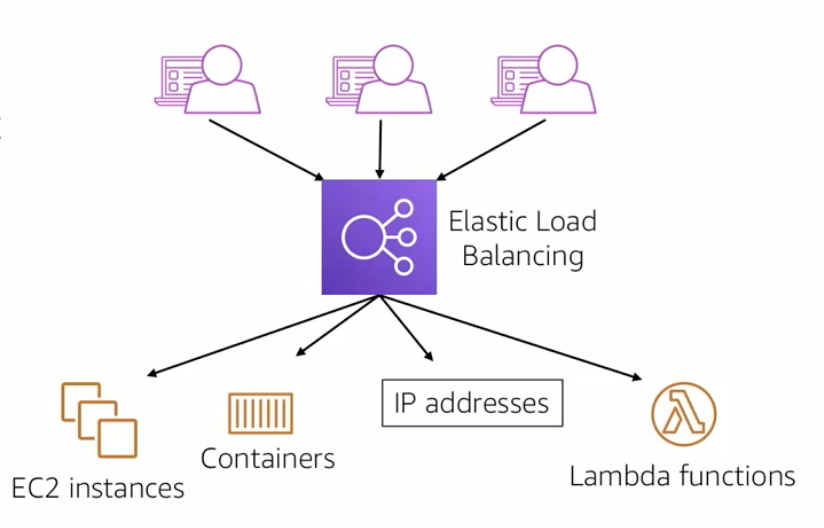
    <h5></h5>
</div>

##### resources요청에 대한 네트워크 트래픽을 분산 라우팅 시켜주는 서비스

##### 사용 사례

1. HA-FT 애플리케이션
2. 중앙 집중식 애플리케이션
3. 유연한 확장성
4. **Virtual Private Cloud**
5. **Invoke Lambda Function Over HTTP(S)**

##### ① ALB (Application Load Balanacer)

* L7단의 로드 밸런서고 HTTP/HTTPS 트래픽을 분산 라우팅한다.
* 컨테이너, 마이크로 서비스, 애플리케이션을 타겟으로 요청을 분산

##### ② NLB (Network Load Balancer)

* L4단의 로드 밸런서고, TCP/IP, UDP, TLS 트래픽을 분산 라우팅한다.
* IP 프로토콜 데이터를 타겟으로 요청을 분산한다.

##### ③ CLB (Classic Load Balancer)

* L7, L4 둘다 원래는 상관 안하고 모놀리스식으로
HTTP/HTTPS/TCP/SSL 트래픽을 분산 라우팅하는것으로 했다


---

> ### 📄 2. Amazon Elastic Compute Cloud(Amazon EC2)

* AWS를 사용하시는 경우에는 이러한 **서버가 곧 물리적인 서버가 아니라 인터넷을 통해서 접근할 수 있는 가상화**되어 있는 서버입니다.
* "높은 보안성" "탄력적인 스케일링"이 가능한 인스턴스를 클라우드를 통해 제공

#### 1). 온프레미스와 EC2 인스턴스 비교

##### ① 온프레미스 

* 필요한 모든 구성을 미리 하드웨어를 구매해야 하고 배달될 때까지 기다려야 한다.
* 물리적 데이터 센터에 서버를 설치해야 합니다.

##### ② Amazon EC2 인스턴스

* **AWS 클라우드에서 가상 서버를 사용하여 애플리케이션을 실행**할 수 있습니다.
* 워크로드 실행을 완료했다면 인스턴스 사용을 중지할 수 있습니다 
* (Pay-As-You-Go) 인스턴스가 실행 중일 때 사용한 컴퓨팅 시간에 대해서만 비용을 지불
인스턴스가 중지 또는 종료된 상태에서는 비용을 지불하지 않습니다.

---

#### 2). EC2 작동 방식

<div align=center>
    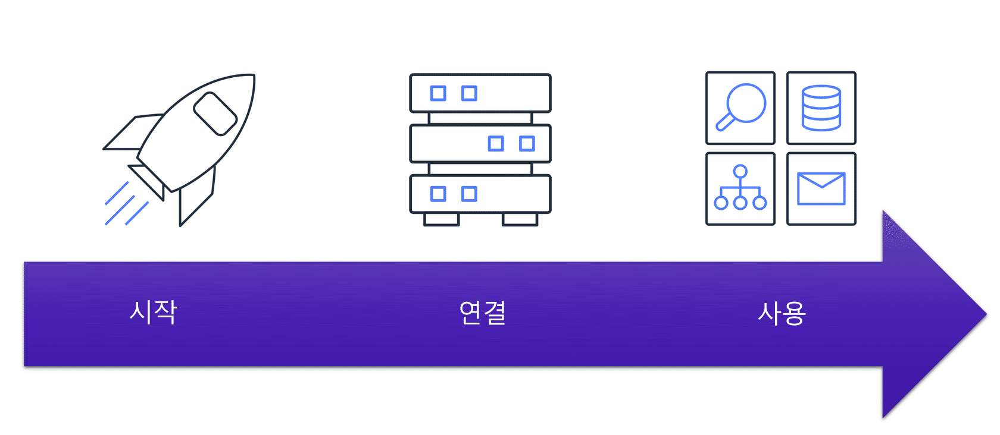
    <h5></h5>
</div>

##### ① 인스턴스 시작

1. 인스턴스 유형 결정(원하는 성능 수준)
2. OS와 SW를 결정하는 인스턴스의 AMI를 선택해야한다.
    AMI(Amazon Machine Images) : 
    운영체제, 스토리지 설정, 아키텍쳐 유형 등등
    이미 설치된 소프트 웨어를 포함한 가상 머신 이미지다
    AMI는 모든 새로운 인스턴스에 대해 일관된 환경을 제공하여 반복성을 제공한다.
    내가 직접 만들수도 있지만, 만들어진걸 구매할 수도 있고, 아예 AWS AMI 템플릿을 사용할 수도 있다.
3. 인바운드 아웃바운드의 네트워크 트래픽을 제어할 보안설정을 진행한다.
   그다음 인스턴스를 시작한다.
   *의외로 Permission은 필요 구성은 아니다.*

##### ② 인스턴스 연결

* 시작 후, 인스턴스에 연결할 때, 방법은 여러 가지이고, 
데이터를 교환하는 방법도 여러 가지다

##### ③ 인스턴스 사용
* 커맨드를 실행해 소프트웨어 설치, 스토리지 추가, 파일 복사 및 정리 등의 작업 수행 가능.

---

#### 3. 인스턴스의 "수직확장" & "수평확장"

##### ① 수직확장 

* 인스턴스에 더 많은 메모리와 CPU 스레드가 필요로 할때, 그 성능을 향상하는 것. 
이것을 인스턴스의 수직 확장이라고 합니다. 
* 기본적으로 인스턴스는 필요할 때 언제든지 크기를 늘리거나 줄일 수 있습니다.

##### ② 수평확장

* Amazon EC2 Auto Scaling을 사용하면 자동으로 **수평적으로 인스턴스가 확장**되게 설정을 하실 수도 있습니다. 
인스턴스 자체 성능 향상이 아닌 **개수를 생성하거나 제거**를 하는 식으로

---

> ### 📄 3. 인스턴스 패밀리 (인스턴스 유형)

<div align=center>
    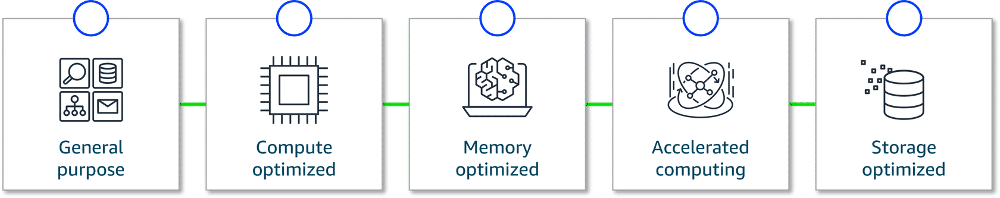
    <h5>제네럴, 컴퓨팅, 메모리, 가속, 스토리지</h5>
</div>

#### 1). 범용 인스턴스

* 컴퓨팅, 메모리, 네트워킹 리소스를 균형 있게 제공합니다.
* 폭넓은 일반 워크로드에 무난하다.

---

#### 2). 컴퓨팅 최적화 전용

* vCPU 비중이 높아 CPU-bound 작업에 유리하다.
* 웹, 애플리케이션, 게임 서버, 대량 배치 처리, 단일 그룹에서 많은 트랜잭션 처리에 적합하다.

---

#### 3). 메모리 최적화 전용

* vCPU 대비 메모리 캐시가 필요하고 메모리 대역폭이 높다. 
* 고성능 데이터베이스에 적합한 유형
    1. 메모리에서 **대규모 집합**, **대용량 데이터 세트**를 빠른 성능으로 처리
    2. 애플리케이션을 실행하기 전에 많은 데이터를 미리 로드
    3. 여러 서버에 저장된 대용량 데이터 세트를 처리하여 빠른 쿼리 결과를 제공하는 실시간 분석 애플리케이션을 운영

---

#### 4). 스토리지 최적화 전용

* 데이터 웨어하우징 애플리케이션에 적합한 Amazon EC2 인스턴스 유형
  디스크 I/O 특화는 스토리지 최적화의 특징.
* **대규모 데이터** 집합에 대한 순차적 **빠른 검색, 액세스, 쓰기**
  즉 데이터 검색은 빠르고, 액세스는 빠른데,
  빠른 데이터 처리와, 높은 메모리 용량이 필요한 작업에는 적합하지 않습니다.

---

#### 5). 액셀러레이티드 컴퓨팅

* GPU/전용 가속기로 부동소수점, 데이터 패턴 매칭, 그래픽을 가속한다. 그래픽 앱, 게임/앱 스트리밍과 유사 병렬 연산에 적합하다.

---

> ### 📄 4. Amazon EC2 Pricing

#### 1). 사용 사례에 따른 다양한 요금

##### ① 온디맨드

* 인스턴스 유형과 선택한 운영 체제에 따라 시간당 혹은 초당으로 과금이 됩니다.
* 중단할 수 없는 불규칙한 단기 워크로드가 있는 애플리케이션에 가장 적합합니다.
* 선결제 비용이나 최소 약정은 적용되지 않습니다. 

##### ② EC2 Instance Savings Plans VS 예약 인스턴스

* **설명**
    1. EC2 Instance Savings Plans : 1,3년 동안 시간당 지출액을 약정하면 그 범위 내 EC2 사용에 자동 할인 적용.
    2. 예약 인스턴스 : 1,3년 약정으로 EC2 속성 일치 사용량에 할인.
    
* **약정 단위**
    1. Savings Plans = $/시간 지출액 약정.
    2. RI = 인스턴스 속성(패밀리/플랫폼/테넌시/스코프) 약정.
    3. **1 또는 3이다** 2년은 없다!

* **유연성**
    1. EC2 Instance Savings Plans : 사용량에 유연성이 필요한 경우 유용한 옵션입니다. 
       변동 사용량, 여러 크기/OS 혼재, 단일 패밀리 중심.
    2. 예약 인스턴스 : 사용량이 확정 가능한 가능한 워크로드에 적합 크기 변경은 제한적
       장기 고정 패턴, 특정 타입 상시 가동, 용량 보장 필요
       컨버터블 RI = 교환 통해 유연, 표준 RI = 고정.

##### ③ 스폿 인스턴스
* AWS가 필요시 언제든 인스턴스의 용량을 회수할 수 있다!!... 
* 따라서 중단을 견딜 수 있는 워크로드 필요.
* 하지만 현재 작업을 마무리할 수 있도록 인스턴스 회수 2분 전에는 경보가 제공되며 이후 필요할 때 언제든지 다시 시작할 수 있습니다. 

##### ④ 전용 호스트

* 전용 인스턴스는 단일 고객 전용 하드웨어에서 
Virtual Private Cloud(VPC)를 통해 실행됩니다.
* 장점이 있다면 성능 향상도 목적이지만, **규제·라이선스/물리적 격리 요구**
* 공유 하드웨어에서 실행되는 다른 선택지의 인스턴스보다 비용이 많이 듭니다.

---

> ### 📄 5. Scaling Amazon EC2 

* 수요 변화에 자동으로 대응하도록 아키텍처를 설계해야 합니다. 
* 그 결과, 사용한 리소스에 대해서만 비용을 지불합니다. 
컴퓨팅 용량 부족 때문에 고객의 요구 사항을 충족할 수 없을지 걱정할 필요가 없습니다.
* Amazon EC2 Auto Scaling을 사용하면 자동으로 **수평적으로 인스턴스가 확장**되게 설정을 하실 수도 있습니다. 

#### 1). Amazon EC2 Auto Scaling (수평 확장)

<div align=center>
    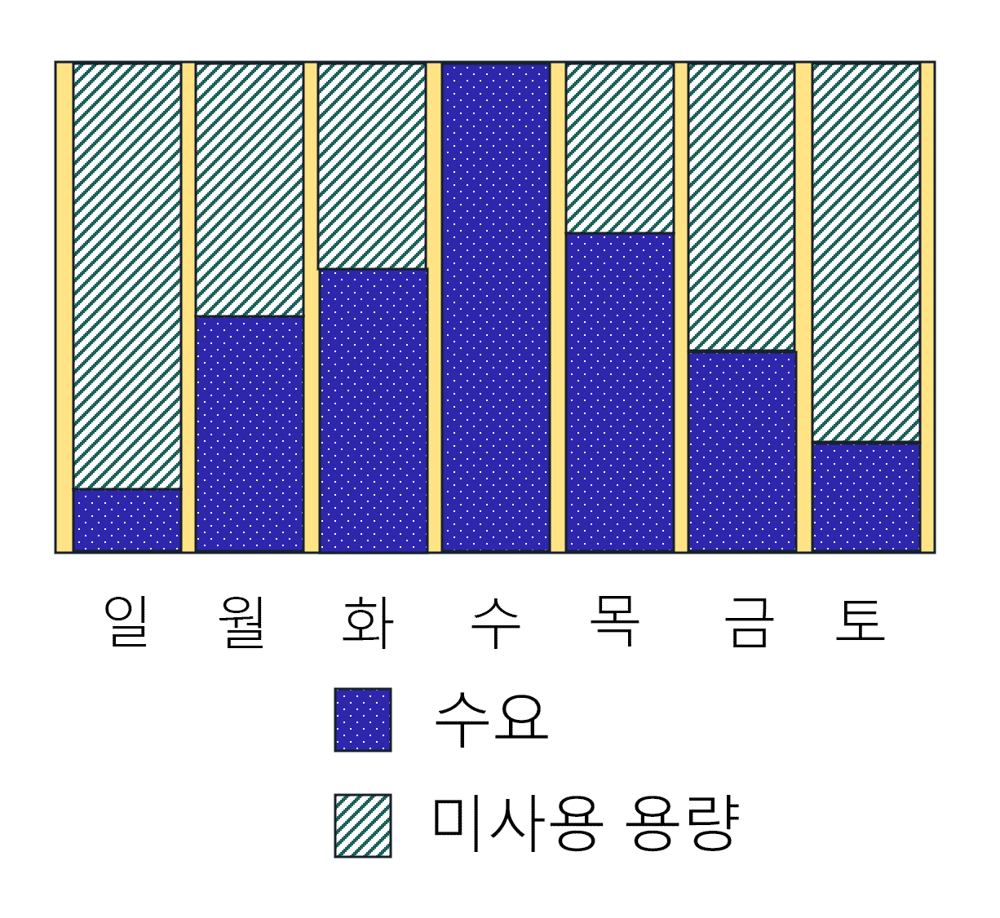
    <h5></h5>
</div>

* 수요가 적을 때 불필요한 Amazon EC2 인스턴스 제거하거나,
수요에 맞춰 Amazon EC2 인스턴스 수를 자동으로 조정
* 2가지 유형 : 아예 이 두 가지를 함께 사용도 가능하긴 함
    1. 동적 조정 : 수요 변화에 대응합니다. 
    2. 예측 조정 : 예측된 수요에 따라 적절한 수의 Amazon EC2 인스턴스를 자동으로 예약합니다.

---

#### 2). 그룹 생성과 최소 용량

<div align=center>
    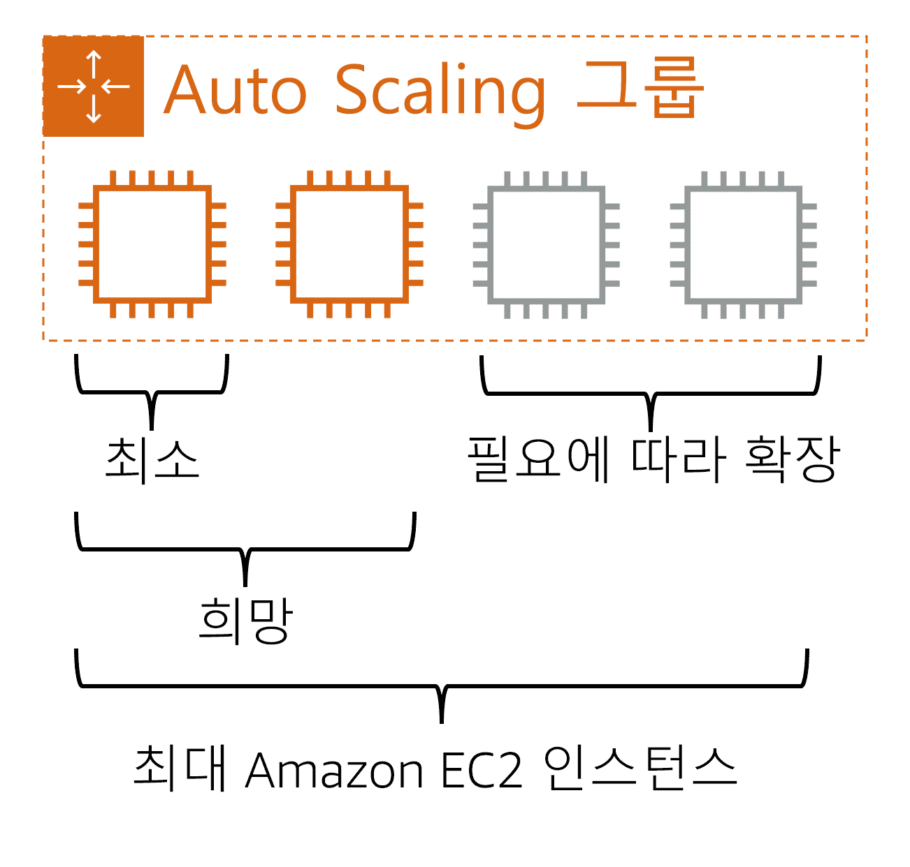
    <h5></h5>
</div>


* Auto Scaling 그룹을 생성한 직후 시작되는 Amazon EC2 인스턴스의 수입니다. 
* 이 예에서 Auto Scaling 그룹의 최소 용량은 Amazon EC2 인스턴스 1개입니다.
* Auto Scaling 그룹에서 희망 Amazon EC2 인스턴스 수를 지정하지 않으면 희망 용량은 기본적으로 최소 용량으로 설정됩니다.

---

> ### 📄 6. Directing Traffic with Elastic Load Balancing

<div align=center>
    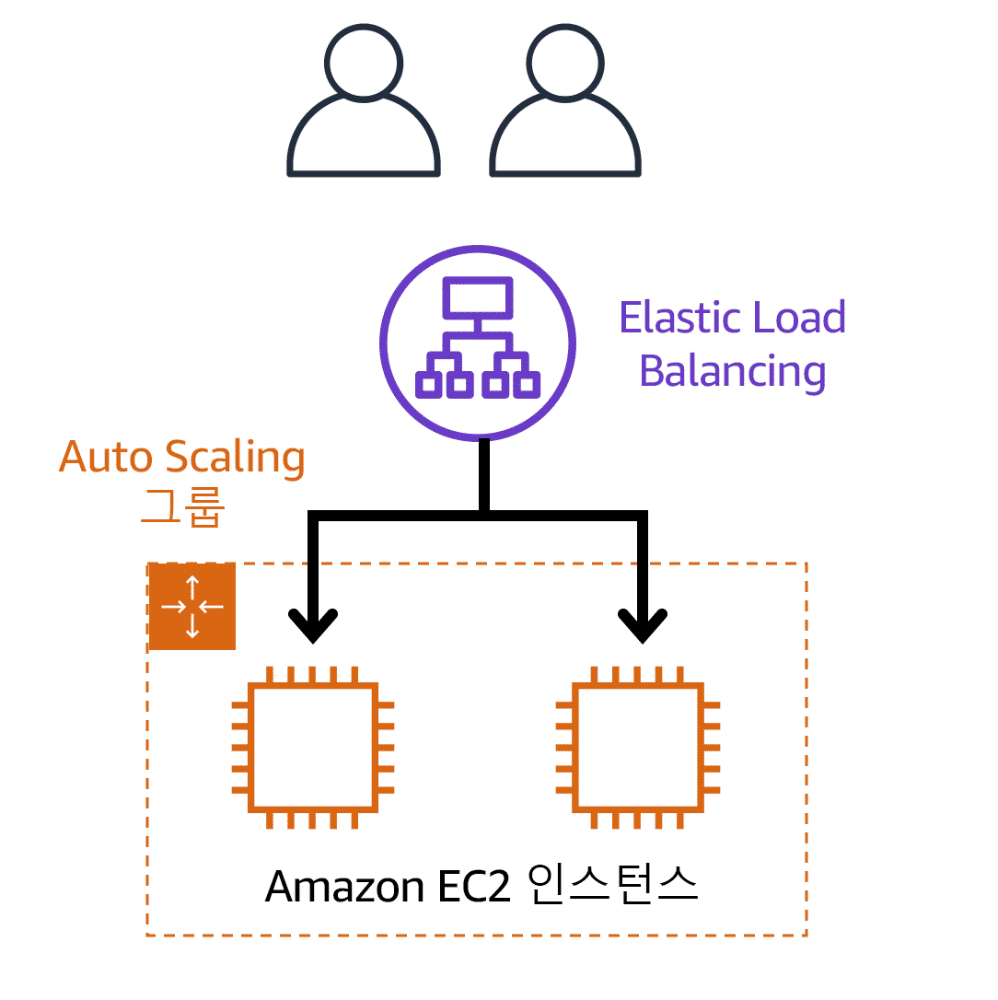
    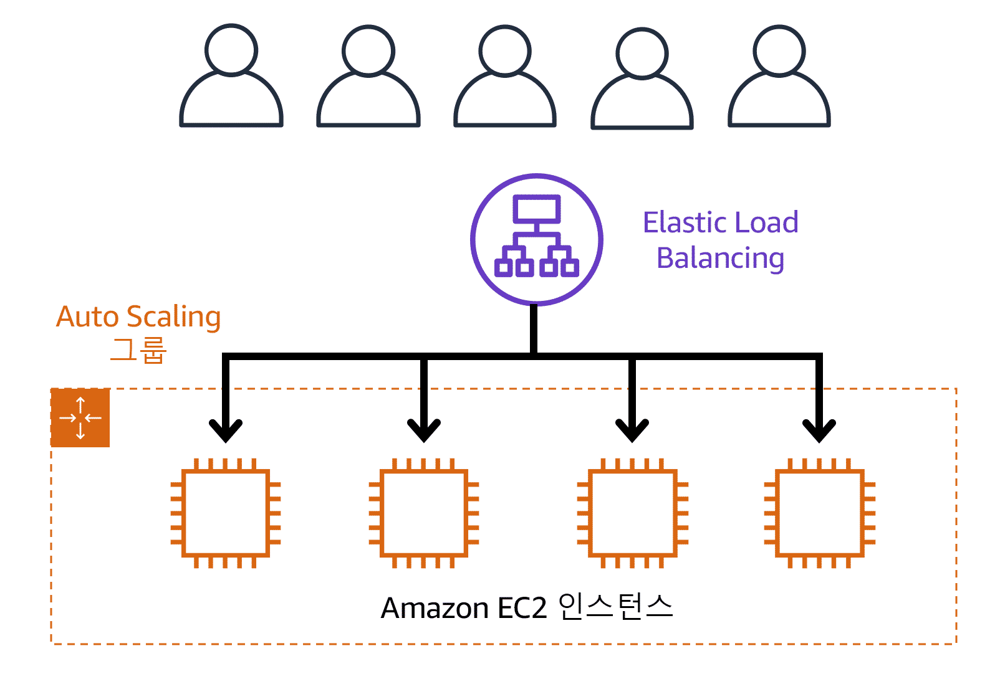
    <h5> 수요가 적은 기간 VS 수요가 많은 기간 </h5>
</div>

#### 1). 애플리케이션 트래픽을 분산 라우팅

##### 네트워크 트래픽을 분산 라우팅 시켜주는 서비스

* 분산 단위는  Auto Scaling 그룹
* EC2 인스턴스 전체에 워크로드를 균일하게 분산해준다.
* 단일 리소스가 "전체 워크로드를 처리하는 등 과도하게 활용되지 않도록" 할 수 있습니다.

##### 작동 흐름

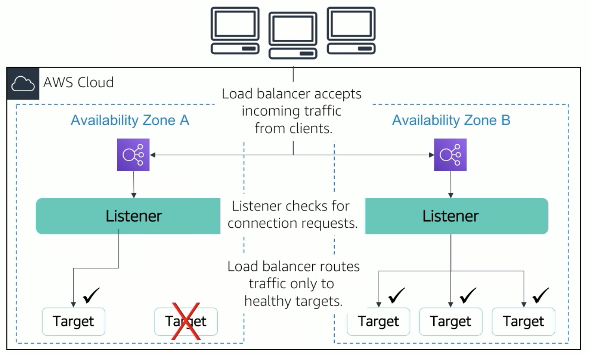

```
1. 일단 로드밸런서를 동작하기 전에, 전제되야 할 것은
Target Group으로 리소스를 묶어 먼저 분산단위를 만들어야 한다.
2. 클라이언트 요청이 로드밸런서로 먼저 라우팅 됨.
3. 로드밸런서는 라우팅 된 들어오는 트래픽을 수락한다.
4. 그런 다음 요청을 처리할 Target Group으로 유도한다.
```


---

> ### 📄 7. Messaging and Queuing

#### 1). 모놀리스 

<div align=center>
    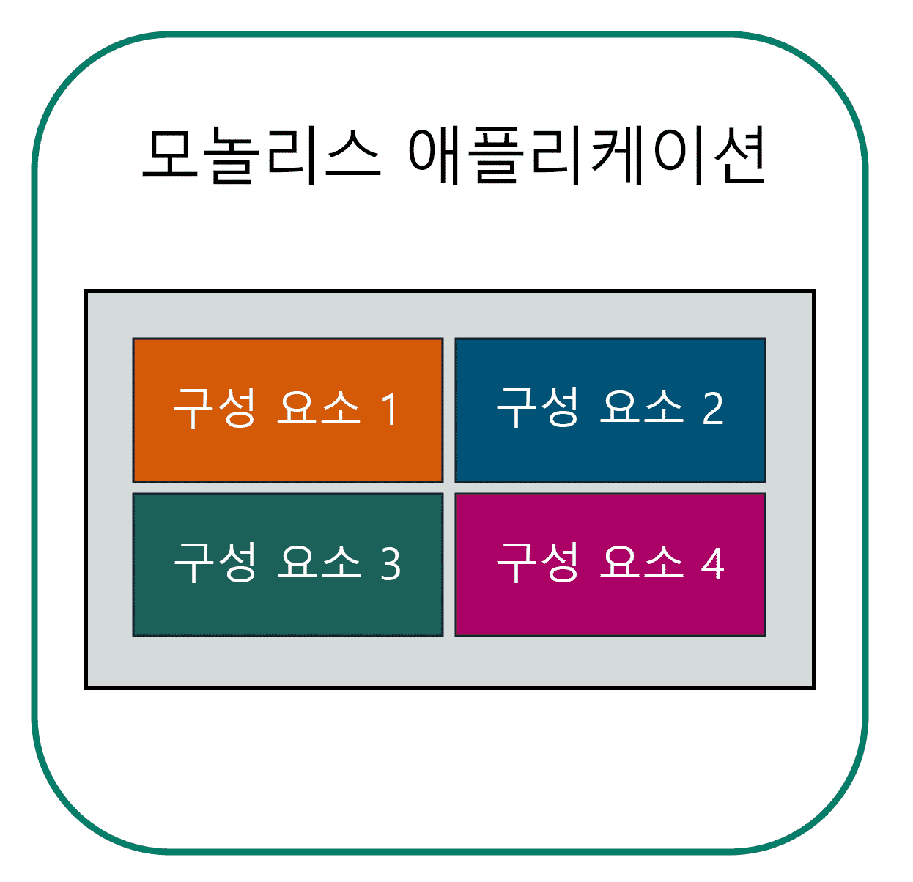
    <h5></h5>
</div>

* 구성 요소(데이터베이스, 서버, 사용자 인터페이스, 비즈니스 로직)나, 워크로드를 
하나의 구조에 때려 박은 아키텍쳐를 모놀리식이라고 부르고
* 한 구성 요소에서 장애가 발생하면 다른 구성 요소에도 장애가 발생하고, 
심지어 전체 애플리케이션에서 장애가 발생할 수도 있습니다.

##### AWS Lambda 

<div align=center>
    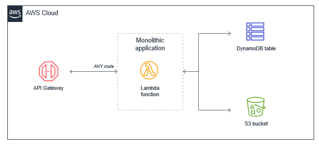
    <h5></h5>
</div>

* 하나의 람다함수로 모든 API Gateway 라우트를 처리하는 방식이고,
함수 하나에 복수의 기능이 결합되어 있어 함수단위 단일책임이 아니라, 확장과 유지보수가 어렵다.
* 권장 패턴은 마이크로 서비스다.

---

#### 2). 마이크로 서비스

<div align=center>
    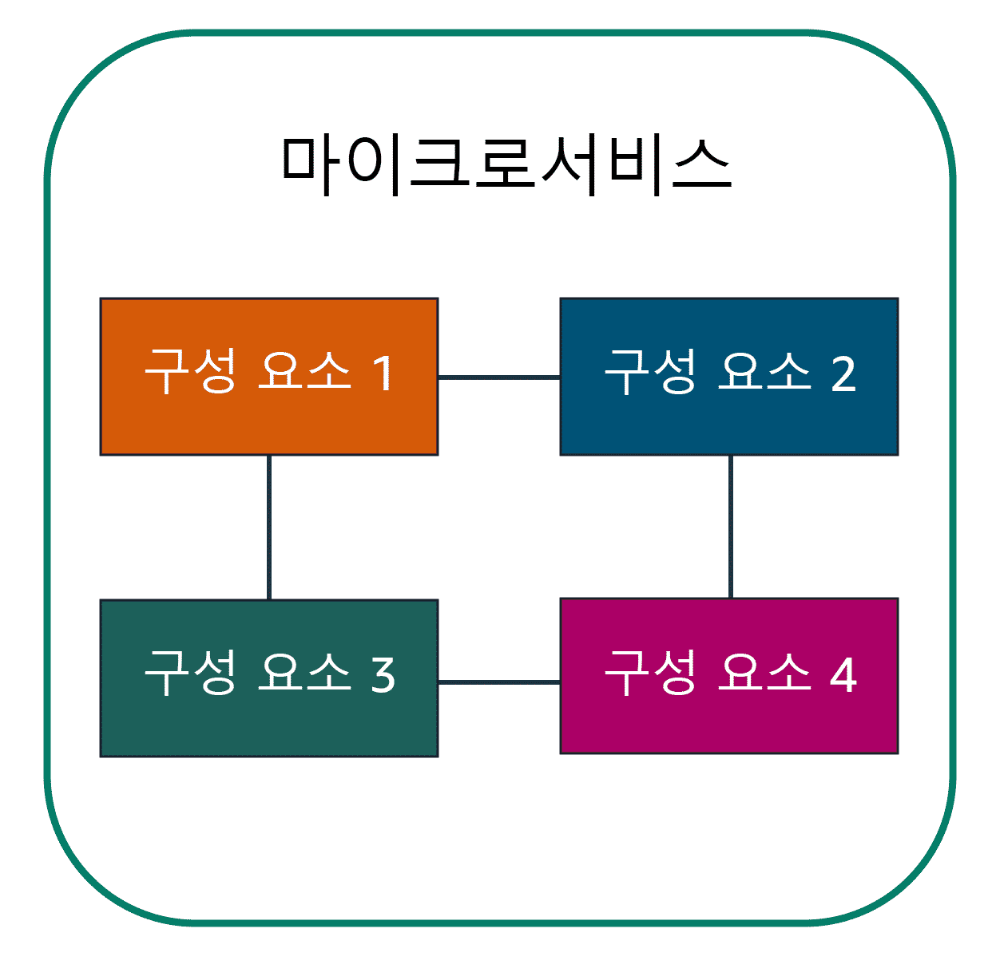
    <h5></h5>
</div>

* 이 경우 단일 구성 요소에 장애가 발생해도 다른 구성 요소들은 서로 통신하기 때문에 계속 작동합니다. 
* 소결합 때문에 전체 애플리케이션에서 장애가 발생하는 것이 방지됩니다. 
* 설계 시 다양한 마이크로서비스 접근 방식을 취할 수 있다.


##### AWS Lambda

<div align=center>
    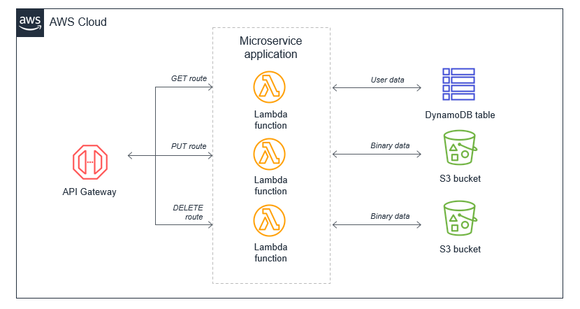
    <h5></h5>
</div>

* 기능에 따라 분리된 복수의 함수를 마이크로 서비스로 분해하여,
API Gateway 라우트에 기반한 처리를 하도록 해야한다.

---

#### 3).Micro Services

##### ① SNS (Amazon Simple Notification Service)
<div align=center>
    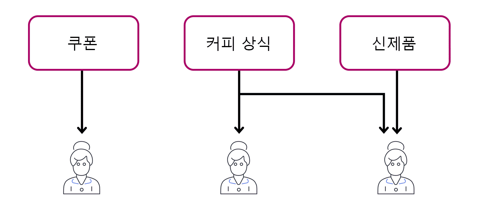
    <h5></h5>
</div>

* 게시 및 구독 서비스
  * 게시자 : Amazon SNS 주제를 사용하여 구독자에게 메시지를 게시합니다. 
  * 구독자 : SQS 대기열, AWS Lambda 함수, HTTPS 혹은 HTTP 웹 훅과 같은 엔드포인트
    구독자가 모~~~든 주제에 대해서 업데이트를 받는 게 아니다. 
    3 개의 뉴스레터로 나누게 되어 구독자는 구독한 특정 주제에 대해서만 즉시 업데이트를 받게 됩니다.

##### ② SQS (Amazon Simple Queue Service)

<div align=center>
    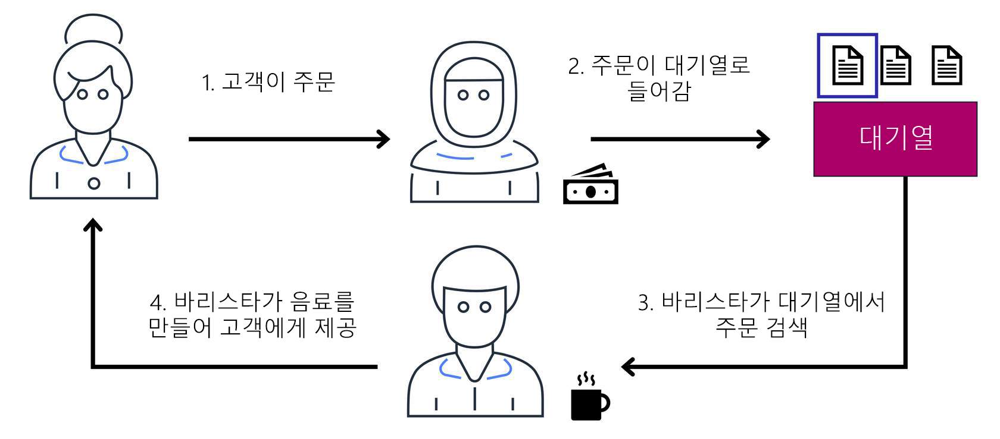
    <h5> 시스템에 일종의 버퍼나 대기열을 도입하면 프로세스가 훨씬 개선될 것입니다. </h5>
</div>

* 메시지 손실이나 다른 서비스 사용 없이 소프트웨어 구성 요소 간에 메시지를 전송, 저장, 수신할 수 있습니다. 
* SQS에서는 애플리케이션이 메시지를 대기열로 전송합니다. 
사용자 또는 서비스는 대기열에서 메시지를 검색하여 처리한 후 대기열에서 삭제합니다.

##### ③ SNS+SQS 조합

1. 주제→여러 대기열로 ‘팬아웃’ + 큐로 버퍼링/확장
2. 확장성·내결합성 이점
3. 비동기 분리

---

> ### 📄 8. 서버리스

<div align=center>
    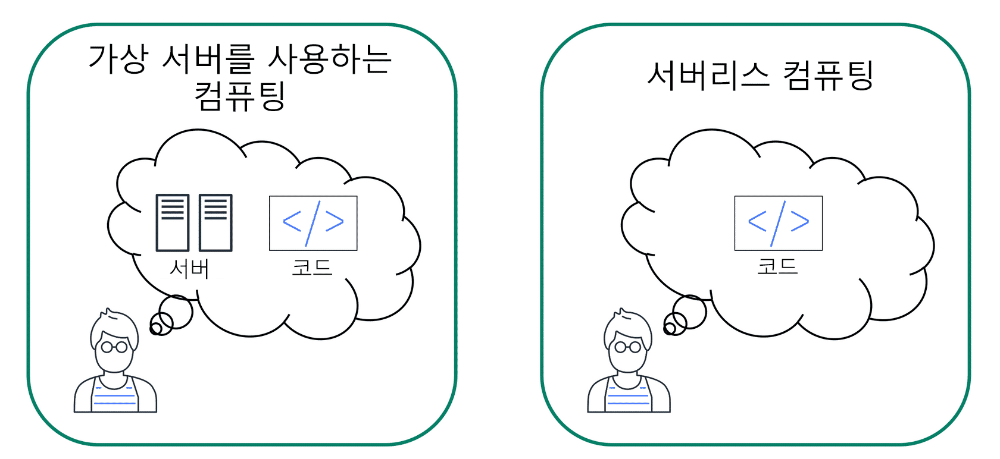
    <h5></h5>
</div>

#### 서버에서 실행되는 건 맞음 단, 서버를 프로비저닝 하거나 관리할 필요가 없다는 뜻입니다. 

#### 1). AWS Lambda 

* VM 인스턴스를 미리 구매해서 **프로비저닝 하거나 관리할 필요 없이 코드를 실행할 수 있는 서비스**입니다. 
* 컴퓨팅 시간에 대해서만 비용을 지불합니다. 코드를 실행하는 동안에만 요금이 부과됩니다.
* 단, 싱글 스레드, 싱글 태스크가 한계다.

---

#### 2). 동작 원리.

##### ① 단순한 자원 모델

* 메모리 사이즈 설정 가능 128MB ~ 1.5GB 까지!

##### ② 유연한 호출 경로

* Event 기반 호출 옵션 (S3 같은..)
* REST API 호출 (API Gateway 라우트 Call)

##### ③ Lambda 실행 환경 & 수명 주기 

<div align=center>
    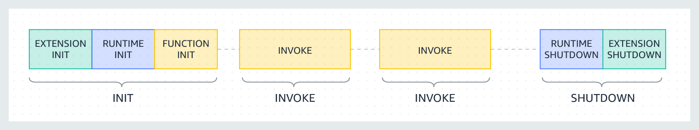
    <h5></h5>
</div>

* 함수 실행 뿐만 아니라, 실행에 필요한 리소스도 관리한다.
* 각 실행 환경은 /tmp 디렉터리에 512MB에서 10,240MB 사이 1MB 단위로 디스크 공간을 제공합니다. 
디렉터리 콘텐츠는 실행 환경이 일시 중지되어도 그대로 유지되기 때문에 일시적인 캐시를 여러 호출에서 사용할 수 있습니다.
* 생명 주기
    ```
    1. 초기화 단계 : 초기 호출에 조금 딜레이가 있을 수 있다.
       하지만, 다시 호출되면 기존 실행환경을 재사용할 수 있음
       함수 실행 전 지연 시간에 가장 많이 기여하는 요인은 초기화 코드입니다.
          Function Init : 함수의 정적 코드 실행
          Extension Init
          Runtime Init
       10초 이내 완료되지 않으면 함수 타임아웃으로 Init 단계를 재실행
    2. 호출 단계
    3. 종료 단계
    ```

---

#### 3). 이미지 업로드 예제

<div align=center>
    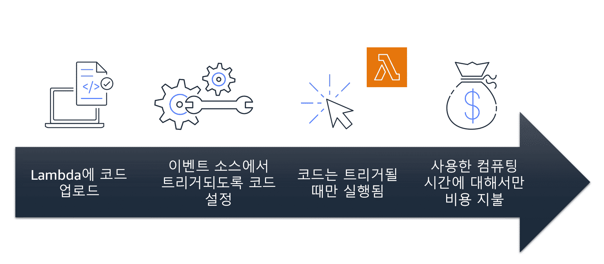
    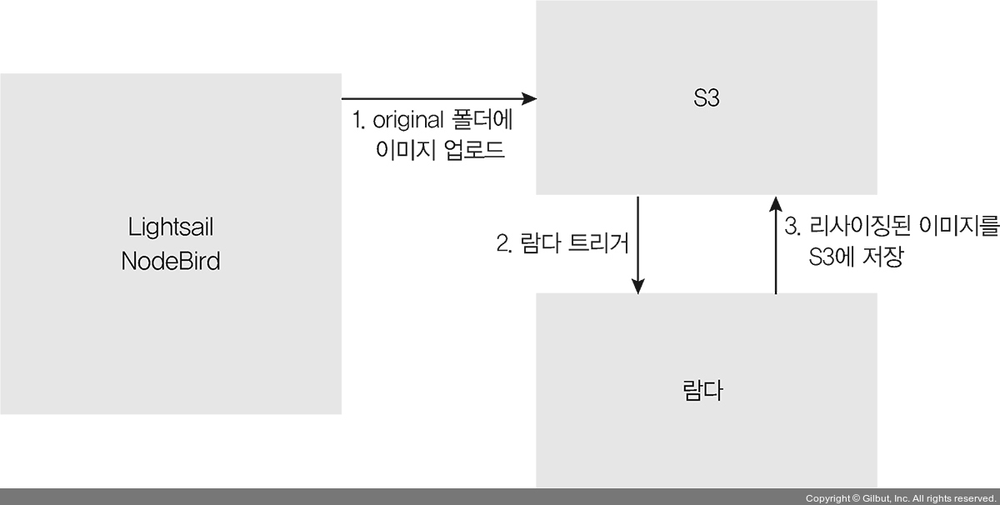
    <h5>Lambda 함수로 업로드되는 이미지의 크기를 AWS 클라우드에 맞춰 자동으로 조정하는 함수 예제 </h5>
</div>

1. 코드를 Lambda에 업로드합니다.
2. AWS 서비스, 모바일 애플리케이션 또는 HTTP 엔드포인트와 같은 이벤트 소스에서 트리거 되도록 코드를 설정합니다.
3. Lambda는 트리거 된 경우에만 코드를 실행합니다.
4. 사용한 컴퓨팅 시간에 대한 요금만 지불합니다. 위의 이미지 크기 조정 예에서는 새 이미지를 업로드할 때 사용한 컴퓨팅 시간에 대해서만 비용을 지불하면 됩니다. 이미지를 업로드하면 Lambda가 트리거 되어 이미지 크기 조정 기능을 위한 코드를 실행합니다.

---

#### 4). 모범 패턴

```
* 분산 시스템과 Async 함수 트리거링
* 마이크로 서비스
* 이벤트 버스 
    함수를 시간 일정에 따라 실행하는 기능을 만들 수 있다.
    예약된 표현식 cron 구문을 사용하면 Lambda함수를 트리거 할 수 있다.
* 상태 비저장 구현
    변수나 데이터 등 상태는 함수 내에서만 사용되는 지역변수로만 존재하도록 하는것이 유리
```

---

> ### 📄 9. 컨테이너 오케스트레이션 도구

#### 컨테이너는 애플리케이션의 코드와 종속성을 하나의 객체로 패키징 하는 표준 방식
개발자는 애플리케이션 환경이 배포와 상관없이 일관되게 유지되기를 원합니다. 따라서 컨테이너식 접근 방식을 사용합니다. 
컴퓨팅 환경의 차이를 진단하는 데 드는 시간을 줄일 수 있습니다.

#### 1). ECS (Amazon Elastic Container Service)

##### ECS는 쿠버네티스 전용 아님

* Amazon ECS는 Docker 컨테이너를 지원합니다. 
Docker는 애플리케이션을 신속하게 구축, 테스트, 배포할 수 있는 소프트웨어 플랫폼입니다.

---

#### 2). EKS (Amazon Elastic Kubernetes Service)

##### EKS는 쿠버네티스 관리형

* AWS에서 Kubernetes를 실행하는 데 사용할 수 있는 완전관리형 서비스입니다. 
* Kubernetes는 컨테이너식 애플리케이션을 
대규모로 배포하고 관리하는 데 사용할 수 있는 오픈 소스 소프트웨어입니다. 

---

#### 3). AWS Fargate

* AWS Fargate는 ECS/EKS용 컨테이너 서버리스 컴퓨팅 엔진입니다. 
Amazon ECS와 Amazon EKS에서 작동합니다. 
* AWS Fargate를 사용하는 경우 서버를 프로비저닝 하거나 관리할 필요가 없습니다.