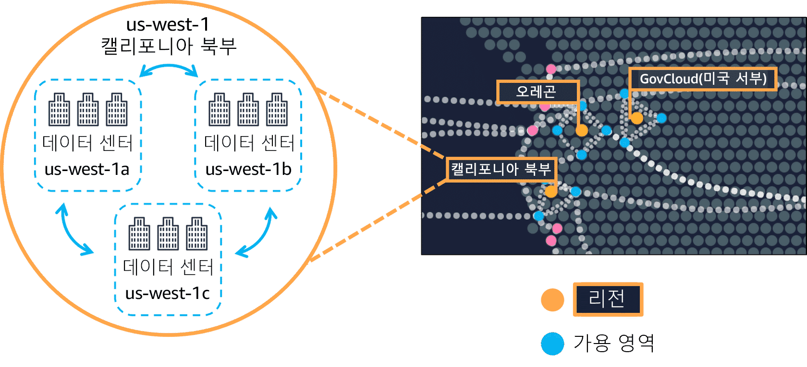
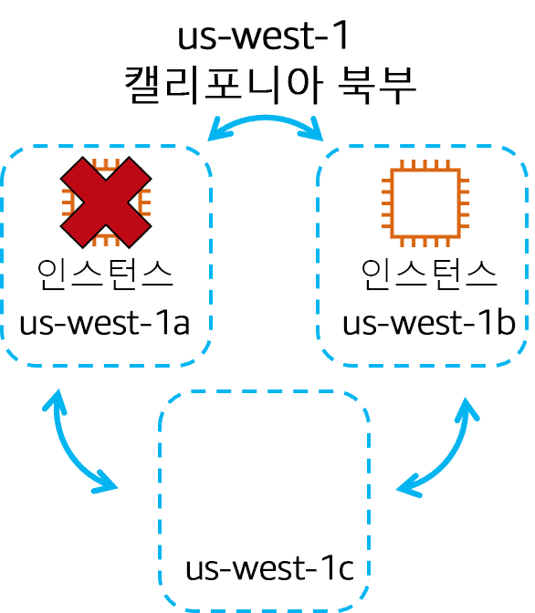
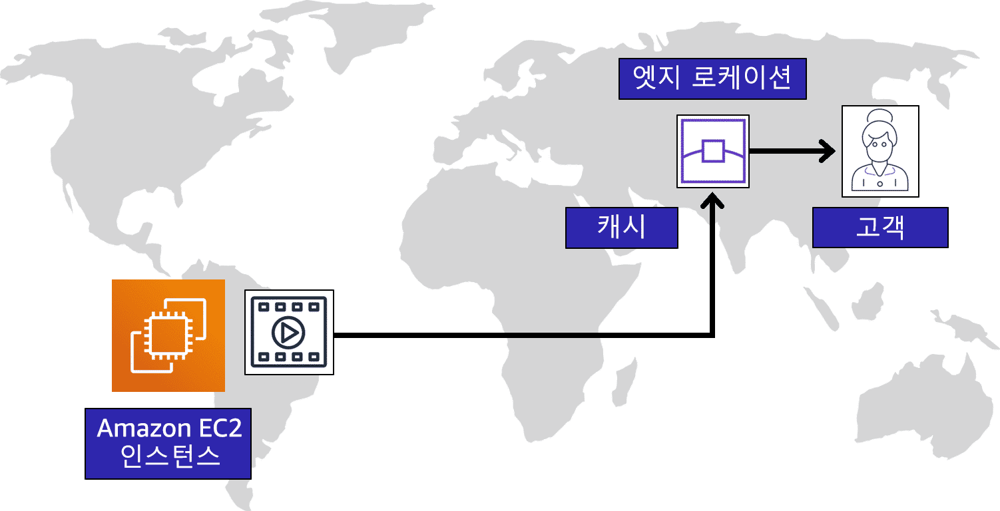
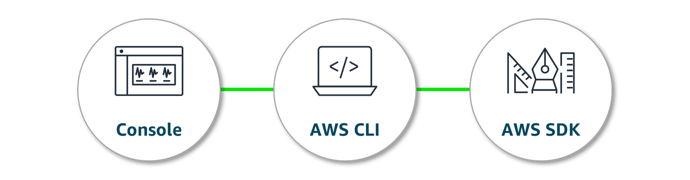

---

## Moduel 3 : Global Infrastducture

---

#### 글로벌 인프라 구조의 핵심 장점은 2가지

##### ① High availability and fault tolerance
##### ② 에지 로케이션 : Low latency for end users

---

> ### 📄 1. 고가용성 & 내결함성

> 모든 리소스를 보관하는 거대한 데이터 센터 하나를 보유하는 것은 바람직한 방법이 아니죠.
> 데이터 센터의 정전이나 자연재해 같은 일이 발생한다면 이 데이터 센터를 사용하는 모든 사용자의 애플리케이션이 동시에 중단되게 됩니다
> 홍수가 나든, 퍼레이드가 나든 이유가 무엇이든 간에 우리는 고객에게 높은 가용성을 제공을 해야 합니다.
> #### 이런 상황을 방지하기 위해서 우리는 고가용성과 내결함성이 필요해요. 

##### 세계 다양한 지역에서 운영되고 있는 지리적 위치를 사용하고 있습니다. 

---

> ### 📄 2. 글로벌 인프라

<div align=center>
    
    <h5>각 리전에는 최소 세 개의 AZ이 포함</h5>
</div>

* AWS가 권장하는 모범 사례는 **한 리전에서 두 개 이상의 가용 영역을 사용하는 것**입니다. 
* 서로 다른 두 AZ에 인프라를 중복해서 배포

#### 1). 리전 선택 (Region) : 리전은 AWS 리소스가 있는 지리적 영역입니다.

* 리전은 전 세계에 위치한 물리적 장소로, 여러 데이터 센터를 포함
* 지진, 홍수, 화재와 같은 대규모 재난에서의 DR, HA 제공

##### 리전 선택의 고려사항
1. **컴플라이언스(규정준수) 요구사항** : 지역별 엄격한 현지 법률 규정(GDPR) 확인
2. **프록시미티(근접성)** : 지역과 가까운 정도, 데이터가 이동해야 하는 거리를 줄여 지연시간을 낮춥니다.
3. **피쳐 가용성** : AWS는 어떤 지역에 따라서 서비스를 제공 안할수도 있다.
4. **프라이싱** : 리전별로 가격이 다를수도, 비용 최적화 적인 곳이 있다.

---

#### 2). 가용 영역 (AZ) : 리전 내의 단일 데이터 센터 또는 데이터 센터 그룹

* 소프트웨어적인 장애에 **비즈니스를 중단 없이 계속 운영할 수 있게** 됩니다.
  1. duplicate/redundant : 서로 다른 **AZ에 데이터 복제/백업** 가능
  2. Fault Tolerance : 한 AZ가 장애 나도 다른 AZ에서 **애플리케이션이 계속 동작**
  3. High availability : **고가용성**
* 단일 데이터 센터로 가용 영역을 복수로 지정할 수는 없다.
* **Privete Link를 통해 매우빠른 연결**을 하고 있다.

<div align=center>
    
    <h5> 리전 내의 단일 데이터 센터 또는 데이터 센터 그룹입니다. </h5>
</div>

---

> ### 📄 3. 에지 로케이션 (Region 바깥과 소통)

<div align=center>
    
    <h5> Edge Location Host AWS Service <br> 에지 로케이션은 다른 여러 AWS 서비스를 호스팅 한다. </h5>
</div>

#### Edge locations are located outside of AWS Regions 

* 이러한 장치는 사용자가 자주 접근하는 데이터에 낮은 지연 시간으로 접근할 수 있도록 지원합니다.

#### 1). Amazon CloudFront : CloudFront is 컨텐츠 전달 "네트워크"

##### ① CDN : 전 세계 고객과 더 가까운 곳에 콘텐츠 복사본을 제공하는 네트워크

* **여기서 말하는 "콘텐츠"란**
  * 이미지, 데이터, 클라이언트 애플리케이션, **API**들을 말한다.
* Amazon CloudFront는 전 세계에 있는 
에지 로케이션을 이용해 사용자가 어떤 위치에 있든 통신 속도를 높입니다. 
* **반드시 같은 리전에서 위치할 필요는 없다.**


##### ② 또 다른 말로는 CDN 즉 네트워크 시스템을 <br> 콘텐츠 캐싱 시스템(저장하고 접근)이라고도 한다.

* 거듭 말하지만. **여기서 말하는 "콘텐츠"란**
  * 이미지, 데이터, 클라이언트 애플리케이션, **API**들을 말한다.

* **캐싱은 파일 복사본을**
  1. 캐시 서버에 저장하고
     저장(배포)는 CloudFront로
  2. 캐시서버에 캐시된 콘텐츠에 빠르게 액세스
     접근은 Route 53을 통해 한다?

##### ③ 따로 지리적 배포 제한을 하지 않으면 모든 국가에서 접근이 가능하다.
* 하지만 사용자의 IP주소를 기반으로 Whitelist, Blacklist를 설정해 국가별 접근을 제어할 수 있다.

##### ④ 엣지 네트워킹의 좀더 자세한 원리
* 410개 이상의 글로벌 멀티 서비스 접속 지점(POP)을 두어 네트워크 홉을 제거한다 -> 이것이 더 짧은 지연시간을 제공한다.

1. **POP의 스펙**
     * 캐싱
     * 네트워크 연결
     * 엣지 컴퓨팅

2. **CloudFront 라는 이름의 CDN**
     * 파일 캐싱 말고, API 전송의 역할
     * 애플리케이션 오리진(원본 위치)로 전송된 요청을 통합

3. **보안** : 내장된 DDoS 보호

4. **트래픽 처리같은 경우**
     * CloudFront 하나가 전세계에 분산된 에지 로케이션에서 나온 트래픽을 처리한다.
     * Route 53을 통해 웹사이트 이름을 IP주소로 변환해 라우팅하거나
     * AWS Global Accelerator을 통해 글로벌 트래픽 라우팅 간소화

---

#### 2).  Amazon Route 53 : Route 53 is a Domain Name System or DNS

* 어떤 도메인이 어느 엔드포인트(클라이언트 입장에서 보이는 URL 진입점)로 갈지 이름 해석/트래픽 정책.
* 도메인 등록, 트래픽 라우팅, 헬스 체크 등을 수행.

##### ① Routing 방법

1. **Failover routing** : 장애 감지 후 건강한 위치로 리다이렉트  
2. **Weighted routing** : A/B 테스트, 트래픽 비율에 따라 분산  
3. **Latency-based routing** : 성능 측정 기반으로 가장 빠른 리전에 라우팅  
4. **Geolocation routing** : 국가/지역에 따라 다른 엔드포인트로 보냄

##### ② 사용 패턴

  ```
  1. CloudFront 배포 생성후, 배포 도메인 부여 dxxxx.cloudfront.net
  2. Route 53 Alias A/AAAA 레코드로 www.example.com(또는 루트 도메인) 만들면, 해당 CloudFront 배포에 매핑
  ```

---

#### 3). Global Accesorator

* 플리케이션 위치 중 하나에 문제가 발생했을 때 트래픽 라우팅을 위한 솔루션
  * 상태, 사용자 위치 및 정책에 기반하여 최적의 엔드포인트로 라우팅함
* 멀티리전 엔드포인트(클라이언트 입장에서 보이는 URL 진입점)로의 TCP/UDP 트래픽을 가속하는 L4 가속기
  *LB → LB 라우팅 가능하다 `전역/에지 레이어 → 리전 로드 밸런서 → 앱 서버 구조`*
* 지연시간에 민감한 상황 FPS, 서버 간의 지연시간을 최소화, 

---

> ### 📄 4. AWS와 상호 작용하는 방법

<div align=center>
    
    <h5></h5>
</div>

#### 1). API

* 어떻게 요청을 보내면 어떻게 응답을 줄 것인지에 대한 약속이다.
* API를 통해 AWS 리소스를 구성하고 관리할 수 있다.
* API를 요청하고 응답받는 방법은 다음과 같다.

---

#### 2). AWS Management Console

* AWS Lambda나, EC2를 생성하는 행위도 클릭 딸깍 으로 가능하다.
* API 호출은 AWS Management Console에서 GUI를 사용할 수 있다.

---

#### 3). AWS Command Line Interface(AWS CLI)

* AWS Management Console이 하는 행동을 모두 CLI 커맨드로 실행할 수 있다.
* 일명 자동화가 가능하다는 것이다.

---

#### 4).AWS SDK

* 프로그래밍 언어(C++, Java, .NET 등)로 AWS API를 쉽게 호출할 수 있도록 제공
  애플리케이션 코드에서 S3, EC2, DynamoDB 등을 제어할 때 사용.

---

#### 5). AWS CloudFormation

1. **핵심 개념 (무엇을 하는 서비스인가)**  
    * **인프라를 코드(IaC)로 다루는 AWS 서비스**  
    * YAML/JSON **템플릿으로 인프라 구성을 정의**하고, 이를 기반으로  **프로비저닝,변경,삭제를 자동화**  
    * 템플릿은 **버전 관리**가 가능하고, **반복,재현 가능한 배포**를 지원

2. **일관된 환경 구성 (왜 쓰는가)**  
    * 개발 / 테스트 / 프로덕션 등 **여러 환경에 동일한 구성을 일관되게 배포**  
    * 수동 설정을 줄여 **프로비저닝 자동화, 오류 감소, 환경 일관성 유지**  
    * 정리하면: “**같은 템플릿으로 어디든 똑같이 깔 수 있게 해주는 도구**”

3. **주요 기능 (어떤 점이 강점인가)**  
    * **다양한 AWS 서비스**와 **복잡한 종속성**까지 템플릿 한 곳에서 정의  
    * CloudFormation이:
      * **리소스 간 의존성 해석** (생성/삭제 순서 자동 처리)  
      * **체인지셋(Change Set)**: 적용 전 변경 사항 미리 확인  
  * **롤백(Rollback)**: 실패 시 이전 상태로 자동 복구  
  * **드리프트 감지(Drift Detection)**: 실제 리소스와 템플릿 차이 감지  
   * 덕분에 **형상 관리,변경 관리,재현성**에 매우 적합

4. **예시 사용 사례**  
    * **정적 웹 사이트 인프라**(S3, CloudFront, Route 53 등) 템플릿으로 한 번에 배포  
    * **다중 계층 애플리케이션**(VPC, 서브넷, ALB, EC2/ASG, RDS 등) 전체 스택을 코드로 정의 후 배포

5. **단순 API 호출과의 차이 (왜 CloudFormation을 쓰는가)**  
    * 클라우드 공급자의 API만 직접 호출해서도 인프라를 만들 수는 있지만:
     * **IaC 도구의 내장 기능**(의존성 관리, 체인지셋, 롤백, 드리프트 감지 등)이 없음  
     * 스크립트가 복잡해지고, **유지 보수,재현,협업이 어려워지기 쉽다**  
    * CloudFormation은 이런 문제를 해결하기 위해 설계된 **전용 IaC 도구**라고 보면 된다.


---

#### 6). 리소스 프로비저닝 자동화 서비스

##### 사용자가 프로비저닝을 하는 것도 귀찮다면, 바탕으로 알아서 자동으로 환경이 구축 된다.

##### ① AWS Elastic Beanstalk

* 개발자는 코드를 업로드하기만 하면 Elastic Beanstalk이 최상위 관리형 자동으로 처리
    1. 인프라 프로비저닝, 확장
    2. 로드 밸런싱 및 애플리케이션 상태 모니터링
* 서버 코드를 전부 Zip파일로 만들면 된다. 그러면 아래의 작업을 알아서 자동으로 구축해 준다.
    1. 용량 조정
    2. 로드 밸런싱
    3. 자동 조정
    4. 애플리케이션 상태 모니터링

##### ② Lightsail

* lightweight cloud-only service, 예측 가능하며 트래픽이 적은서비스
* 간소화된 VPS, 스토리지, DB, 네트워킹을 제공

##### ④ AWS Outposts

* 일관된 도구와 API를 통해 AWS 인프라를 온프레미스에서 워크로드를 실행

