---

1. API 요청 
2. 게이트웨이 
    1. 로드밸런싱
    2. 서버에 접근 시도
    3. 서버리스 트리거
3. 어찌됫건 3가지로 갈려도 컴퓨팅 하는애한테 도달한다 
   VPC VS Serverless

---

> ### 📄 사전 지식
#### 1). 리소스

##### 이름 붙일 수 있고(식별 가능), 어떤 연산을 할 수 있으며, 사용/권한/할당을 관리해야 하는 대상

1. 식별 가능하다 : URL, ID, 포트 번호, 파일 경로, 핸들(handle) 등으로 가리킬 수 있어야 함.
2. 연산이 정의돼 있다 : 읽기/쓰기, 생성/삭제, 예약/해제 등 “무엇을 할 수 있는지”가 정해져 있음.
3. 유한하고 경쟁적이다 : 무한하지 않다. 동시에 여러 주체가 쓰려 하면 충돌/경쟁이 생김
4. 누가 접근 가능한지, 얼마까지 쓸 수 있는지, 어떤 상황에 우선하는지.

##### ① 데이터 리소스 (DB, 스토리지, 메세지/스트림)
##### ② 인터페이스 리소스 (Rest API, RPC, WebSocket)
##### ③ 컴퓨팅 리소스 (CPU, RAM, IO 비즈니스 로직 처리 연산)
* `EC2 인스턴스`, `Lambda`, `로드 밸런서`


---

#### 2). AWS 클라우드의 2가지 구성 요소
  1. VPC (리소스 배치 위치)
  2. Gateway (리소스 연결/접근)

---

> ### 📄 네트워크 구성 요소 이해하기

<div align=center>
    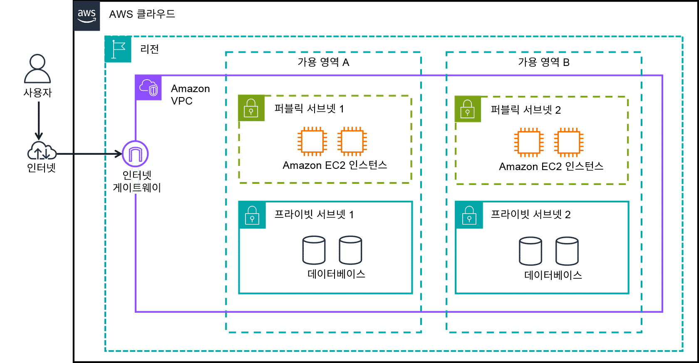
    <h5> 집중할 것은 네트워크의 이중화, 보안, 확장성</h5>
</div>

#### 1). Cloud > Region > Amazon VPC > AZ

<div align=center>
    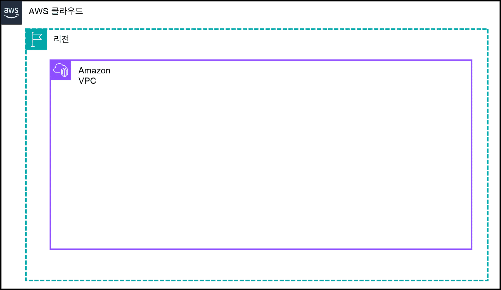
    <h5></h5>
</div>

##### ① Region

* 지리적 영역

##### ② VPC

* Cloud는 리소스를 배치하는 공간이다. 단지..

* **Public Cloud** : 구분없이 무분별 접근이 허용하는 인프라
* **Private Cloud** : 논리적 구분으로 리소스 접근 제어가 가능한 인프라 형성
    * AWS 내애세도 격리되어 논리적으로 분할된 **IP 네트워크**
      **서로 다른 특정 서브넷에 리소스를 배치하고 AWS 리소스의 프라이빗 IP 범위를 정의할 수 있음**


##### ③ AZ

* 서브넷과 AZ = 1 : 1 대응
* AZ는 1개 이상의 데이터 센터로 구성됨
* 이중화, 네티워킹, 상호 연결


#### 2). 횡단 교차, 프라이빗 서브넷

<div align=center>
    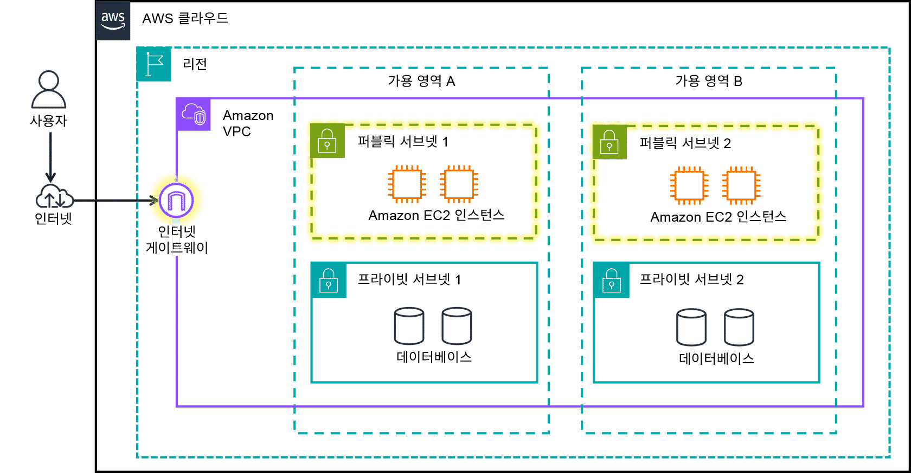
    <h5></h5>
</div>

##### ① 서브넷

<div align=center>
    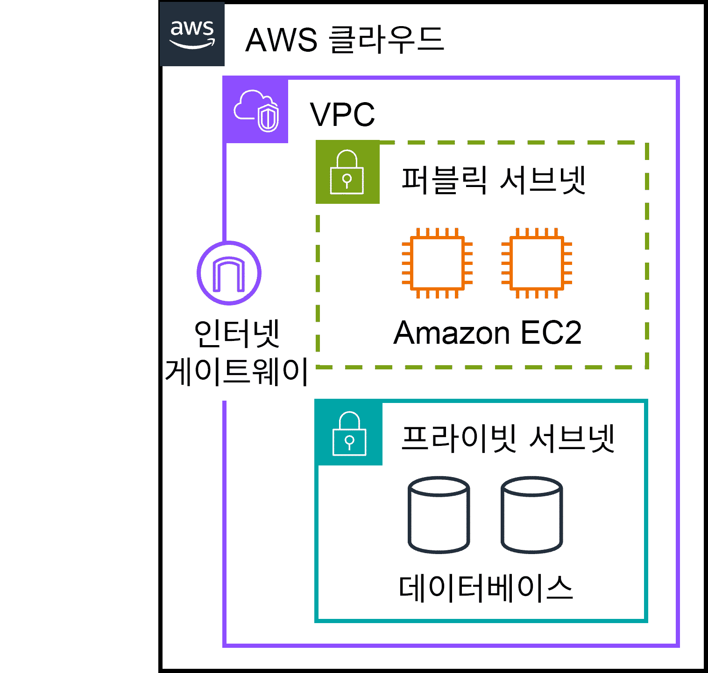
    <h5></h5>
</div>

* **서브넷 = 단일 AZ**
   * 서브넷은 반드시 **한 AZ에만** 속함. 라우트 테이블/ACL은 **서브넷 단위**로 적용.
* VPC라는 가정하에 쓰이는 분할된 IP 네트워크다.
  * VPC 내 격리된 리소스 배치 섹션을 서브넷으로 구성할 수 있다.
  * 여러 서브넷이 있지만서도, 한 AZ와 서브넷은 대응된다.

##### ② 프라이빗 서브넷

* 오직 프라이빗 네트워크를 통해서만 액세스할 수 있는 리소스
* 외부에서 직접 접속할 수 없고, 주로 애플리케이션/DB/내부 시스템 등 민감한 데이터를 처리하는 용도로 사용됨
* “격리된 네트워크 영역”일 뿐, 실제 트래픽 허용/차단은 보안 그룹·NACL 등 별도 정책으로 제어

##### ③ 퍼블릭 서브넷

<div align=center>
    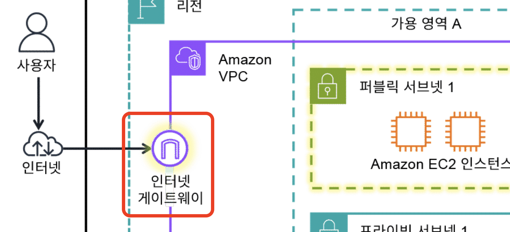
    <h5></h5>
</div>

* VPC 안에서 인터넷 게이트웨이(IGW)로 라우팅되어 인터넷과 직접 통신 가능한 서브넷
* 인터넷에서 접근 가능한 웹 서버·정적 파일 등 “공개용 리소스”를 두기 위한 영역
* 인터넷 액세스가 필요하지만, 다른 비공개 리소스와는 논리적으로 분리해 두기 위한 용도로 사용됨

---

> ### 📄 Gateway == 리소스 연결 기법

* 프라이빗 엑세스, 퍼블릭 엑세스

##### ① Internet Gateway 

<div align=center>
    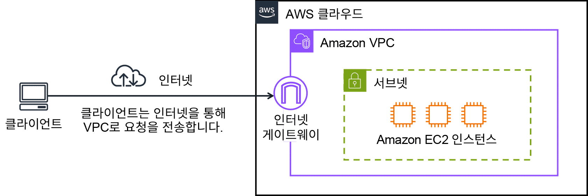
    <h5> 클라이언트 - 클라우드</h5>
</div>

* 퍼블릭 리소스만 포함된 VPC
* 퍼블릭 서브넷이 가능하려면 반드시 IG를 VPC에 붙여야 한다.
  * 이것이 바로 퍼블릭 리소스간 퍼블릭 연결 가능 여부를 나타낸다.
  * 퍼블릭 인터넷의 트래픽이 VPC로 들어오고, 나가는것을 허용

##### ② Virtual Private Gateway

<div align=center>
    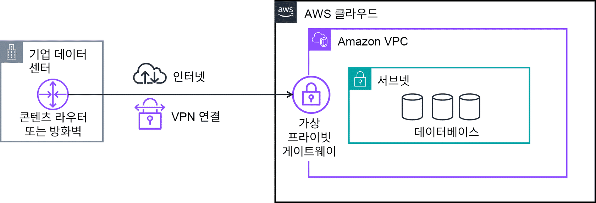
    <h5> 기업 - 클라우드 </h5>
</div>

* AWS 측의 가상 프라이빗 네트워크(VPN) 엔드포인트(클라이언트 입장에서 보이는 URL 진입점)입니다.
* 보호된 인터넷 트래픽이 VPC로 들어오도록 허용하는 구성 요소
* 프라이빗 내부 리소스간 VPN 연결 
    * 온프레미스 데이터 센터와 VPC간에 연결
    * 사내 프라이빗 네트워크로 VPC 간에 연결 생성
* 인터넷 게이트 웨이를 연결해서는 안됨

##### ③ AWS Transit Gateway

* VPC와 온프레미스 네트워크 연결
* 리전 간 피어링은 AWS Global Infrastructure를 사용하여 전송 게이트웨이를 서로 연결

##### ④ Network Address Translation(NAT) Gateway

* NAT Gateway
* 프라이빗 서브넷의 인스턴스에서 VPC 외부 서비스에 연결

##### ⑤ Amazon API Gateway

* API는 서로 다른 소프트웨어 시스템이 상호 작용하고 서로 통신할 수 있는 방법을 정의하는데.
* Amazon API Gateway는 API를 생성, 게시, 유지 관리, 모니터링, 보호하는 AWS 서비스
`Lambda`, `AWS Service API`, `Https Backend`, `EC2 Web API Server`

---

> ### 📄 클라우드 연결기법 != 리소스 연결

<div align=center>
    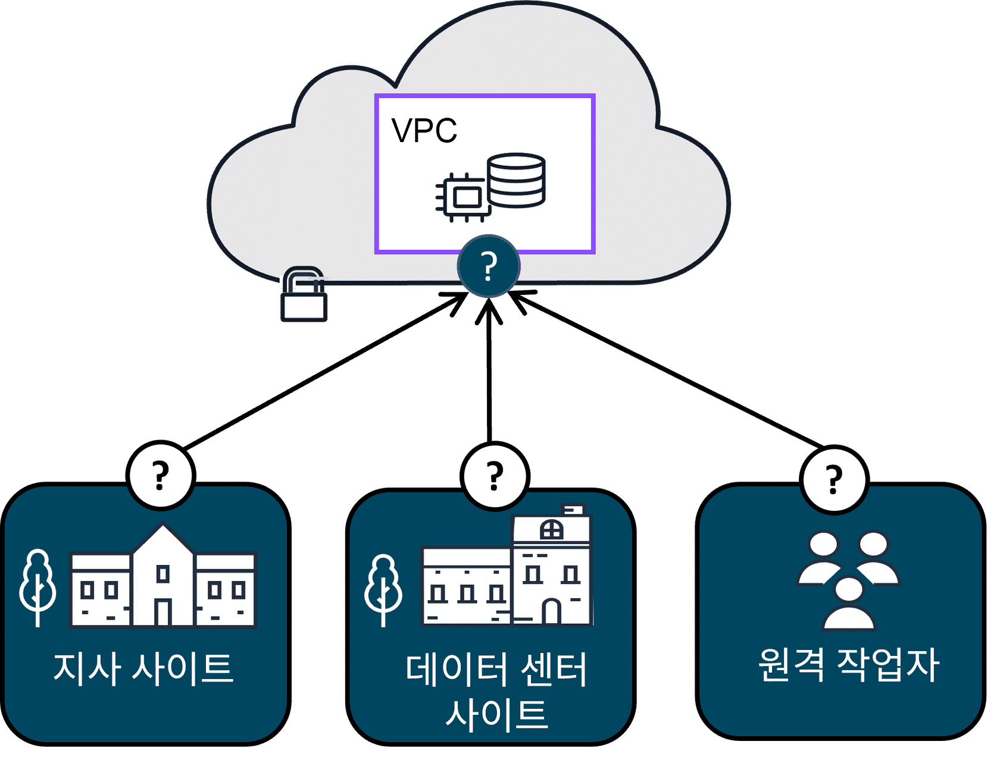
    <h5></h5>
</div>

#### AWS 클라우드의 네트워킹은 애플리케이션, 데이터 및 그 밖의 필요한 리소스를 호스팅하기 위해 함께 작동하는 인프라와 서비스라고 생각하면 됩니다.

#### VPN 

* 일반 대중이 게이트웨이를 통해 일반인이 트래픽이 이동시 
* 함부로 볼 수 없도록 암호화 시키고 보호된 트래픽으로 만드는 네트워크

#### 1). AWS Client VPN 
*  원격 작업자와 온프레미스 네트워크를 클라우드에 연결하는 데 사용할 수 있는 네트워킹 서비스입니다
#### 2). AWS Site-to-Site VPN
#### 3). AWS PrivateLink
#### 4). AWS Direct Connect

<div align=center>
    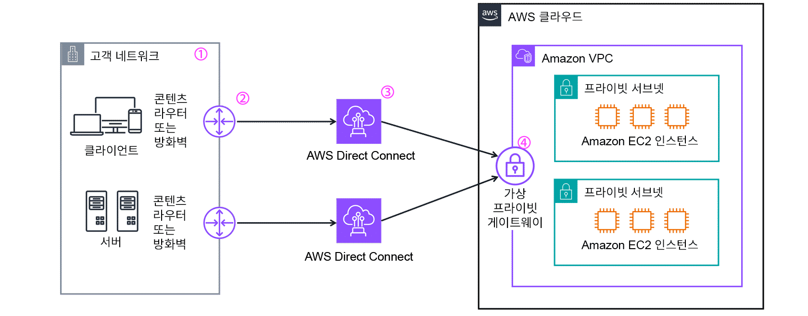
    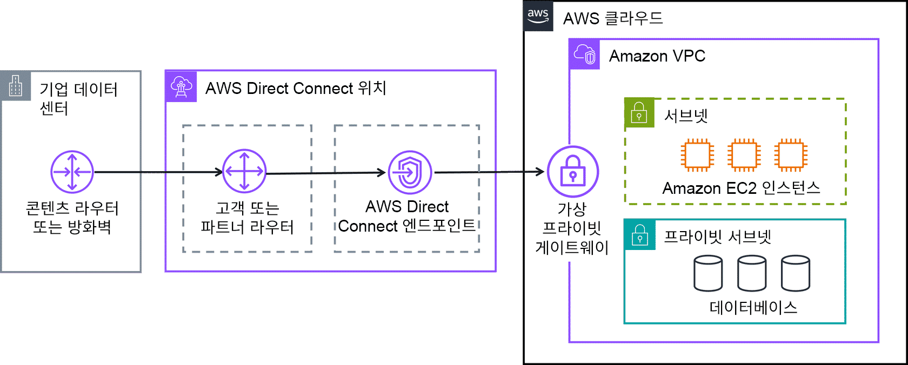
    <h5></h5>
</div>

* 온프레미스 네트워크에서 1개 이상의 Virtual Private Cloud(VPC)까지 
가상 프라이빗 게이트웨이 연결을 설정합니다. 
* 뿐만 아니라 대규모 데이터 전송 및 높은 대역폭 연결을 지원

```
1. 고객 네트워크 
    * 고객 네트워크 클라이언트와 서버에는 대규모 데이터 전송 및 
    중요한 애플리케이션 성능을 위해 안전한 고대역폭 연결이 필요합니다.
2. 콘텐츠 라우터 또는 방화벽 
    * 고객은 네트워크를 Direct Connect에 연결하는 콘텐츠 라우터 또는 방화벽을 보유하고 있습니다.
3. 다중 Direct Connect 연결 
    * 고객은 내결함성 외에도, 대역폭을 늘려야 했습니다. 다중 연결을 결합하여 집계 대역폭을 더 높일 수도 있습니다.
4. 가상 프라이빗 게이트웨이 
    * 클라이언트는 가상 프라이빗 게이트웨이를 사용하여 Amazon VPC의 프라이빗 리소스에 안전하게 액세스할 수 있습니다.
```

---

> ### 📄 VPC의 네트워크 트래픽

<div align=center>
    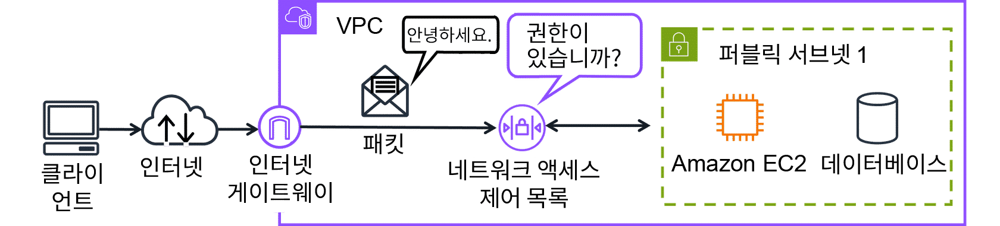
    <h5> 네트워크 전체로 전송되는 데이터 패킷의 이동 </h5>
</div>

```
1. VPC에 호스팅(리소스 배치)이 전제
2. 고객이 클라우드에 호스팅된 리스소를 요청
3. 요청은 패킷으로 전송되어 네트워크를 통해 라우팅
4. 인터넷 게이트웨이에 도착
5. VPC에 들어감
6. "트래픽 권한 검사 : ACL"
7. "리소스 권한 검사 : 보안 그룹"
8. 리소스 허용 또는 거부
```

#### 1). ACL (서브넷 트래픽 제어 혹은 패킷 권환 확인)

<div align=center>
    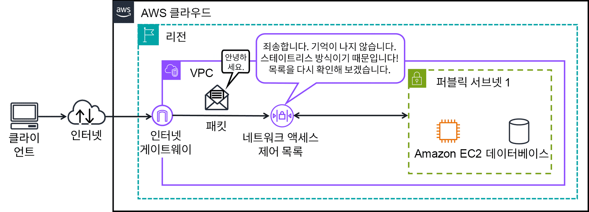
    <h5></h5>
</div>

* 서브넷 경계에서 왔다갔다.
* 서브넷 수준에서 인바운드 아웃바운드 트래픽 제어

#### 2). 보안 그룹 (리소스 수준 트래픽 제어) 

<div align=center>
    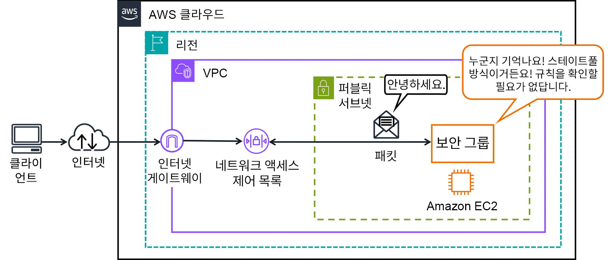
    <h5></h5>
</div>

* 서브넷 경계 통과 이후 거기 내에서 호스트(리소스) 경계 왔다갔다.
* 리소스 수준의 인바운드 아웃바운드 트래픽 제어