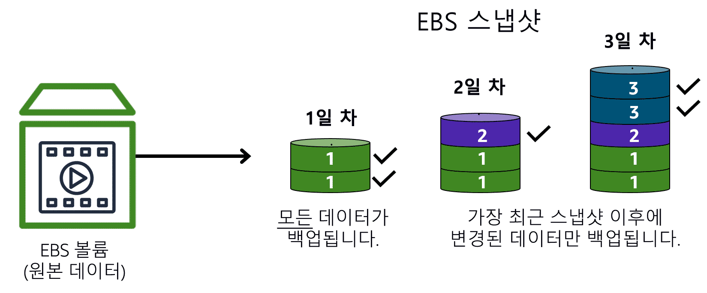

---

## 스토리지 및 데이터 베이스

---

#### 사전 지식
```
EBS VS EFS VS S3
* EBS : 단일 AZ EC2 인스턴스에서 사용할 수 있는 블록 수준 스토리지 볼륨을 제공하는 서비스입니다.
        EC2 생존에 따라 일시적으로만 존재하는게 아닌 영속적인 로컬 스토리지 확보
* S3 :  파일을 객체로 다루고, 스토리지를 버킷으로 다루는 스토리지
        HTTP RestAPI 사용으로 PUT, GET
* EFS : 단일 AZ가 아닌 여러 가용영역 
        거희 Region단위로 여러 EC2가 공유하는 파일 스토리지

RDS VS DynamoDB
* 관계형 데이터 베이스 VS 비관계형 데이터 베이스
```

#### 문제

```
1. EBS의 올바른 설명은?
   B. 단일 AZ에서 EC2에 블록 디바이스로 연결된다 ✅
2. 다음 중 S3의 특징은?
   C. 버킷/객체 모델의 객체 스토리지 ✅
3. EFS에 대한 설명으로 옳은 것은?
   B. 다수 인스턴스가 NFS로 동시 마운트 가능 ✅
4. 인스턴스 스토어의 적절한 사용처는? 🤔
   A. 트랜잭션 DB 데이터 파일
   B. 장기 보관 백업
   C. 캐시/스크래치 같은 재생성 가능 데이터 ✅
   D. 규제 데이터 아카이브
5. EBS 스냅샷에 대한 설명으로 옳은 것은?
   B. 증분 저장(변경 블록만) ✅
6. 다음 중 퍼블릭 인터넷 없이 S3에 사설로 접근하는 방법은? 
   B. VPC 엔드포인트(Gateway 라우트/Interface) ✅
   C. VGW ❌
7. RDS의 고객 책임 항목은?
   C. 스키마/쿼리/인덱스/접근제어 ✅
8. DynamoDB의 강점으로 가장 적절한 것은?
   B. 키 기반 단순 조회/대규모 확장/서버리스 ✅
9. 다음 중 S3 Standard-IA의 대표 사용처는?
   C. 드물게 접근하지만 즉시 복원이 필요한 데이터 ✅
10. EFS vs S3 비교로 옳은 것은?
    B. EFS는 NFS 파일시스템, S3는 객체 스토리지 ✅
11. EBS vs S3 적합성 매칭으로 옳은 것은?
    A. 80GB 동영상 소수 프레임 수정 ✅
12. Redshift의 주 목적은? 🤔
    C. 대용량 기록(과거) 데이터 BI/집계 분석 ✅
13. Redshift Spectrum을 바르게 설명한 것은? 🤔
    C. S3 데이터 레이크를 SQL로 직접 조회
    D. DynamoDB 전수 스캔 ❌
14. DMS 동종 마이그레이션의 예는? 🤔
    B. MySQL → RDS for MySQL ✅
15. DMS 이종 마이그레이션 시 필요한 추가 도구는? 🤔
    A. CloudFormation
    B. AWS Schema Conversion Tool(SCT) ✅
    C. DataSync
    D. Glue Crawler
16. 프라이빗 서브넷 인스턴스가 인터넷으로 나가려면? 🤔
    B. NAT 게이트웨이(퍼블릭 서브넷 상주) 경유 ✅
17. EFS One Zone의 올바른 이해는? 🤔
    A. 여러 리전 자동 복제 ❌
18. DynamoDB DAX의 목적은?
    B. 인메모리 캐시로 마이크로초급 읽기 가속 ✅
19. S3 버전관리의 이점은?
    B. 오버라이트/삭제 보호(이전 버전 보존) ✅
20. 다음 중 서비스–사용처 매칭으로 옳은 것은?
    B. EBS → 빈번한 임의 수정 파일 시스템 ✅

80GB 영상 파일을 자주 일부만 편집·저장하는 워크로드에 가장 적합한 서비스는?

    A. S3 
    B. EBS 
    C. EFS 
    D. Glacier

여러 AZ의 다수 EC2가 동시에 POSIX 파일시스템을 마운트해야 한다.

    A. S3 
    B. EBS 
    C. EFS 
    D. 인스턴스 스토어

전 세계 사용자에게 이미지·정적 파일을 URL로 제공, 무제한 규모가 필요하다.

    A. EBS 
    B. S3 
    C. EFS 
    D. RDS

완전관리형 관계형 DB로 백업·패치·장애조치를 AWS가 담당하는 서비스는?

    A. DynamoDB 
    B. RDS 
    C. Redshift 
    D. ElastiCache

RDS에서 고객 책임에 해당하는 것은?

    A. DB 엔진 패치 
    B. 호스트 OS 패치 
    C. 스키마/쿼리/접근정책 
    D. 스토리지 내구성 보장

드물게 접근하지만 즉시 복원 필요, 저장비용을 낮추고 싶은 데이터 클래스는?

    A. S3 Standard 
    B. S3 Standard-IA 
    C. S3 Glacier Deep Archive 
    D. S3 One Zone-IA(단일 AZ)

EBS 스냅샷의 특징으로 옳은 것은?

    A. 항상 전체 복사 
    B. 증분 저장(변경 블록만) 
    C. 파일 단위 버전 
    D. 복구 불가

S3 버전관리의 주 이점은?

    A. 쓰기 지연 감소 
    B. 트랜잭션 보장 
    C. 실수로 덮어쓰기/삭제 시 이전 버전 보존 
    D. 자동 암호화 의무화

빅데이터 기록(과거) 분석용, 페타바이트 규모 집계 SQL에 적합한 서비스는?

    A. RDS 
    B. DynamoDB 
    C. Redshift 
    D. EFS

Redshift Spectrum을 올바르게 설명한 것은?

    A. DynamoDB를 직접 조인 
    B. RDS 읽기 전용 복제본 생성

    C. S3 데이터 레이크를 SQL로 직접 조회 
    D. ALB 로그 자동 파싱

DMS 이종 마이그레이션에 필요한 추가 도구는?

    A. Glue Crawler 
    B. AWS Schema Conversion Tool(SCT) 
    C. DataSync 
    D. Snowball

DMS의 **지속 복제(CDC)**를 사용하면 얻는 효과는?

    A. 암호화 키 자동 순환 
    B. 다운타임 최소화(라이브 마이그레이션) 
    C. 비용 예측 
    D. 자동 샤딩

퍼블릭 인터넷 없이 프라이빗 서브넷→S3로 사설 접근하려면?

    A. NAT Gateway 
    B. VGW 
    C. DX 전용회선만 
    D. VPC 엔드포인트

EFS vs S3 비교로 옳은 것은?

    A. EFS=객체, S3=NFS 
    B. EFS=NFS 파일시스템 / S3=객체 스토리지

    C. 둘 다 파일 잠금 지원 동일 
    D. 둘 다 퍼블릭 인터넷 전용

DynamoDB DAX의 목적은?

    A. 쓰기 스루풋 증가(항상 일관) 
    B. 인메모리 캐시로 읽기 지연을 μs급으로 
    C. 글로벌 테이블 대체 
    D. 파티션 자동 합병

ElastiCache(Redis/Memcached)의 주 사용 목적은?

    A. 객체 저장 
    B. 읽기 지연 단축·DB 부하 완화(캐시 계층) 
    C. 스냅샷 보관 
    D. 데이터 영구 아카이브

인스턴스 스토어의 적합한 사용처는?

    A. 규제 데이터 
    B. 장기 백업 
    C. 임시 캐시/스크래치(휘발 OK) 
    D. 중요 트랜잭션 로그

EBS와 EFS 가용성 범위 비교로 옳은 것은?

    A. EBS 볼륨은 AZ 범위, EFS는 리전(다중 AZ) 
    B. 둘 다 리전

    C. 둘 다 AZ 
    D. EFS만 온프레미스 전용

S3 수명주기 정책으로 Glacier 계열로 전환할 때의 일반적 트레이드오프는?

    A. 저장비↑, 복원지연↓ 
    B. 저장비↑, 복원지연↑

    C. 저장비↓, 복원지연↑ 
    D. 저장비↓, 복원지연↓

Aurora에 대한 설명으로 옳은 것은?

    A. NoSQL 
    B. MySQL/PostgreSQL 호환, 고가용성 관리형 RDB 
    C. 서버리스 캐시 
    D. 데이터 웨어하우스
```

```
B C B B C B B C C C B B D B B B C A C B
```

> ### 📄 사전 지식

#### 1). 블록 : 블록 스토리지에서 데이터를 저장하는 단위

##### ① 블럭 주소 지정
* 파일을 동일 크기 블록으로 분할하고 각 블록을 고유 식별자로 접근. 
* 파일시스템 메타데이터가 아닌 블록 ID 중심으로 I/O가 일어난다. 
* 메타데이터가 제한적이라 전송 오버헤드가 작고 지연이 짧다
##### ② 블럭 읽기/쓰기 동작
* 블록 단위로 저장되고, 수정된다. 
* 변경 시 전체 파일이 아니라 해당 블록만 갱신.
* 이렇게 블럭 단위로 갱신함으로, 임의 접근과 잦은 수정에 유리.

#### 2). 적합 워크로드

* 트랜젝션, 미션 크리티컬에 적합하여 DB(관계형, 시계열), 하이퍼 바이저 파일 시스템

#### 3). 파일 스토리지

* 여러 클라이언트 (사용자, 애플리케이션, 서버)가 공유 파일 폴더에 저장된 데이터를 액세스할 수 있다.
* 여러 인스턴스가 EFS의 데이터에 동시 액세스가 가능하다.
* 많은 수의 서비스 및 리소스가 각 클라이언트마다 중복 저장되는게 아니라,
동일한 데이터에 액세스해야 하는 사례에서 이상적이다.

#### 4). RDBMS

##### 데이터를 다른 데이터 조각과 관련 짓는 방식으로 저장한다는 뜻이죠.
* 공통 속성을 이용해 두 테이블을 관련지으며 두 테이블에 보관된 데이터를 쿼리할 수도 있습니다.
* 관계형 데이터베이스는 정형 쿼리 언어(SQL)를 사용하여 데이터를 저장하고 쿼리합니다. 
* 데이터 모델 : 스키마를 엄격하게 정의하여 하나의 "행튜레"에 수많은 "CoFiAtt"
  상황에 따라 데이터 유형을 변경해야할 수도 있음.


#### 5). NO-SQL

* 데이터 모델 : 매우 유연하게 정의, 행과 열이 아닌 "키"와 "JsonValue"
* SQL 쿼리를 실행할 필요가 없다 다만, 파티셔닝(샤딩)과 같은 방식으로 같은 테이블을 분리 가능

#### 6). RDS VS SQL

| / | RDS | NoSQL |
|---|---|---|
|데이터 모델 | 관계형 테이블, 스키마, 조인에 최적 | 키-값 문서 중심, 조인 없음, 단순 조회에 최적|
|스키마 | 엄격한 정의 (정규화, 제약) | 스키마 리스(아이템 중심) |
| 대표 사용 사례 | 판매/공급망 관리, 복잡 조인 분석 | 직원 연락처/아이디 등 단일 테이블 룩업 |

----

> ### 📄 인스턴스 스토어 및 Amazon Elastic Block Store(Amazon EBS)

#### 스토리지 액세스를 집중적으로 보자.

#### 1). 인스턴스 스토어

<div align=center>
    
    
    
    <h5>
        <ol>
            <li>인스턴스 스토어가 연결된 Amazon EC2 인스턴스가 실행 중입니다.</li>
            <li>만약 인스턴스가 중지 또는 종료된다면..</li>
            <li>연결된 인스턴스 스토어에서 모든 데이터가 삭제됩니다.</li>
        </ol>
    </h5>
</div>

#### Amazon EC2의 임시(휘발) 블록 수준 스토리지
* EC2 인스턴스와 직접 연결된 디스크로, 인스턴스와 수명이 동일한 임시 디스크 스토리지.

##### ① 용도
* 인스턴스 수명에 따라 데이터 소멸되는 임시 파일, 캐시, 스크래치, 재생성 가능한 데이터.
* 영속 보관 금지. 장애·재배치 시 복구 불가, 휘발성. 내구성 보장 없음.
* Elastic Block Store로 작은 편집을 다수 수행하는 것이 완벽한 사용 사례입니다. 
만일 S3를 사용한다면 변경 사항을 저장할 때마다 시스템에 80GB 전체를 업로드해야만 합니다.

##### ② 장점
* 매우 낮은 지연, 높은 IOPS/스루풋(로컬).

#### 2). Amazon Elastic Block Store(Amazon EBS)

<div align=center>
    
    <h5></h5>
</div>

#### 인스턴스 스토어와 다르게 인스턴스 중지·재시작·재부팅과 무관하게 데이터 유지.
* EC2 인스턴스의 호스트 컴퓨터에서 드라이브를 분리

##### ① 용도 : 스토리지 볼륨 제공

1. 보존이 필요한 데이터에 적합하다.
2. 보안 : 인스턴스 <-> EBS경로에서도 암호화가 적용된다.
3. 장애 극복, 영속성, 가용성
    
##### ② 생성

* EBS 스토리지 볼륨도 프로비저닝이 가능하다.

##### ③ 스냅샷

<div align=center>
    
    <h5>EBS 스냅샷은 시점 복사이며, 변경 블록만 보관한다.</h5>
</div>

1. **복구** : 스냅샷으로 복구를 하거나,  형상관리의 기본 단위가 된다.
    백업에서는 가장 최근의 스냅샷 이후 변경된 데이터 블록만 저장됨 
2. **가용성** : AZ 단위, 단 리전에 복사하려면 스냅샷으로 복제해야 한다.

---

> ### 📄 Amazon Simple Storage Service(Amazon S3)

####  S3는 스토리지 서비스입니다.

* **"평소 파일이 파일 디렉토리에"** 저장되듯 **"S3는 객체를 버킷이라는 곳에 저장한다"**
  * 파일 -> 객체 (업로드 가능 최대 크기는 5TB)
  * 디렉토리 -> 버킷
* 객체는 버젼이라는 태그가 있어서, 자체적으로 버젼 관리가 가능하다.
* 일레븐 나인 내구성 
    내구성이 99.999... 라는 의미다. 온전히 유지될 확률이 굉장히 높다는 의미고,
    AZ덕분에 HA 설계가 뛰어나다.
* 단, EBS와 다르게 일부 객체가 변경될 때마다 전체 파일을 다시 업로드해야 합니다.

#### ). 객체 스토리지.


* 키 : 식별자
* 데이터 : 이미지, 동영상, XML, 정적 웹 정보
* 메타데이터 : 데이터의 내용, 사용 방법, 객체 크기에 대한 정보,

#### ). 스토리지 클래스 와 비용

##### ① S3 Standard

* 자주 액세스하는 데이터용으로 설계
* 최소 3개의 가용 영역에 데이터를 저장
* 정적 웹, 콘텐츠 배포, 데이터 분석에 적합

##### ② S3 Standard-Infrequent Access (S3 Standard-IA)

* 자주 액세스 하지는 않지만 필요한 경우 즉시 사용할 수 있어야 합니다.
* 검색 가격은 Standard에 비해 높지만, 스토리지 자체 저장은 더 저렴
* 백업, 재해 복구를 위한 파일, 장기보관이 필요한 객체에 안성맞춤

##### ③ S3 Glacier Flexible Retrieval

* 아카이브 데이터에 최적화 된 스토리지 클래스
* 매우 저비용 스토리지로, 단, 생명 주기 정책을 사용하여 제한시간이 있음
* 데이터 구성 생성, 데이터 이동 작업 자동화

---

> ### 📄 "Amazon EBS(Elastic Block Store)" VS "Amazon S3"

아래 비교표는 제공 문장을 바탕으로 핵심만 압축했습니다.

| 항목           | **Amazon EBS (Elastic Block Store)**        | **Amazon S3 (Simple Storage Service)**          |
| ------------ | ------------------------------------------- | ----------------------------------------------- |
| 스토리지 유형      | **블록 스토리지**                                 | **객체 스토리지**                                     |
| 단일 단위 크기     | **볼륨당 최대 16 TiB**                           | **객체당 최대 5 TB(≈5,000 GB)**                      |
| 총 용량 확장성     | 인스턴스에 볼륨 여러 개 연결해 확장(볼륨 단위)                 | **사실상 무제한**(버킷/객체로 수평 확장)                       |
| 연결/접근        | **EC2에 블록 디바이스로 연결** 후 파일시스템 마운트            | **HTTP(S) URL**로 직접 접근, 권한 제어                   |
| 업데이트/수정      | **블록 단위 증분 갱신**(부분 변경만 기록)                  | **객체 단위 재업로드**(부분 수정 시도해도 전체 업로드 필요)            |
| 내구성/분산       | (문서 기준) 인스턴스 종료 후에도 볼륨 **지속**               | **11-9s(99.999999999%) 내구성**, **리전 내 다중 AZ 분산** |
| 서버 의존성       | **EC2 필요**                                  | **서버리스**(EC2 없이 사용 가능)                          |
| 대표 사용 사례     | 대용량 파일 **자주 편집/부분 수정**(예: 80 GB 영상 다수 컷 편집) | 대규모 **정적 콘텐츠 저장/배포**(이미지 수백만 장, 동시 조회)          |
| 비용 관점(문서 맥락) | 잦은 수정 워크로드에 적합(객체 전체 재업로드 비용 회피)            | 동일 로드 대비 **비용 효율↑**(대량 저장/배포), 백업 부담 완화         |
| 백업/보호        | 스냅샷 등 별도 전략 설계 필요                           | **S3 자체가 백업 전략에 가까움**(고내구성/다중 AZ)               |

---

> ### 📄 Amazon Elastic File System(Amazon EFS)

#### 파일 스토리지 (공유되는 파일 시스템)

#### EBS와 비교

##### ① 공통점

* 부분 업데이트 가능 : 블럭단위 업데이터임.
* 하드웨어로 연결된 보조 저장 장치와 같은 수준의 IO를 제공한다는점에서 S3 보다 빠르다.
* 파일 시스템의 크기는 자동 확장이 된다.

##### ② 차이점

* EBS는 단일 AZ수준 범위의 리소스라, EC2 인스턴스와 EBS 볼륨 모두 동일한 가용 영역에 상주해야함.
* EFS는 리전별 서비스라, 한 리전의 모든 가용 영역에서 동시에 데이터에 액세스할 수 있다.
  온프레미스 서버는 AWS Direct Connect를 사용하여 Amazon EFS에 액세스할 수 있습니다.

#### S3와 비교

* EFS NFS 파일 스토리지 기반이다 | S3는 객체 스토리지(키-값 버킷/객체)
* EFS 접근 프로토콜은 NFS | S3는 HTTPS S3 API (PUT, GET)
* 저지연 | 대역폭이 매우 큼 상대적 지연 높음

---

> ### 📄 Amazon Relational Database Service(Amazon RDS)

####  AWS 클라우드에서 관계형 데이터베이스를 실행할 수 있는 서비스

* 리프트 앤 시프트라는 작업을 수행해 
* 온프레미스의 환경에서와 동일한 컴퓨팅 자원을 제공하는 EC2 인스턴스 위에서 
혹은 AWS Lambda와 같은 서버리스 애플리케이션에서도 통합 가능하다. 
* 데이터 베이스 마이그레이션이 가능하다.

#### Amazon RDS 장점
* 패치 적용, 백업, 이중화, 장애 조치, 재해 복구 자동 진행

#### Amazon Aurora
* MySQL과 PostgreSQL 같은 Amazon RDBMS
* 워크로드에 고가용성이 필요한 경우 Amazon Aurora를 고려하십시오.

---

> ### 📄 DynamoDB (No SQL DB)

#### Amazon DynamoDB는 키-값 데이터베이스 서비스
* 모든 규모에서 한 자릿수 밀리초의 성능을 제공합니다.
* 반드시 서버리스 컴퓨팅에서 운영된다.

#### 1). 서버리스

* 서버를 프로비저닝, 패치적용이나 관리가 젼혀 필요하지 않다.
* 소프트웨어 설치, 유지관리도 전혀 필요가 없다

#### 2). Auto Scaling

* DB의 크기가 축소되거나 확장되면,
용량 변화에 맞춰 DynamoDB의 크기를 자동 조절하면서
일관된 성능을 유지한다.

> ### 📄 Amazon RedShift

#### 빅 데이터 분석 :  대용량(수 PB) 기록(과거) 데이터에 대해 BI/분석용 SQL 쿼리를 빠르게 실행하도록 최적화.

* 여러 원본에서 데이터를 수집하여 데이터 간의 관계 및 추세를 파악하는 데 도움이 되는 기능을 제공합니다.

#### 장점 
* 운영 DB(OLTP)는 실시간 읽기/쓰기 성능을 위해 용량·스키마 측면에서 제약/비효율 발생.
* 관계형 DB가 다원 데이터·초대용량·복잡 집계를 장기간 처리하기엔 비용/운영 부담이 큼.
* Redshift는 이 기록 분석 전용 워크로드에 맞게 설계되어 전통 DB 대비 최대 10배 수준의 성능(문맥상)과 운영 단순화를 제공.

#### 예시 
* 기록(과거) 분석: "지난 1시간/지난 분기 매출을 보여줘" 같은 집계·리포팅.
* 대규모·다양한 데이터를 단일 분석 허브에서 처리(운영 트랜잭션 DB의 범위를 넘어섬).

> ### 📄 AWS Database Migration Service

#### 기존 DB를 AWS로 안전하게 이전(또는 복제)하면서 다운타임을 최소화하는 마이그레이션/복제 서비스.

* 관계형 데이터베이스, 비관계형 데이터베이스 및 기타 유형의 데이터 저장소를 마이그레이션 가능.
* 원본 DB를 계속 운영한 채로 데이터를 대상 DB로 이전(중단 최소화).
* 엔진이 같아도/달라도 마이그레이션 가능(동종/이종).

| 유형     | 설명                                                                                 | 추가 도구                                              |
| ------ | ---------------------------------------------------------------------------------- | -------------------------------------------------- |
| **동종** | 예: MySQL → RDS for MySQL, SQL Server → RDS for SQL Server, Oracle → RDS for Oracle | 별도 변환 불필요(스키마/코드 호환)                               |
| **이종** | 원본·대상 **엔진/스키마/코드가 다름**                                                            | **AWS SCT**로 스키마·저장 프로시저 등 **사전 변환** → DMS로 데이터 이관 |

#### 소스/대상 위치
* 원본: 온프레미스, EC2의 자체 DB, RDS
* 대상: EC2의 DB, RDS

#### 예시

* 본(Prod) → 개발/테스트 환경 데이터 이관(1회 또는 연속)
* 여러 DB의 통합(Consolidation)
* 연속 복제(라이브 마이그레이션): 마이그레이션 시간·데이터 손실 최소화

----

> ### 📄 캐싱 솔루션

#### 1). Amazon ElastiCache
* 자주 사용되는 요청의 읽기 시간을 향상시키기 위해 데이터베이스 위에 캐싱 계층을 추가하는 서비스입니다.
* 이 서비스는 두 가지 데이터 스토어 Redis 및 Memcached를 지원합니다.

#### 2). Amazon DynamoDB Accelerator
* DynamoDB용 인 메모리 캐시입니다. 
* 응답 시간을 한 자릿수 밀리초에서 마이크로초까지 향상시킬 수 있습니다.