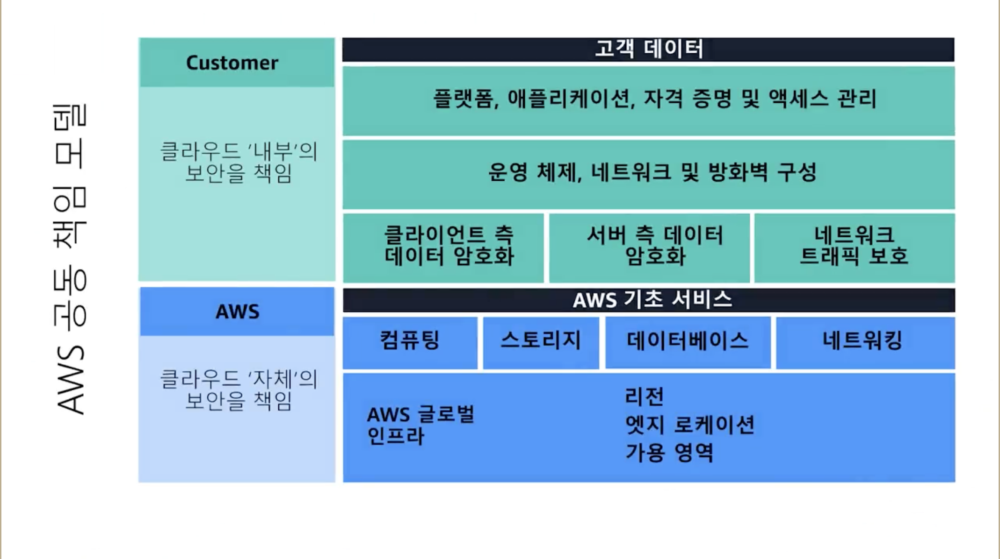
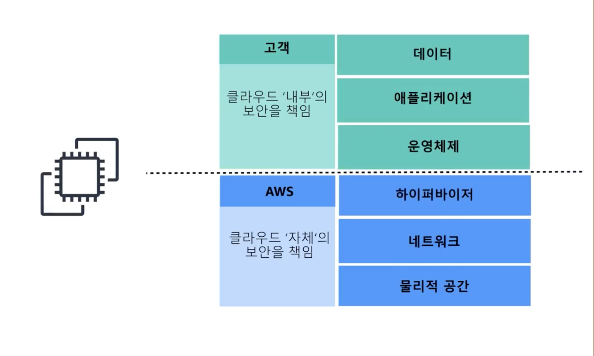
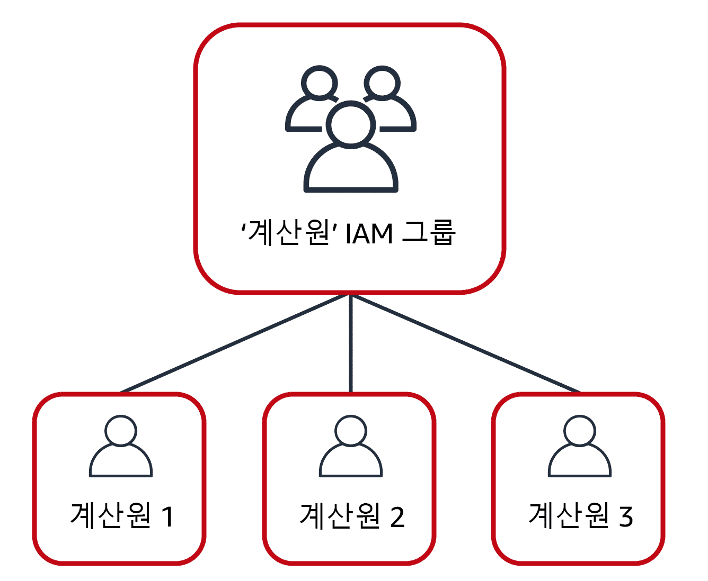
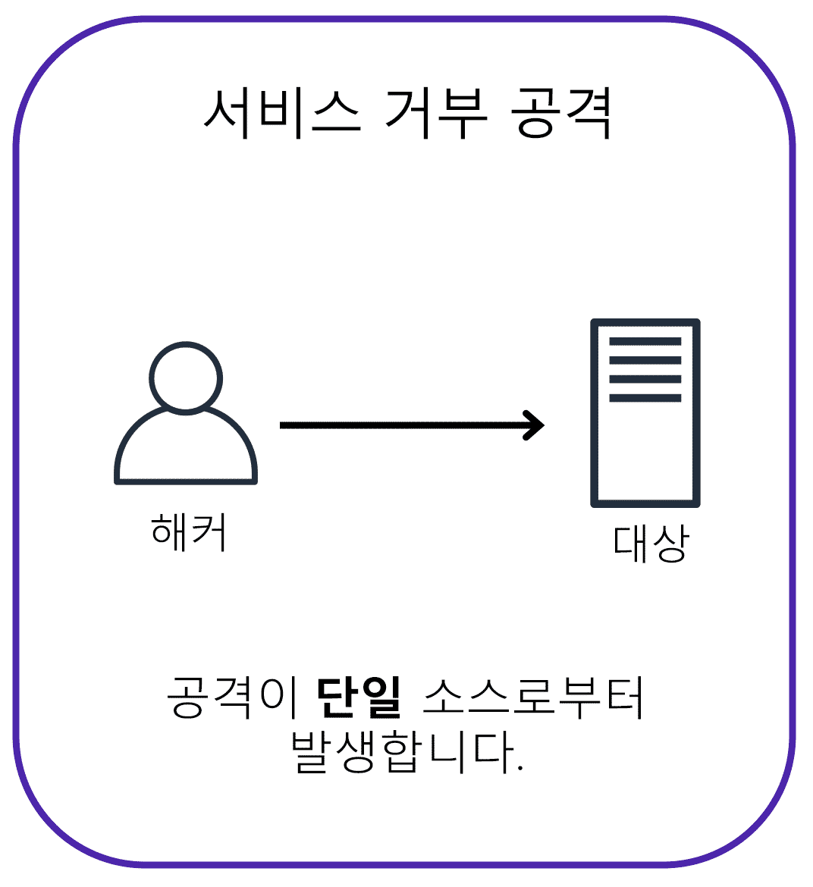
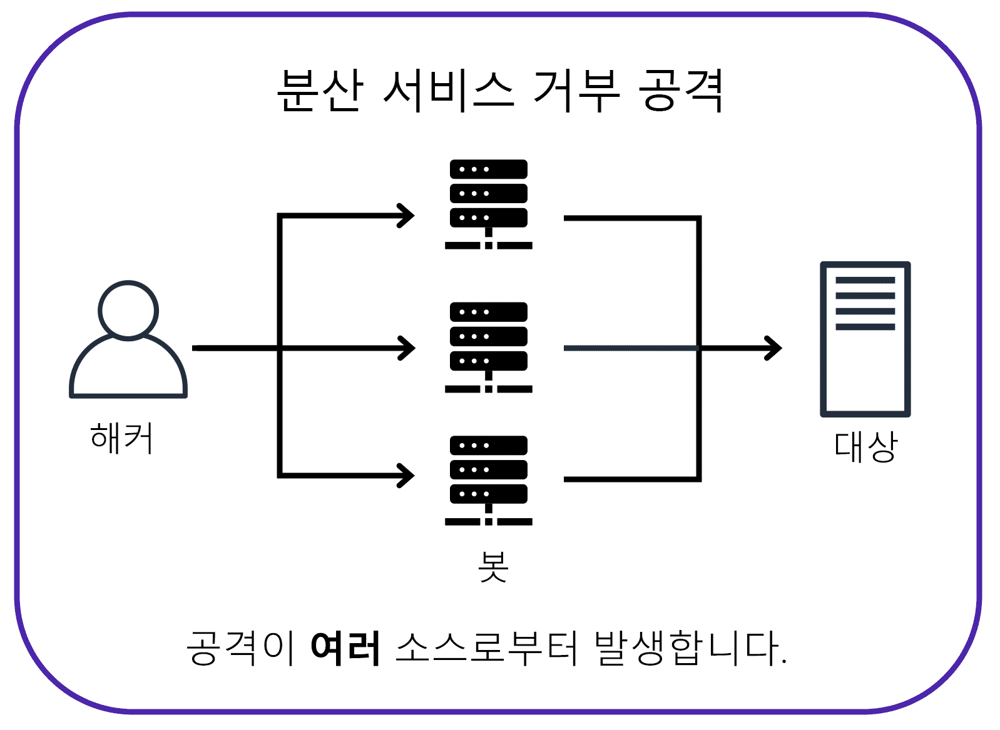
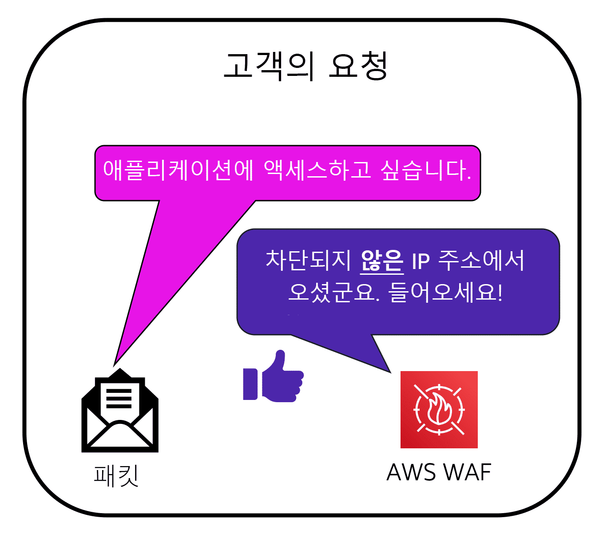
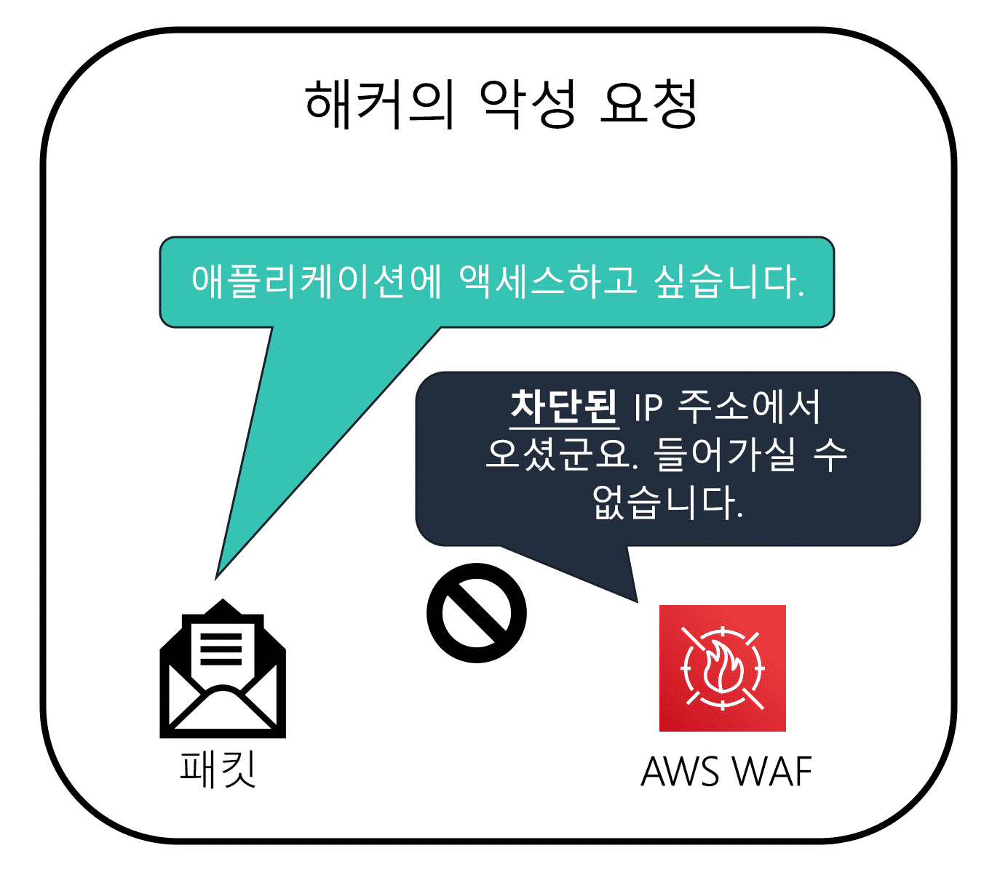

---

## Module 6

---

#### 클라우드 내부 보안을 관리해보자.

**AWS는 집을 튼튼히 짓고(인프라)**<br> **문을 잠그고 열쇠를 관리하는 건 고객(구성,데이터)** 입니다.

```
* 공동 책임 모델의 이점을 설명할 수 있습니다.
  AWS는 클라우드 자체의 보안을 책임지고 고객은 클라우드 내부의 보안을 책임집니다
* AWS Identity and Access Management(IAM) 보안 수준을 구별할 수 있습니다.
  * 최소 권한 IAM : (MFA, 액세스키 순환, 루트 사용 금지)
    IAM에는 사용자, 그룹, 역할, 정책이 있습니다. 
    사용자는 사용자 이름과 암호를 사용하고 기본적으로 아무런 권한이 없습니다.
    그리고 그룹은 사용자의 모음이죠. 
* 다중 인증(MFA)을 설명할 수 있습니다.
  루트 사용자의 경우 기본적으로 모든 권한을 가지고 제한할 수 없기 때문에
* AWS Organizations의 주요 이점을 설명할 수 있습니다.
  AWS 계정을 여러 개 가지고 계실 텐데요. 
  일반적으로 계정은 워크로드, 환경, 팀 또는 애플리케이션끼리 격리하는 데 사용됩니다.
* 보안 정책을 기본 수준에서 설명할 수 있습니다.
* AWS를 사용한 규정 준수의 이점을 요약할 수 있습니다.
  AWS Artifact를 사용해서 규정 준수 문서에 액세스하실 수도 있죠
* 추가 AWS 보안 서비스를 기본 수준에서 설명할 수 있습니다.
  ELB, 보안 그룹, AWS Shield, AWS WAF
```

```
공유 책임 모델에서 옳은 것은? 
C. AWS=클라우드 ‘자체’ 보안, 고객=클라우드 ‘내부’ 보안 ✅

EC2에서 게스트 OS 패치 책임은?
B. 고객 ✅

RDS에서 DB 엔진 패치 책임은?
A. AWS ✅

S3 버킷 공개/정책 책임은?
B. 고객 ✅

IAM 평가 로직으로 옳은 것은?
B. 기본 거부, Allow가 허용, ‘명시 Deny’가 최우선 ✅

루트 사용자 모범 사용은?
B. MFA 필수, 결제/계정 작업 등 최소 사용 ✅

IAM 사용자 vs 역할(Role) 올바른 설명은?
B. 역할은 STS 임시 자격증명, 사용자/서비스/외부 주체가 ‘가정’ ✅

그룹 사용의 장점은?
B. 정책을 그룹에 부여해 구성원에게 일괄 적용 ✅

다음 정책 의미로 옳은 것은? Effect:Allow, Action:s3:ListBucket, Resource: 특정 버킷
B. 해당 버킷 ‘목록’만 허용, 나머지는 기본 거부 ✅

MFA의 목적은?
B. 로그인에 2차 인증 추가로 계정 탈취 방지 ✅

**SCP(Service Control Policies)**의 기능은?
B. 계정/OU의 ‘최대 권한 상한’(가드레일) 설정 ✅

SCP 적용 범위로 옳은 것은? ❌
A. Member 계정(루트 포함)과 OU/Root에 적용, Management 계정엔 미적용 ✅
B. 모든 계정 무조건 적용
C. 리소스 정책에만 적용
D. 리전에만 적용

Consolidated Billing only 모드에서 불가한 것은? ❌
A. 통합 청구 
B. 비용 가시화
C. SCP 사용 ✅
D. 볼륨 할인 공유

AWS Artifact는 무엇을 제공?
B. 감사 보고서(SOC/ISO/PCI)와 계약(BAA 등) 포털 ✅

Artifact Agreements vs Reports 구분은?
D. Agreements=계약 수락/관리, Reports=감사 보고서 다운로드 ✅

AWS WAF는 어느 계층 방어?
B. L7(HTTP/S) 규칙·레이트 기반 필터링 ✅

AWS Shield Standard vs Advanced 옳은 비교는?
C. Standard=기본·무료 완화, Advanced=유료·DRT·비용보호·심층 텔레메트리 ✅

보안 그룹과 NACL의 차이로 옳은 것은?
B. SG=상태저장 허용목록, NACL=무상태 허용/거부 ✅

KMS에서 고객 책임은?
B. 키 정책/권한/회전/사용 결정(암호화 적용 선택) ✅

**CloudTrail(조직 트레일)**의 목적은? ❌
A. 성능 모니터링
B. 방화벽
C. 계정/조직의 API 활동 로깅·감사 가시성 제공 ✅
D. 규정 준수 자동 통과

공유 책임 모델의 올바른 설명은?

    A. 전부 AWS 책임 
    B. 전부 고객 책임 
    C. AWS=클라우드 ‘자체’, 고객=클라우드 ‘내부’ 
    D. 벤더 공동 운영

EC2에서 게스트 OS 패치 책임은?

    A. AWS 
    B. 고객 
    C. 공동 
    D. 없음

RDS에서 DB 엔진 패치 책임은?

    A. AWS 
    B. 고객 
    C. 공동 
    D. 없음

S3 버킷 공개 여부/정책 책임은?

    A. AWS 
    B. 고객 
    C. 공동 
    D. 없음

IAM 정책 평가 로직으로 옳은 것은?

    A. Allow 우선 
    B. 기본 거부, Allow 허용, 명시 Deny 최우선 
    C. Deny 무시 
    D. 리전 우선

루트 사용자 모범 사용은?

    A. 일상 운영에 사용 
    B. MFA 필수·최소 사용(결제/계정설정만) 
    C. 액세스 키 발급 
    D. 다계정 공유

IAM 사용자 vs 역할(Role) 차이로 옳은 것은?

    A. 둘 다 상시 자격 
    B. 역할은 STS 임시 자격·가정(Assume) 
    C. 역할은 사람만 
    D. 사용자는 임시만

그룹 사용의 장점은?

    A. 사용자별 정책 반복 
    B. 정책을 그룹에 부여해 일괄 적용(관리 단순화) 
    C. 루트 대체 
    D. OU 대체

아래 정책의 의미는? Effect:Allow, Action:s3:ListBucket, Resource: 특정 버킷

    A. 모든 S3 작업 허용 
    B. 해당 버킷 ‘목록’만 허용 
    C. 객체 쓰기 허용 
    D. 콘솔 로그인 허용

MFA의 주 목적은?

    A. 네트워크 가속 
    B. 2차 인증으로 계정 탈취 방지 
    C. 비용 절감 
    D. 리전 잠금

**SCP(Service Control Policies)**의 기능은?

    A. 계정에 권한 부여 
    B. 최대 권한 상한(가드레일) 설정 
    C. 비용 보고 
    D. 로깅

SCP 적용 범위로 옳은 것은?

    A. Member 계정(루트 포함)·OU/Root에 적용, Management 계정엔 미적용
    B. 모든 계정 강제 
    C. 리소스 정책만 
    D. 리전만

Consolidated Billing only 모드에서 불가한 것은?

    A. 통합 청구 
    B. 비용 가시화 
    C. SCP 사용 
    D. 볼륨 할인 공유

AWS Artifact가 제공하는 것은?

    A. 자동 컴플라이언스 패스 
    B. 감사 보고서(SOC/ISO/PCI) & 계약(BAA 등) 포털
    C. 실시간 IDS 
    D. 자동 시정조치

Artifact Agreements vs Reports 구분은?

    A. 둘 다 보고서 
    B. 둘 다 계약 
    C. 반대 
    D. Agreements=계약 수락/관리, Reports=감사 보고서 다운로드

보안 그룹(SG) vs NACL로 옳은 것은?

    A. SG 무상태 
    B. SG=상태저장 허용목록 / NACL=무상태 허용·거부 
    C. 둘 다 인스턴스 단위 
    D. 둘 다 거부 불가

AWS WAF는 어느 계층을 보호?

    A. L3/4만 
    B. L7(HTTP/S) 규칙·레이트기반 필터링 
    C. 데이터베이스 
    D. OS

AWS Shield Standard vs Advanced 비교로 옳은 것은?

    A. 둘 다 유료 
    B. 둘 다 무료 
    C. Standard=기본·무료, Advanced=유료·심층가시성/DRT/비용보호 
    D. Advanced=온프레 전용

KMS에서 고객 책임은?

    A. HSM 물리 보안 
    B. 키 정책/권한/회전·사용 결정(암호화 적용 선택) 
    C. 리전 전력 
    D. 하이퍼바이저 패치

**CloudTrail(조직 트레일)**의 목적은?

    A. 성능 모니터링 
    B. 방화벽 
    C. 계정·조직의 API 활동 로깅/감사 가시성 
    D. 자동 합격증 발급
```

```
C B A B B B B B B B B A C B D B B C B C
```

---

> ### 📄 시스템 검사

#### Authentication

* 인증은 사용자의 이름과 비밀번호로 로그인 하는 행위와 같이 신원을 확인하는 과정이다.

#### Authorization

* 고객의 권한(허용되는 행동)인지 검증, 액세스나 사용 권한 부여
* 예를들어 시스템은 고객에게 10,000 달러를 이체할 권한이 있는지 확인하는 Authorization Control을 수행한다.

---

> ### 📄 1. 공유 책임 모델
##### AWS는 일부 객체인 "클라우드 자체(OF the cloud)" 보안을 책임 <br> 그리고 나머지 객체 클라우드 내(IN the cloud) 대해서는 고객이 책임진다.
<div align=center>
    
    
    <h5></h5>
</div>


#### 1). 책임 주체에 따른 분리

| 책임 주체 | AWS 환경 부분                                                                                                                        |
| --------- | ------------------------------------------------------------------------------------------------------------------------------------ |
| 고객      | 고객 데이터 <br> 플랫폼, 애플리케이션, IAM <br> 운영 체제, 네트워크/방화벽 <br> 클라이언트/서버측 데이터 암호화, 트래픽 보호         |
| AWS       | **소프트웨어** : "EC2 & Lambda", "EBS & EFS & S3", "RDS & Aurora & DynamoDB", 네트워킹 <br> **하드웨어** : Region, AZ, 에지 로케이션 |


#### 2). 서비스별 책임 범위(요점표)

| 서비스 유형               | AWS 책임 **인프라**(OF the cloud)               | 고객 책임 **데이터/접근**(IN the cloud)                                                        |
| ------------------------- | ----------------------------------------------- | ---------------------------------------------------------------------------------------------- |
| **EC2(IaaS)**             | 물리/네트워크/하이퍼바이저                      | **게스트 OS, 소프트웨어 패치**, 미들웨어, 앱, **데이터**, IAM/SG/NACL, 디스크/전송 암호화 설정 |
| **RDS/Aurora(관리형 DB)** | 호스트 OS,DB엔진 설치/패치, 백업,복구, 고가용성 | **스키마,쿼리,인덱스**, 파라미터/백업보존,복구전략, **접근정책,암호화 선택(KMS)**, 데이터      |
| **S3(객체)**              | 스토리지 내구성,가용성, 인프라 보안             | **버킷 정책/퍼블릭 접근 차단/객체 권한설정**, 버전관리,수명주기, **암호화 정책**, 데이터       |
| **Lambda(서버리스)**      | 런타임,OS,플릿 보안                             | **함수 코드/라이브러리**, IAM 역할/비밀관리, 환경변수/네트워크 구성                            |

---

> ### 📄 2. 사용자 권한 및 액세스

#### 시스템에 따른 서로 다른 로그인 자격 증명을 사용하기.

#### 1). 주체(Entity) 요약

| 주체            | 용도                                       | 자격증명                       | 특징                                         |
| --------------- | ------------------------------------------ | ------------------------------ | -------------------------------------------- |
| **루트 사용자** | 계정 수준 작업(결제, 계정 설정 등)         | 이메일/비밀번호(+**MFA 필수**) | **항상 비활성화 수준 사용**: 일상 업무 금지  |
| **IAM 사용자**  | 사람/봇의 상시 계정                        | 콘솔 비밀번호/액세스 키        | 생성 시 **권한 0** → 정책으로 최소 권한 부여 |
| **그룹**        | 사용자 권한 묶음                           | (없음)                         | 그룹에 정책 연결 → 구성원에게 일괄 부여      |
| **역할(Role)**  | **임시 권한 위임**(사용자/서비스/외부 IdP) | **STS 임시 키**                | 역할을 "가정(assume)"하는 동안에만 권한 유효 |

#### 2). MFA (Multi-Factor Authentication)

* AWS 계정에 추가 보호 계층을 제공하는 인증 프로세스는 다중 인증(MFA)
  *루트 계정은 그만큼 중요한 자격이기 때문에 로그인에 있어서 매우 엄격해야 한다.*

#### 3). IAM

##### IAM = "누가(주체)가 어떤 리소스에 어떤 작업을 할 수 있는가"를 정책으로 제어하는 시스템.

* 사람과 애플리케이션이 AWS 서비스 및 리소스와 상호 작용할 수 있도록 사용자를 생성
* 최소 권한 제어를 잘 설정해야 한다,

##### ① IAM 정책

* AWS 서비스 및 리소스에 대한 권한을 부여하거나 거부하는 문서
* 용자가 리소스에 액세스할 수 있는 수준을 사용자 지정할 수 있는 유연성을 제공합니다
* 이는 JSON 문서를 사용한다.
    ```json
    {
        "Version": "2012-10-17",
            "Statement": {
            "Effect": "Allow",  // Effect(Allow|Deny)
            "Action": [         // Action(아무 AWS API호출)
                "s3: ListBucket"
            ], 
            "Resource": [       // API 호출에 필요한 리소스 배열 나열
                "arn:aws: s3::: coffee_shop_reports"
            ] 
        }
    }
    ```


##### ② **IAM 사용자**

* 하지만, 모든 작업에서 루트 사용자 자격을 사용할 필요는 없을것이다.
사장의 권한을 다른 직원들에게 제공한다는것은 이상하다.
* IAM 이라는 서비스를 이용해 액세스를 계정별로 보안 수준을 굉장히 세부적으로 제어가 가능해 진다.
* 처음 IAM을 만들 당시에는 EC2 인스턴스든, S3 버킷이건 아무것도 할 수 없다. **루트 계정에서 권한을 부여햐 줘야 한다**.

##### ③ **IAM 그룹**

<div align=center>
    
    <h5></h5>
</div>

* IAM 그룹이라는 것을 만들어, 그룹 내에 속하여 있다면,
이 그룹에서 허용하는 권한은 속한 모든 사용자가 가질수 있다.
그래서 개별적으로 IAM 설정을 하지 않아도 된다.

##### ④ IAM Role 

* 임시로 권한에 액세스하기 위해 수임할 수 있는 자격 증명
* 이전 역할에 지정된 모든 권한을 포기하고 새 역할에 지정된 권한을 인계하는것.

---

> ### 📄 3. Organizations

#### 조직의 계정에 대한 권한을 중앙에서 제어하자.

*개발은 개발 내용에 액세스 하고, 회계는 회계 자료에만 액세스 하자.*
* 중앙 위치에서 여러 AWS 계정을 통합 및 관리 
* 모든 멤버에 대한 통합 결제 (대량 할인)
* 계정의 계층적 그룹화
* AWS 서비스 및 API 작업 액세스 제어

#### 1). 계층 구조

##### ① Root
##### ② OU

* 용도는 비슷한 보안/컴플라이언스 요구의 계정 묶음
  *(예: Prod/Dev/Sandbox, Security/Shared Services)*

##### ③ Account

#### 2). SCP 최대 권한 상한(Guardrail)

* SCP에 Deny가 있으면 항상 거부(IAM Allow도 무력화).
  참고로 SCP는 권한 부여하는게 아니다 -> "최대 허용치"만 제한.
* SCP가 적용할 수 있는 자격 증명과, 리소스는 다음과 같다.
  1. 조직 단위(OU)
  2. 개별 멤버 계정
* Management account에는 SCP 미적용
* Consolidated Billing only 모드= SCP 불가
* SCP는 대상 계정 내 모든 주체(루트 포함)에 영향

---

> ### 📄 4. 규정 준수.

#### AWS에 직접 구축한 아키텍처에서의 규정 준수 충족에만 신경을 쓰면 된다


#### 1). AWS Artifact (무료 포털)

* AWS Artifact는 AWS 보안 및 규정 준수 보고서
* 일부 온라인 계약에 온디맨드로 액세스할 수 있는 서비스입니다.
* 단, Artifact는 보고서/계약 포털, 규정 준수를 ‘보장’하는 서비스가 아님.

##### ① Artifact Agreements

* 조직/계정 단위로 계약 수락·관리
* AWS Organizations 전체에 일괄 적용 가능(관리 계정에서 수락).

##### ② Artifact Reports

* 감사 보고서 다운로드(항상 최신)

#### 2). 고객 컴플라이언스 센터

* 산업별 사례, 규정 준수 백서, 보안 감사 체크리스트, 감사자 학습 경로 제공.
* 고객 책임: **암호화(KMS), IAM 최소권한, 로깅(CloudTrail), 네트워크 보안(SG/NACL)** 를 실제로 설정해야 함.
* 시험 관점: "어디서 규정 준수 리소스/가이드/사례를 보나? → Customer Compliance Center".

---

> ### 📄 5. 서비스 거부 공격

#### 1). DDOS 
#### 웹 사이트 또는 애플리케이션을 이용할 수 없게 만들려는 의도적인 시도
* 사이트 또는 애플리케이션이 과부하가 걸려 더 이상 응답할 수 없을 때까지 
웹 사이트 또는 애플리케이션을 과도한 네트워크 트래픽으로 플러드할 수 있습니다.

<div align=center>
    
    
    <h5></h5>
</div>


#### 2). AWS Shied

##### ① AWS Shield Standard

* AWS Shield Standard는 모든 AWS 고객을 자동으로 보호하는 무료 서비스입니다. 
AWS 리소스를 가장 자주 발생하는 일반적인 DDoS 공격으로부터 보호합니다.
* Shield Standard는 다양한 분석 기법을 사용하여 실시간으로 악성 트래픽을 탐지하고 자동으로 완화합니다.

##### ② AWS Shield Advanced

* AWS Shield Advanced는 상세한 공격 진단 및 정교한 DDoS 공격을 탐지하고 완화할 수 있는 기능을 제공하는 유료 서비스입니다. 
* Amazon CloudFront, Amazon Route 53, Elastic Load Balancing과 같은 다른 서비스와도 통합됩니다. 
* 또한 복잡한 DDoS 공격을 완화하기 위한 사용자 지정 규칙을 작성하여 AWS Shield를 AWS WAF와 통합할 수 있습니다.

#### 3). AWS Key Management Service(AWS KMS)

* 암호화 키 생성으로 암호화 작업을 수행.
* 암호화 키의 용도
    1. 암호 : 데이터 잠금
    2. 암호 해독 : 잠금 해제에 사용

#### 4). AWS WAF

##### 네트워크 요청을 모니터링할 수 있는 웹 애플리케이션 방화벽
* AWS WAF는 Amazon CloudFront 및 Application Load Balancer와 함께 작동합니다. 
* 이전 모듈에서 배운 네트워크 액세스 제어 목록을 기억해 보십시오.

<div align=center>
    
    
    <h5></h5>
</div>