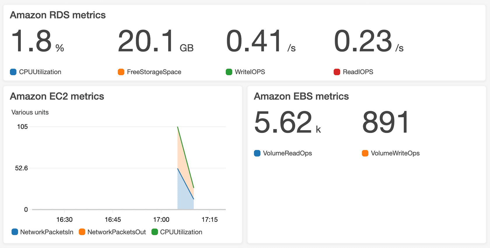
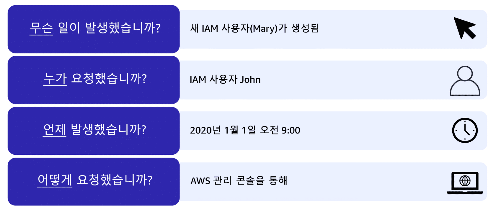
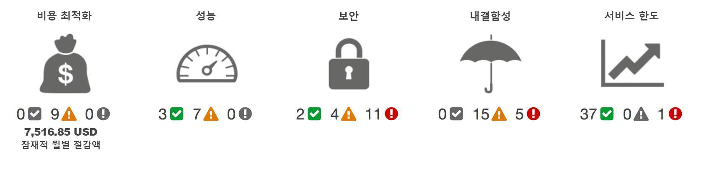

---

## Module 7

---

#### 클라우드 자원에서 지표, 로그, 트레이스를 수집해 상태를 파악하고, 임계치 경보/자동 조치로 가용성과 성능을 유지한다.

```
AWS 환경의 모니터링 방법을 요약할 수 있습니다.
Amazon CloudWatch의 이점을 설명할 수 있습니다.
    Amazon CloudWatch: Metrics, Logs, Alarms, Dashboards, (EventBridge 이벤트)
AWS CloudTrail의 이점을 설명할 수 있습니다.
    AWS CloudTrail: 계정 내 API 활동 감사 로그
AWS Trusted Advisor의 이점을 설명할 수 있습니다.
```

#### 문제 해결
```
1. Amazon **CloudWatch**의 주 목적은?
   
   A. 계정 간 결제 통합  
   B. **지표/로그 수집 및 경보로 운영 모니터링**  
   C. 데이터 마이그레이션  
   D. 키 관리


2. **AWS CloudTrail**이 기록하는 것은?
   
   A. 서버 CPU 사용률  
   B. **계정 내 API 활동 로그**  
   C. 비용 예측  
   D. 패킷 캡처


3. **Trusted Advisor** 기본 점검 범주에 *해당하지 않는* 것은?
   
   A. 비용 최적화  
   B. 보안  
   C. 내결함성  
   D. **데이터 마이그레이션**


4. CloudWatch **Alarm**이 트리거되는 조건은?
   
   A. 콘솔 로그인 수  
   B. **지표가 설정 임계치를 위반**  
   C. SNS 주제 구독자 수  
   D. 태그 개수


5. EC2가 유휴 시 자동 **중지**되게 하려면 올바른 조합은?
   
   A. CloudTrail+SNS  
   B. **CloudWatch Alarm+EC2 Stop 액션**  
   C. Route 53 정책  
   D. S3 수명주기


6. **CloudWatch Logs**의 주 용도는?
   
   A. 키 관리  
   B. **애플리케이션/시스템 로그 수집·검색·보관**  
   C. API 서명  
   D. CDN 캐시


7. **Metric Filter**의 역할은?
   
   A. 버킷 정책 적용  
   B. **로그 패턴을 지표로 변환**  
   C. RDS 백업  
   D. IAM 역할 생성


8. **Dashboard**의 장점으로 적절한 것은?
   
   A. 데이터 암호화  
   B. **여러 지표를 한 화면에서 시각화**  
   C. 전용선 연결  
   D. DNS 라우팅


9. 비정상 API 활동 자동 탐지는?
   
   A. Config  
   B. **CloudTrail Insights**  
   C. GuardDuty만 가능  
   D. IAM Access Analyzer

10. S3 버킷의 **누가/언제/어디서** 접근했는지 확인할 서비스는?
    
    A. CloudWatch  
    B. **CloudTrail**  
    C. Trusted Advisor  
    D. Shield

11 일정/이벤트에 따라 **람다**를 호출해 운영 작업을 자동화하려면?
    
    A. CloudWatch Logs  
    B. **Amazon EventBridge(CloudWatch Events)**  
    C. Route 53  
    D. Direct Connect

12. **지표 기반 자동 확장(Scale out)**을 트리거하는 구성요소는?
    
    A. CloudTrail  
    B. **CloudWatch Alarm → Auto Scaling 정책**  
    C. WAF  
    D. Artifact

13. 계정 전체 API 로그를 **중앙 S3**로 모으려면?
    
    A. 계정별 로컬 파일  
    B. **조직(Organizations) CloudTrail 트레일**  
    C. 엣지 로케이션  
    D. SNS 이메일

14. 장애 조기 경보를 위해 **애플리케이션 오류율**을 모니터링할 위치는?
    
    A. CloudTrail  
    B. **CloudWatch(지표/로그)**  
    C. CodeBuild  
    D. Macie

15. Trusted Advisor에서 **서비스 한도** 초과 위험 알림을 보려면 어떤 범주?
    
    A. 성능  
    B. **Service Limits(서비스 한도)**  
    C. 내결함성  
    D. 보안

16. 운영팀에 알림을 보내려는 **경보 알림 채널**로 적절한 것은?
    
    A. KMS  
    B. **SNS**  
    C. EFS  
    D. S3 Glacier

17. CloudWatch와 CloudTrail의 차이로 가장 적절한 것은?
    
    A. 둘 다 API 로그만  
    B. **CloudWatch=성능/운영 지표·경보, CloudTrail=API 감사 로그**  
    C. 반대  
    D. 동일

18. 애플리케이션 로그에서 "ERROR" 발생 시 **지표로 집계**하려면?
    
    A. CloudTrail Insights  
    B. **Logs Metric Filter**  
    C. WAF 규칙  
    D. CloudFormation

19. 비용 절감·보안 모범 사례 **권장사항**을 한눈에 보려면?
    
    A. CloudTrail  
    B. **Trusted Advisor**  
    C. CloudWatch Logs  
    D. Batch

20. **대시보드/경보/로그**를 묶어 가시성과 대응을 높이는 목적은?
    
    A. 키 회전  
    B. **가용성·성능 유지 및 문제 대응 속도 향상**  
    C. VPC 피어링  
    D. 도메인 등록
```

```
B B D B B B B B B B B B B B B B B B B B
```

> ### 📄 Amazon CloudWatch

#### 지표 및 그래프를 통해 AWS 인프라 및 리소스의 성능을 실시간으로 모니터링할 수 있고, <br> 지표의 역치를 감지해 작업을 트리거하는 경보를 생성할 수 있다.
* 예). Amazon EC2 인스턴스를 중지하는것을 잊었을때, 자동 중지하는 경보 생성 가능.

#### 1). CloudWatch Dashboard

<div align=center>
    
    <h5>EC2 인스턴스 CPU 사용률, S3 버킷 요청수 등등..</h5>
</div>

* 단일 위치에서 리소스에 대한 모든 지표에 액세스할 수 있다.

> ### 📄 AWS CloudTrail

#### 계정에 대한 API 호출을 기록 

* IT에서 트랜잭션을 감사하는 기능은 대부분의 규정 준수 구조에서 필수적인 요소이다.
    따라서 무언가를 변경해도 해당 변경 내용을 기록해야 하는데.
  이때 사용할 수 있는것이 **Cloud Trail**이다
* 로그는 API 호출자 ID, API 호출 시간, API 호출자의 소수 IP 주소 등을 수집하고
    수집한 로그를 필터링할 수도 있다는것.

#### 1). 이벤트

<div align=center>
    
    <h5>IAM 사용자가 생성된 것을 추적할 수 있다.</h5>
</div>

* 또 다른 예시로, DynamoDB 테이블에 행을 추가할때도 CloudTrail 엔진에 기록이 된다.
그리고 이러한 로그를 S3 버킷에 무제한으로 저장할 수 있다.

#### 2). CloudTrail Insights

* AWS 계정에서 비 정상적인 API 활동을 자동 감지할 수 있다.

> ### 📄 AWS Trusted Advisor

<div align=center>
    
    <h5></h5>
</div>

#### AWS 환경을 검사하고 AWS 모범 사례에 따라 실시간 권장 사항을 제시하는 웹 서비스입니다.
* **5가지의 범주에서 모범 사례와 비교**
  ```
  1. 비용 최적화
  2. 성능
  3. 보안
  4. 내결함성
  5. 서비스 한도
  의외로 안정성, 확장성, 탄력성 이런것들이 아니다.
  ```