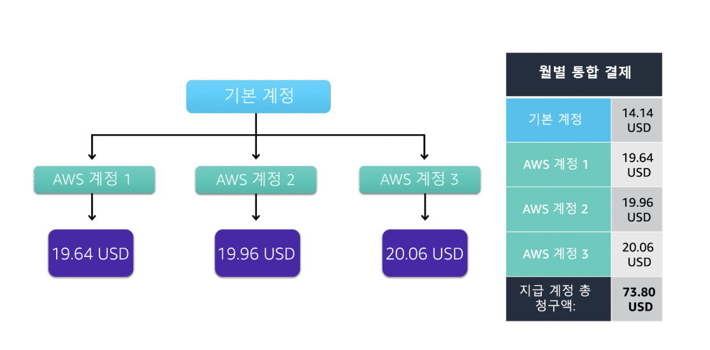
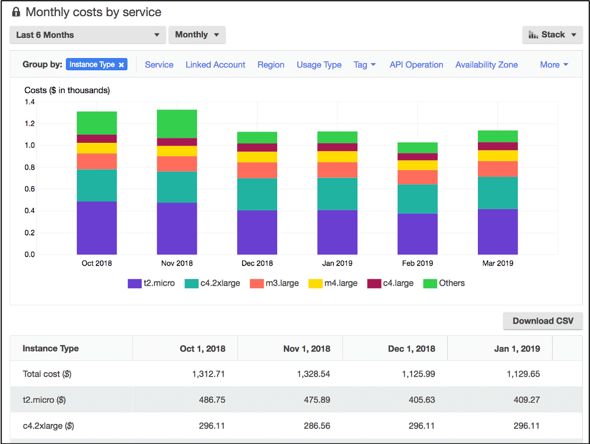
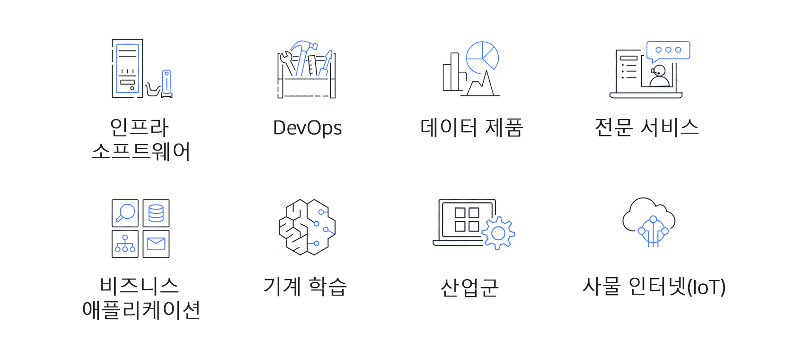

---

## Module 9

---

### 문제
```
1) S3 스토리지 클래스 선택
한 애플리케이션은 작은 설정 파일을 자주 읽고/자주 수정합니다. 
이 파일들은 자주 접근되지만, 전체 용량은 그리 크지 않습니다. 
저장 비용보다는 요청 성능과 단순성이 더 중요합니다. 
어떤 S3 스토리지 클래스를 사용하는 것이 가장 적절합니까?

A. S3 Standard ✅
B. S3 Standard-IA (Infrequent Access)
C. S3 Glacier
D. S3 Glacier Deep Archive

2) S3 비용 요소
다음 중 S3 비용에 직접적인 영향을 주는 요소만을 모두 고른 것은 어느 것입니까? (정답 2개)

A. PUT, GET 요청과 같은 요청 횟수 ✅
B. 객체가 저장된 스토리지 클래스 ✅
C. S3 버킷 이름의 길이
D. 동일 리전 내 CloudFront 캐시 적중(캐싱) 트래픽

3) 데이터 전송 비용
한 S3 버킷에서 같은 리전의 EC2 인스턴스로 데이터를 전송하고 있습니다. 
또 다른 S3 버킷에서는 다른 리전의 EC2 인스턴스로 데이터를 전송합니다. 
일반적인 AWS 요금 기준으로, 다음 설명 중 가장 정확한 것은 무엇입니까?

A. 두 경우 모두 데이터 전송 비용이 발생하지 않는다.
B. 두 경우 모두 데이터 전송 비용이 동일하게 발생한다.
C. 같은 리전 내부 전송은 무료이며, 다른 리전으로 나가는 트래픽에만 데이터 전송 비용이 발생한다. ✅
D. 다른 리전 간 전송만 무료이며, 같은 리전 내부 전송에 데이터 전송 비용이 발생한다.

4) Consolidated Billing / Organizations
AWS Organizations의 통합 결제(Consolidated billing) 기능을 사용할 때 얻을 수 있는 이점은 무엇입니까?

A. 여러 AWS 계정의 비용을 한 계정으로 모아 볼 수 있고, 볼륨 할인을 계정 간에 공유할 수 있다. ✅
B. 모든 계정이 자동으로 같은 리전에만 리소스를 생성하도록 강제된다.
C. 모든 계정의 보안 그룹 규칙이 자동으로 동기화된다.
D. 개발 계정과 운영 계정을 하나의 계정으로 합치는 기능이다.

5) AWS Budgets 활용
한 사용자는 월간 AWS 비용이 200달러를 초과하기 전에 이메일과 SNS로 알림을 받고, 
동시에 특정 IAM 사용자에게만 EC2 시작 권한을 제한하는 자동 조치를 하고 싶습니다. 
이 요구사항을 가장 잘 충족하는 것은 무엇입니까?

A. AWS Budgets와 Budgets Actions ✅
B. AWS Cost Explorer
C. AWS Marketplace
D. AWS Support Basic 플랜

6) AWS Cost Explorer와의 구분
다음 중 AWS Cost Explorer의 주 사용 목적을 가장 잘 설명하는 것은 무엇입니까?

A. 예산을 설정하고, 임계값 초과 전 알림을 보내는 기능
B. 시간 경과에 따른 AWS 비용과 사용량을 시각화하고, 서비스/리전/태그별로 분석하는 기능 ✅
C. 온프레미스와 AWS 간의 총소유비용(TCO)을 비교·추정하는 기능
D. 지원 티켓을 생성하고 AWS Support 팀과 소통하는 기능

7) TCO Calculator
어떤 회사는 현재 온프레미스 데이터 센터에서 서버, 스토리지, 네트워크 장비를 운영 중입니다. 
이 회사는 AWS로 이전을 고려하고 있으며, 온프레미스와 AWS를 사용했을 때의 총 비용을 비교하고 싶습니다. 
이 목적에 가장 적합한 도구는 무엇입니까?

A. AWS Cost Explorer
B. AWS Budgets
C. TCO Calculator ✅
D. AWS Marketplace

8) AWS Support Plans – Trusted Advisor
한 고객은 프로덕션 워크로드를 운영 중이며, 
24×7 전화/채팅 지원과 함께 모든 Trusted Advisor 검사(보안, 비용, 성능 등)를 전체 사용하고 싶습니다. 
어떤 지원 플랜이 이러한 요구를 충족합니까?

A. Basic
B. Developer
C. Business ✅
D. 어떤 Support 플랜에서도 Trusted Advisor 전체 검사는 제공되지 않는다.

9) AWS Marketplace
AWS Marketplace를 가장 잘 설명하는 것은 무엇입니까?

A. AWS 리전과 가용 영역을 선택하여 EC2 인스턴스를 시작하는 콘솔 화면
B. 서드파티 소프트웨어를 찾아보고, AWS 청구와 통합된 형태로 구독/구매하여 바로 사용할 수 있는 카탈로그 ✅
C. AWS에서 제공하는 모든 무료 티어 리소스 목록
D. AWS 서비스 요금제를 협상하는 전용 포털

10) 개발용 계정에 적합한 Support Plan
한 스타트업은 아직 개발/테스트(비프로덕션) 환경만 AWS에 구축해 두었고, 비용을 아끼고 싶습니다.
다만, 가끔 기술적인 질문을 공식 Support를 통해 받고 싶습니다. 어떤 AWS Support Plan이 가장 적절합니까?

A. Basic Support ✅
B. Developer Support
C. Business Support
D. Enterprise Support
```

```
A, A, B, C, A, A, B, C, C, B, A
```

---

> ### 📄 1. 요금 예시

#### 1). EC2

*선택한 스토리지 클래스랑 별개다*

##### EC2 인스턴스 요금은 여러 변수에 따라 달라집니다.  
1. 구매 옵션 유형  
2. 선택한 AMI  
3. 선택한 인스턴스 타입  
4. 리전  
5. 데이터 송·수신(트래픽)  
6. 스토리지 용량 등이 이에 해당합니다.

##### 인스턴스 타입
* t3.micro, m6g.large 처럼 인스턴스 타입에 따라 **시간당 요금이 크게 달라진다.**

##### 사용 시간
* 온디맨드/리저브드/스팟 모두 **사용 시간(시간/초 단위)** 에 따라 비용이 책정된다.

##### AMI
- 순수 Amazon Linux 같은 기본 AMI는 추가 요금이 없지만,  
- **마켓플레이스 상용 AMI(백업 SW, 보안 솔루션 등)**는 
라이선스 비용이 붙어 전체 인스턴스 요금에 영향을 준다.  
따라서 **선택한 AMI가 요금에 영향을 줄 수 있다.**

---

#### 2). Amazon S3

##### 스토리지 클래스를 결정하여 요금을 최적화 하자.

##### ① 객체 크기

##### ② 요청 및 검색 빈도

* 파일을 서버에 요청할떄 마다 비용이 지불된다.
    1. 객체를 버킷에 추가 혹은 복사 : `PUT`, `COPY`, `POST` 또는 `LIST` 요청
    2. 버킷에서 객체를 검색하라는 요청 : `GET`

##### ③ 데이터 전송

1. 동일 리전 내, CloudFront 캐식
   * 드는 비용 없음

2. 다른 리전
   * 데이터 전송 비용 생김.
   * Data Transfer Out 별도 과금

##### ④ 스토리지 클래스

* Standard : 정기 접근, 저장비 높음, 요청비는 낮음
* Standard-IA : 비정기 접근, 저장비 낮음, 요청비 높음 
* Glacier :  아예 접근 안함 백업용, GB당 요금은 싸다, 요청비는 압도적,

---

> ### 📄 2. 통합 결제(Consolidated Billing / Organizations)

<div align=center>
    
    <h5></h5>
</div>

#### Consolidated billing/AWS Organizations의 통합 결제 기능을 사용하면<br> 조직의 모든 AWS 계정에 대한 단일 청구서를 받을 수 있다.

##### 장점

1. **multiple AWS accounts 단일 청구서**
2. **볼륨 할인 공유**
3. **Reserve Instance /Savings Plans 공유**
4. 계정별 비용 분리 가시화.

비용 **분석**은 Cost Explorer(또는 TCO 계산기)를 통해 수행되며, 이는 AWS Organizations의 일부가 아닙니다.


---

> ### 📄 3. AWS Budgets

#### 예산을 생성하여 서비스 사용, 서비스 비용 및 인스턴스 예약을 계획할 수 있다.

* 예상 AWS 사용량을 기준으로 월말 비용을 검토

#### 1). 예산/사용량/Reserve Instance/Savings Plans 커버리지/활용

* 목표 설정 → **임계 초과 전** 이메일/SNS/Chatbot 알림.

#### 2). Budgets Actions

* 자동 태그 IAM 정책 전환 등 **완화 조치**(선택).

---


> ### 📄 4. AWS Cost Explorer

<div align=center>
    
    <h5>시간 경과에 따라 AWS 비용 및 사용량을 시각화 및 관리</h5>
</div>

#### 비용 사용량 **시각화/분석**(서비스 계정 태그 리전별) 

* 발생 비용 기준 상위 5개 AWS 서비스의 비용 및 사용량에 대한 기본 보고서가 포함되어 있습니다.

---

> ### 📄 5. TCO Calculator

#### 온프레미스 데이터 센터를 사용하는 것과 AWS를 사용하는 것의 비용을 비교,추정

---

> ### 📄 6. AWS Support Plans(지원 플랜)

#### 문제를 해결하고 비용을 절감하며, <br> AWS 서비스를 효율적으로 사용하는데 도움이 되는 4가지 Support 플랜

* `Basic` , `Developer` , `Business` , `Enterprise`
  * 비 프로덕션(실험용/테스트용)이든, 프로덕션(실제 서비스) 계정이든 모두 사용가능하다.


| 플랜 | 주요 용도 / 권장 대상 | 지원 채널 / 시간 | Trusted Advisor | 주요 특징 |
|------|----------------------|------------------|-----------------|-----------|
| **Basic (기본)** | 무료 플랜, 계정만 있으면 자동 포함 | 온라인 문서, **계정 청구 지원**, **개발자 포럼** | **Trusted Advisor 검사 일부 액세스 가능** | • 비용: **무료**<br>• 기본적인 계정/청구 문의<br>• 커뮤니티·포럼 중심 지원 |
| **Developer** | 개발·테스트/실험 환경에 권장 | 주로 이메일, 업무 시간 기준<br>**긴급하지 않은 이슈에 최대 12시간 내 응답** | **Trusted Advisor 검사 액세스 가능** (기본적인 체크) | • **모범 사례 지침** 제공<br>• **클라이언트 측 진단 도구** 제공<br>• 개발/PoC 단계에 적합 |
| **Business** | 프로덕션/운영 환경, 상시 지원 필요 고객 | **24×7 전화 / 채팅 / 이메일 지원** | **모든 AWS Trusted Advisor 검사 전체 사용 가능** | • **최저 비용으로 모든 TA 검사 포함**하는 유료 플랜<br>• **API 지원** (Support API 사용 가능)<br>• 운영 중인 서비스에 권장 |
| **Enterprise On-Ramp / Enterprise** | 대규모/미션 크리티컬 워크로드, 엔터프라이즈 고객 | **24×7**, 전담 인력 포함 지원 | **모든 AWS Trusted Advisor 검사 전체 사용 가능** | • **TAM (Technical Account Manager)** 배정: 빠른 기술 지원, 설계/배포/최적화/아키텍처 리뷰 등 지속적 커뮤니케이션<br>• **Concierge 팀**: 요금·계정 관련 전담 지원<br>• **운영 아키텍처 리뷰**, 미션 크리티컬 워크로드에 최적화 |

---

> ### 📄 7. AWS Marketplace



* 서드파티 SW를 **AWS 청구로 통합 결제**, 
* 시간 월 연 구독/AMI SaaS 등. **Private Offers/조직 구매** 가능.
* 산업 및 사용 사례별로 소프트웨어 솔루션을 탐색할 수도 있습니다.

---


