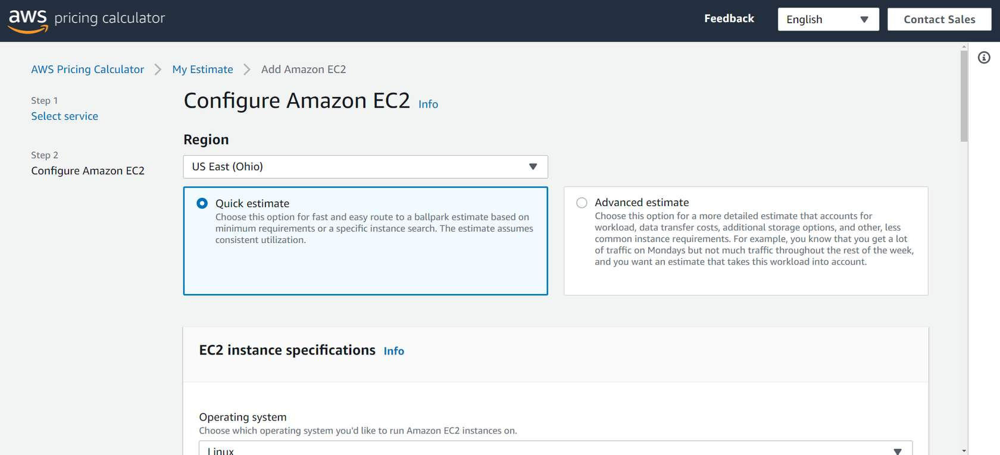
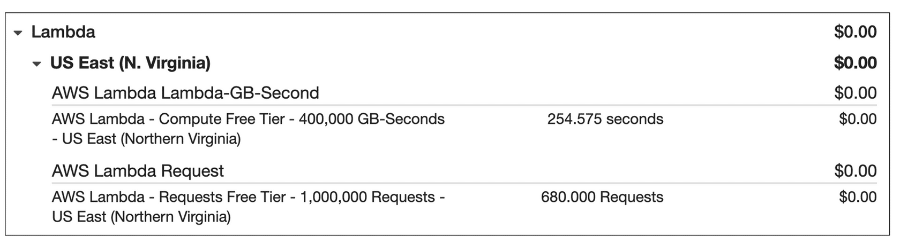
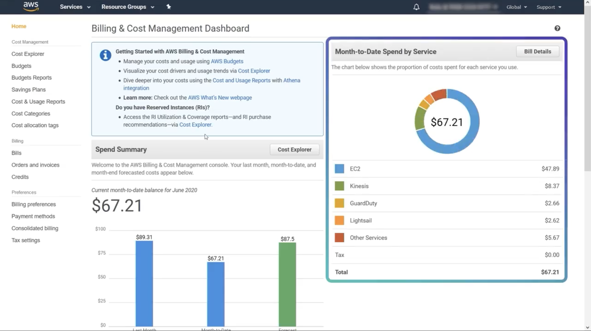

---

## Module 9

---

#### 요금 및 지원

```
AWS 요금 및 지원 모델을 설명할 수 있습니다.
AWS 프리 티어를 설명할 수 있습니다.
AWS Organizations 및 통합 결제의 주요 이점을 설명할 수 있습니다.
AWS Budgets의 이점을 설명할 수 있습니다.
AWS Cost Explorer의 이점을 설명할 수 있습니다.
AWS 요금 계산기의 주요 이점을 설명할 수 있습니다.
다양한 AWS Support 플랜을 구별할 수 있습니다.
AWS Marketplace의 이점을 설명할 수 있습니다.
```

#### 문제 해결

---


> ### 📄 AWS 프리 티어

#### 1). 종류

##### ① Always Free(상시)

```
AWS Lambda에서는 매월 무료 요청 1백만 건과 최대 320만 초의 컴퓨팅 시간
Amazon DynamoDB에서는 매월 25GB의 무료 스토리지를 사용
Amazon S3 : "Get 20,000" "Put 2,000" "5G Storage"
```

##### ② 12-Month Free(계정 생성 후 12개월)

```
일정량의 Amazon S3 Standard 스토리지
월별 Amazon EC2 컴퓨팅 시간 한도
Amazon CloudFront 데이터 전송량
```

##### ③ Trials(기간 사용량 한정).

#### 2). 주의 사항

1. 한도 초과 시 **유료 과금**
2. **리전별** 가격/한도 상이.

---

> ### 📄 AWS 요금 개념(Pricing Basics)

#### 1). 결제 모델

1. On-demand Pay-As-You-Go : 사용한 만큼 지불
2. **Savings Plans/RI**(약정으로 할인) : 예약하는 경우 비용 감소
3. 많이 사용할 수록 볼륨 기반 할인 적용

#### 2). 요금 계산기

<div align=center>
    
    <h5>AWS 기반 사용 사례에 대한 비용을 추정</h5>
</div>

#### 3). TCO Calculator  

* TCO (total cost of ownership)
* AWS vs. on-premises 가격비교 계산.


---

> ### 📄 요금 예시

##### ① AWS Lambda 



* 함수 요청 수 & 함수 실행 시간
* 리전마다 항목별 요금이 다름.
* $+$ 1년 또는 3년 기간 예약하는 경우 비용 감소 가능

##### ② Amazon EC2

* 인스턴스 실행 동안 사용된 컴퓨팅 시간에 대해 지불
* Spot 인스턴스를 사용하면 비용을 대폭 절감 할 수 있다
  중단에 견딜수 있는 배치 처리 작업

##### ③ Amazon S3

* 스토리지 : 객체 크기, 스토리지 클래스, 저장한 기간에 따라 요금 청구
* 요청 및 데이터 검색 : 웹 사이트에서 사진 파일을 서버에 요청할때마다 비용을 지불해야 함.
  1. 객체를 버킷에 추가 혹은 복사 : `PUT`, `COPY`, `POST` 또는 `LIST` 요청
  2. 버킷에서 객체를 검색하라는 요청 : `GET
* Data Transfer Out :  S3 -> CloudFront로 전송되는 데이터 버킷이나, 동일한 리전 내라면, 드는 비용은 없다.
* 관리 및 복제  : 관리 기능에 대한 비용을 지불해야 한다.

##### ④ Amazon DynamoDB

* 요청당 과금과, 프로비저닝 시간당 과금, 예약 용량(1–3년) 로 절감.
* 테이블 클래스 – Standard vs Standard-IA(비정기 접근, 저장비↓/요청비↑).
* 스토리지/전송 – GB-월 저장, 인터넷 Data Transfer Out 별도 과금.
* 프리 티어(Always Free)
  리전별 매월 25GB 저장 + 25 RCU + 25 WCU(Standard 테이블 클래스 기준). 
  Streams 250만 읽기 무료.
* **지역별 가격 상이**: 콘솔/가격 페이지에서 리전 선택 필수.

#### 4). 비용 절감 기본기

---


> ### 📄 계정의 결제 대시보드(Billing Console)

<div align=center>
    
    <h5></h5>
</div>

####  AWS 청구서를 결제하고, 사용량을 모니터링하고, 비용을 분석 및 제어

1. 예상 비용, 인보이스 크레딧 확인, 
2. Cost Allocation Tags 관리, 세금/지불수단.

---

> ### 📄 통합 결제(Consolidated Billing / Organizations)

<div align=center>
    
    <h5></h5>
</div>

#### AWS Organizations의 통합 결제 기능을 사용하면<br> 조직의 모든 AWS 계정에 대한 단일 청구서를 받을 수 있다.

##### 대량 구매 할인을 적용받기 위해 계정 간 사용량을 결합

##### ① 장점

1. **단일 청구서**
2. **볼륨 할인 공유**
3. **RI/Savings Plans 공유**
4. 계정별 비용 분리 가시화.

---

> ### 📄 AWS Budgets

#### 예산을 생성하여 서비스 사용, 서비스 비용 및 인스턴스 예약을 계획할 수 있다.
* 예상 AWS 사용량을 기준으로 월말 비용을 검토
* AWS 배포를 확장하는 과정에서 예산을 초과한 금액을 지출하지 않기를 원할 것입니다.

#### 1). 예산/사용량/RI SP 커버리지/활용

* 목표 설정 → **임계 초과 전** 이메일/SNS/Chatbot 알림.

#### 2). Budgets Actions

* 자동 태그 IAM 정책 전환 등 **완화 조치**(선택).

---


> ### 📄 AWS Cost Explorer

<div align=center>
    
    <h5>시간 경과에 따라 AWS 비용 및 사용량을 시각화 및 관리</h5>
</div>

#### 비용 사용량 **시각화/분석**(서비스 계정 태그 리전별) 

* 발생 비용 기준 상위 5개 AWS 서비스의 비용 및 사용량에 대한 기본 보고서가 포함되어 있습니다.
* Rightsizing 권장 
* **Cost Anomaly Detection** 연계.
* 
* Consolidated billing(통합 청구)의 주요 이점은 무엇입니까?  
    * Organization과 연계함
    * 모든 AWS 계정의 사용량을 합산하여 관리 및 모니터링 가능
    * 볼륨(사용량) 할인 혜택을 받을 수 있다.  

---

> ### 📄 AWS Support Plans(지원 플랜)

#### 문제를 해결하고 비용을 절감하며, AWS 서비스를 효율적으로 사용하는데 도움이 되는 4가지 Support 플랜

##### ① **Basic**(무료)

* 계정 청구, 개발자 포럼, **Trusted Advisor검사에 액세스할 수 있다.**. 

##### ② **Developer**

* 모범 사례 지침
* 클라이언트 측 진단 도구
* AWS에서 실험 중이거나 테스트하는 경우 권장됩니다.
* 빌딩 블록 아키텍처 지원을 통해 특정 서비스 및 기능을 결합할 수 있는 기회를 파악

##### ③ **Business**

* 최저 비용으로 모든 AWS Trusted Advisor 검사를 포함하는 Support 플랜
* AWS에 프로덕션 워크로드가 있는 경우 최소 권장 티어입니다.
* 24×7, 전화/채팅, **Trusted Advisor 전체 체크**, **API 지원**, 생산 워크로드. 

##### ④ **Enterprise On-Ramp/Enterprise**

* 24×7, **TAM/Concierge**, 운영 아키텍처 리뷰, 미션 크리티컬. 
* AWS에 비즈니스 및 미션 크리티컬 워크로드가 있는 경우 권장됩니다.
* AWS에 프로덕션 및/또는 비즈니스 크리티컬 워크로드가 있는 경우 권장됩니다.

##### ⑤ **응답 목표**(개략)
* Business/Ent.는 프로덕션 장애에 **빠른 응답** 제공. 

#### 2). TAM

* Enterprise On-Ramp 및 Enterprise Support 플랜을 보유한 AWS 고객만 이용할 수 있습니다.
* 애플리케이션을 계획, 배포, 최적화할 때 TAM이 지속적으로 커뮤니케이션하면서 권장 사항, 아키텍처 검토를 제공

---

> ### 📄 AWS Marketplace


* 서드파티 SW를 **AWS 청구로 통합 결제**, 
* 시간 월 연 구독/AMI SaaS 등. **Private Offers/조직 구매** 가능.
* 산업 및 사용 사례별로 소프트웨어 솔루션을 탐색할 수도 있습니다.

---


> ### 📄 참고

https://docs.aws.amazon.com/whitepapers/latest/how-aws-pricing-works/abstract-and-introduction.html

https://aws.amazon.com/ko/premiumsupport/plans/