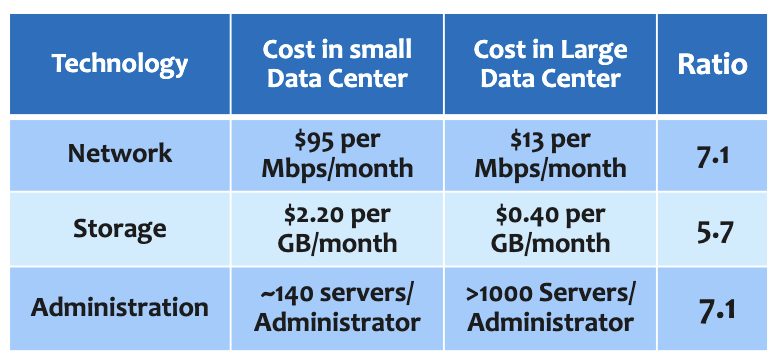

---

## Module 10

---

#### 클라우드 아키텍쳐

*여러분이 생성한 아키텍처가 훌륭한지 어떻게 알 수 있을까요?*
* 6가지 핵심 요소

#### 문제 해결

```
1. Well-Architected **보안(Security)** 필러의 핵심은?
   A. 장애 감내를 위한 백업/복구
   B. 암호화·액세스 제어·감사로 기밀성/무결성 확보
   C. 비용 가시화와 우측사이징
   D. 자동 확장으로 처리량 극대화

2. **신뢰성(Reliability)** 필러에 해당하는 것은?
   A. 다중 AZ 배치와 자동 복구
   B. 레이트 기반 차단
   C. 비용 할당 태그
   D. 캐시 적중률 향상

3. **비용 최적화(Cost Optimization)**의 모범 사례는?
   A. 항상 최대 스펙 인스턴스 사용
   B. 사용량 예측 불가라도 RI만 구매
   C. 우측사이징·소비 모델·Savings Plans 활용
   D. 단일 AZ로 요금 절감

4. **지속 가능성(Sustainability)**의 목표는?
   A. 보안 로그 중앙화
   B. 환경 영향 최소화와 에너지 효율
   C. 재해 복구 시간 단축
   D. API 속도 최적화

5. **성능 효율(Performance Efficiency)** 실천 예는?
   A. 모든 워크로드에 범용 인스턴스 고정
   B. 요구(컴퓨트/메모리/스토리지)에 맞는 리소스 선택과 지속적 튜닝
   C. 단일 스레드 처리 강제
   D. 데이터 암호화 해제

6. **운영 우수성(Operational Excellence)**에 해당하는 것은?
   A. 정적 웹 호스팅
   B. 배포 자동화와 관측·운영 절차 개선
   C. 데이터 아카이빙
   D. 전용 호스트 사용

7. **Well-Architected Tool**의 주된 용도는?
   A. 비용 자동 결제
   B. 질문 기반 워크로드 점검·리포트로 위험/개선 제시
   C. 실시간 DDoS 완화
   D. 도메인 등록

8. 다음 중 **필러와 설명 매칭**이 옳은 것은?
   A. 보안–용량 계획
   B. 신뢰성–다중 AZ/백업/자동 복구
   C. 비용 최적화–암호화 키 관리
   D. 성능 효율–감사 로그 수집

9. **CapEx → OpEx** 전환의 이점은?
   A. 선투자 확대
   B. 사용량과 무관한 고정비
   C. On-demand로 사용한 만큼 지불
   D. 데이터 전송료 면제

10. **용량 추정 불필요**를 가장 잘 설명하는 것은?
    A. 3년치 최대 피크 기준 과다 구매
    B. Auto Scaling으로 수요에 따라 신속 확장/축소
    C. 스팟만 사용
    D. 전용 호스트만 사용

11. **속도/민첩성** 이점과 가장 관련 깊은 것은?
    A. 하드웨어 조달 리드타임
    B. 분 단위 프로비저닝과 빠른 실험/폐기
    C. 다중 리전 간 전송료 증가
    D. 수동 수용량 계획

12. **글로벌 배포를 수분 내** 달성하는 방법은?
    A. 해외 데이터센터 직접 건설
    B. CloudFormation 등 IaC로 타 리전에 스택 복제
    C. 수동 콘솔 클릭만 허용
    D. 단일 AZ에 집중

13. **멀티 AZ ≠ 멀티 리전**인 이유로 옳은 것은?
    A. 둘 다 동일한 내재 리스크
    B. 멀티 AZ는 리전 재해 대비 목적이 아님
    C. 멀티 AZ는 항상 더 비쌈
    D. 멀티 리전은 HA에 불리

14. 아래 중 **잘못된** 매칭은?
    A. 신뢰성–자동 복구
    B. 운영 우수성–관측/런북
    C. 지속 가능성–에너지 효율
    D. 보안–요금 청구 관리

15. **비용 최적화**를 위해 적절한 선택은?
    A. 최대 인스턴스 고정
    B. 미사용 리소스 종료·우측사이징·예약/약정 활용
    C. 모든 스토리지를 S3 Glacier로
    D. 장애 대비로 중복 과다 프로비저닝

16. **Well-Architected Tool** 결과가 ‘적색’인 경우 일반적 조치는?
    A. 무시
    B. 권장사항 따라 설계 개선·우선순위 조치
    C. 리전 변경
    D. 과금 이의제기

17. **CloudFormation**을 사용하는 주된 이유는?
    A. 라이브 트래픽 라우팅
    B. 인프라를 코드로 선언·반복 가능 프로비저닝
    C. 키 관리
    D. CDN 캐싱

18. **Auto Scaling + ELB**의 결합 효과로 옳은 것은?
    A. 비용은 증가하나 가용성 저하
    B. 수요 변화에 따른 확장/축소와 균등 분산으로 성능·가용성 향상
    C. 인바운드 차단
    D. 멀티 리전 자동 보증

19. 다음 중 **필러가 아닌 것**은?
    A. 보안
    B. 성능 효율
    C. 혁신 속도
    D. 운영 우수성

20. 다음 시나리오에 가장 적합한 필러는?
    "장애·변경에도 서비스 지속, 백업/복구 계획 수립, 다중 AZ 배치"
    A. 신뢰성
    B. 비용 최적화
    C. 보안
    D. 성능 효율
```

```
B A C B B B B B C B B B B D B B B B C A
```

---

> ### 📄 Well-Architected Framework

#### 1). 모범 설계 6가지 핵심 요소(필러) `보 신 비 지, 성 운`

##### ① 보안 (Security)

* **데이터 기밀성·무결성** 보장, **암호화/액세스 제어/감사**로 위협에 대비.
* 전송 중 및 저장 시 데이터를 보호합니다.

##### ② 신뢰성 (Reliability)

* 의도한 기능을 일관되고 올바르게 수행할 수 있는 워크로드의 기능
* **장애·변경에 대한 복구 계획**
* 다중 AZ/백업/자동 복구 등으로 **중단 최소화**.

##### ③ 비용 최적화 (Cost Optimization)

* **지출 가시화·제어**, 과대 프로비저닝 제거, 적정 인스턴스/요금제(예: Savings Plans) 선택.
*  낮은 가격으로 비즈니스 가치를 제공하도록 시스템
*  소비 모델 채택, 비용 분석 및 귀속, 관리형 서비스를 사용하여 소유 비용 절감이 포함

##### ④ 지속 가능성 (Sustainability)
* 워크로드의 **환경 영향 최소화**, **에너지 효율**·사용량 절감을 고려한 설계.

##### ⑤ 성능 효율성 (Performance Efficiency)
* 컴퓨팅 리소스를 효율적으로 사용하여 시스템 요구 사항을 충족하고 수요 변화와 기술 진화에 따라 효율성을 유지하는 데 중점
* 워크로드 요구(컴퓨트/메모리/스토리지)에 맞는 
* **적절한 리소스 선택**과 **지속적 튜닝**.

##### ⑥ 운영 우수성 (Operational Excellence)
* 시스템을 **운영·모니터링**해 비즈니스 가치를 지속 제공, 
* **배포 자동화/운영 절차 개선**에 초점.

---

#### 2). Well-Architected Tool (콘솔)

* 워크로드를 등록해 **질문 기반 점검** -> **보고서(녹/주/적 신호등)**로 위험·개선 영역 제시.
* 권장사항 포함, **시나리오 비적용 항목은 제외(커스터마이즈 가능)**.

---

> ### 📄 AWS 클라우드의 이점

1. **경제성**
    * **초기 비용 감소** : **CapEx $\rightarrow$ OpEx** 전환
      On-demand, Pay-as-you-go, 비용 최적화 도구(예: Trusted Advisor).
      어떻게 사용할지 결정하기도 전에 데이터 센터와 서버에 대규모로 투자하는 대신, 
      컴퓨팅 리소스를 투자 없이 사용량 기반(Pay-as-you-go). 필요만큼 시작·중지.
    * **운영비 절감** : **규모의 경제(Economies of scale)** 로 단가$\downarrow$ 
      인프라 및 서버 관리에 더 많은 비용과 시간을 소비하지 않아도 된다.
      이용량 집계로 각자의 종량제 단가 인하 효과
   
2. **용량 추정 불필요**(탄력적 확장/축소)
   * 탄력성/오토스케일링으로 수요에 따라 신속 확장/축소.
   * Auto Scaling, ELB → 성능·가용성 확보.
3. **속도/민첩성**(빠른 배포·실험)
   * 리소스 분 단위 프로비저닝, 빠른 실험/실패 비용↓ → 시장 출시 가속.
4. **글로벌 배포** 수분 내 가능
    * 전 세계 고객에게 Region/AZ 선택으로 해외 리전에 신속 복제/자동화
        ```
        예: CloudFormation
        ```
    * Region / Availability Zone 구분(멀티-AZ ≠ 멀티-리전).
    * CloudFormation 등으로 반복 가능·신뢰성 있는 배포.
