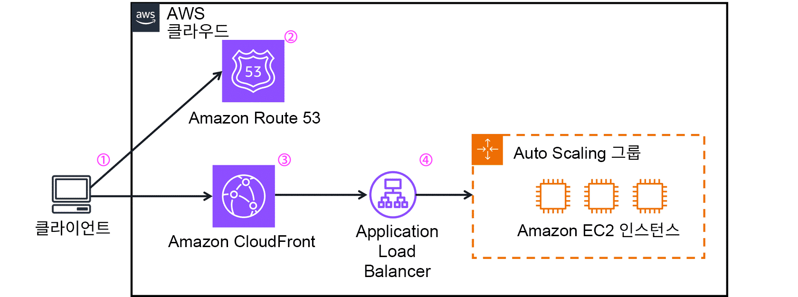

https://www.youtube.com/watch?v=mpQZVYPuDGU

> ### 📄 Domain Name System

#### DomainName is key IP is value
##### DNS는 하나의 중앙 DB가 아니다. 전 세계에 분산된 계층형 데이터베이스다.

#### DNS의 절차

* 만약 IP 주소를 알고 있다면 아래 작업은 생략된다.

```
1.  도메인 네임을 클라이언트 에 입력했다

2.  클라이언트의 첫 확인 위치는 브라우저 캐시와 OS 캐시다. 
    없으면 OS의 스텁 리졸버가 네트워크에 ISP에 질의한다.

3.  라우터를 통해 ISP 까지 패킷을 전달하고 
    네트워크 설정에 지정된 리졸버서버 로 요청을 보낸다, 
    그리고 요청을 받는 측은 바로 리졸버서버다. 

4.  리졸브 서버에서도, 도메인 네임에 대한 IP값이 저장되었는지 리졸버 서버 캐시를 검색를 검색한다. 
    만약 여기서 조차도 없으면 리졸브 서버는 Root Sever에 요청한다

5.  루트 서버는 IP를 주지 않는다. 대신 TLD 서버에 접근할 수 있도록 루트는 
    ".com은 여기 TLD 서버에 물어봐"라는 레퍼럴을 준다.

6.  TLD 서버도 보통 최종 IP를 모른다. 
    TLD는 "example.com을 관리하는 권한 NS는 이거야"하며 
    해당 도메인의 권한 있는 네임서버(NS)를 리졸버 서버에 응답한다

7.  최종적으로 Authoritative Name Server에서 IP 요청 응답을 리졸버에 보낸다

8.  리졸버는 이제 한번 검색한 IP에 대해서는 저장할 예정이다.
```

#### 왜 바로 네임 서버에 치고들어가지 못하고 리졸브를 경유 해야 하는가?
* 전 세계 단말이 직접 루트 TLD 권한에 치고 들어가면 핵심 인프라가 과부하된다.
* 재귀 리졸버가 앞단에서 흡수하고 재사용한다.
* 또한 현실에서는 권한 NS를 미리 알기 어렵다 게다가 리졸버 경유는 검증, 장애 처리까지 도맡기 때문이다.

---

> ### 📄 Route 53

#### Route 53 is a Domain Name System or DNS <br> 클라이언트 DNS 요청을 받으면 도메인 이름을 IP 주소로 응답 <br> 이에 더해 ‼️ 인터넷 애플리케이션에 최종 사용자를 라우팅할 수 있도록 지원합니다. ‼️(거희 확실함)

##### ① DNS 쿼리 routes "end users" to "end application"*

* Route 53은 DNS다. 이름을 IP로 바꿔줄 뿐이다.
  단, **"어느 리전의 엔드포인트(클라이언트 입장에서 보이는 URL 진입점) IP를 돌려줄지"** 까지는 Route 53이 결정한다.
  어떤 에지 네트워크(CloudFront/GA/ALB/Region 등)에 붙일지”를 DNS로 선택
    ```
    서울 리전 ALB
    도쿄 리전 ALB
    미국 동부 리전 ALB
    ```

* "에지 POP 중 어디가 선택되는가와 + 라우팅 (패킷 포워딩)" 책임은  OSI L3 라우팅 쪽에 더 가깝다.
    ```
    가까이 있는 에지 로케이션으로 트래픽이 라우팅 되는것은 순수 Anycast 기술이다.
    순수 OSI L3 네트워크 계층에 의한 기술로 
    라우터(L3)에서는 네트워크 라우팅 알고리즘(BGP)에 따라
    올바른 에지 로케이션(서울 POP)의 IP로 자동 라우팅 해준다.
    ```
    1. S3 정적 웹 호스팅 엔드포인트(클라이언트 입장에서 보이는 URL 진입점)로 라우팅
    2. CloudFront 배포 등으로 라우팅

##### ② Health Check

* 리소스의 상태를 주기적으로 확인.
* 리소스를 사용할 수 없게 될 때 알림을 수신하고 
비정상 리소스가 아닌 다른 곳으로 인터넷 트래픽을 라우팅할 수도 있습니다.

##### ③ 도메인 등록 및 관리

* 사람이 기억하기 쉬운 이름(도메인 네임/ 예 example.com )을 
숫자 IP로 등록한다
* DNS 구성을 위한 호스팅 영역 생성.
* 호스팅 영역 안에서 다양한 DNS 레코드 (A, AAAA, Alias 등)를 설정하여 라우팅 동작을 정의.
* 도메인을 등록하면 도메인과 동일한 이름의 호스팅 영역이 자동으로 생성됩니다.
호스팅 영역을 사용하여 Route 53가 도메인의 트래픽을 라우팅할 장소를 지정할 수 있습니다.
    이 호스팅 영역에 대해 매월 요금이 별도로 청구된다

* 예시: S3 웹 사이트로 라우팅
    ``` json
    {
      "레코드 이름": "www.example.com",
      "레코드 형식": "A (Alias)",
      "별칭 대상": "S3 정적 웹 호스팅 엔드포인트(클라이언트 입장에서 보이는 URL 진입점)"
    }
    ```

### 📄 CloudFront & Route 53 작동 흐름

<div align=center>
    
    <h5></h5>
</div>

```
1.  AnyCompany의 웹 사이트로 이동하여 애플리케이션에서 데이터를 요청합니다.
2. Amazon Route 53는 DNS 확인을 사용하여 AnyCompany.com의 IP 주소인 192.0.2.0을 식별합니다. 이 정보는 고객에게 다시 전송됩니다.
3. 고객의 요청은 CloudFront를 통해 가장 가까운 엣지 로케이션으로 전송됩니다. 
4. Amazon CloudFront는 수신 패킷을 Amazon EC2 인스턴스로 전송하는 Application Load Balancer에 연결됩니다.
```