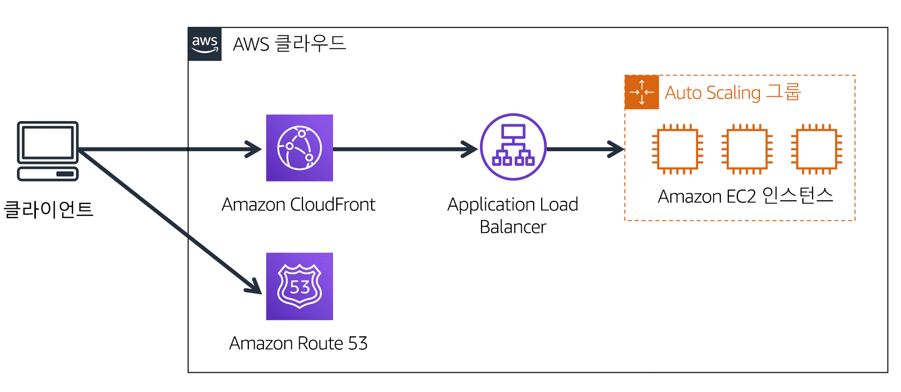

> ### 📄 1. Cache & Caching

#### 1). CDN 맥락의 캐시를 의미한다.

##### 콘텐츠 캐시 서버(에지 로케이션)에 캐싱(CloudFront)하고, DNS는 CloudFront/GA로만 안내(Route 53 등)

* 캐시는 에지 로케이션이 한다.
* 컨텐츠를 먼저 Caching(저장/컨텐츠를 배포하면 쌓이는쪽)하는 그 주체이고
  * CloudFront로 각 에지 로케이션에 컨텐츠를 저장한다.
* 에지 로케이션은 유저와 가까이 있어 저지연(Low Latency)로 컨텐츠를 전달한다.

#### 2). 요청-응답 순서

##### 마치 우리 컴퓨터의 캐시 정책과 비슷하다.
```
엣지 캐시 → REC → 원본(Region)
L1/L2 → L3 → RAM
```

##### 캐시가 작동하는 서비스 예시

1. 어드레서블 형태의 정적 파일 내지는 유니티 에셋
    ```
    1.  서울 이용자(클라이언트)가 https://${회사명}/Addressable/apple/${version_name}/Android/* 라는 도메인 질의를 한다.
    2.  Route 53 라는 DNS가 `cdn.example.com → dxxxx.cloudfront.net` Alias를 응답
    3.  그 다음 dxxxx.cloudfront.net에 대한 질의는 CloudFront가 운영하는 글로벌 DNS 가 처리
    4.  DNS/Anycast+BGP 조합으로, 사용자와 가장 지연이 낮은 올바른 에지 로케이션(서울 POP)의 IP로 자동 라우팅 해준다.
    5.  서울 POP에 컨텐츠를 조회하고 없으면 MISS
    6.  타고타고 올라가
    7.  S3 (정적 컨텐츠) / ALBApplication Load Balancer (API) 에서 가져와 캐싱 먼저하고
    8.  그다음에 엣지에서 컨텐츠를 전달후 이용자에게 응답 보냄
        HTTP 헤더에는 진짜로 이렇게 적혀 있음
            x-cache: `Hit from cloudfront`
            x-cache: `Miss from cloudfront` 
    ```

#### 3). 캐시가 없다면
1. 지연시간 폭증
2. 원본(Region) 과부하와 비용 증가
3. 중복 요청 폭주

---

> ### 📄 2. Edge Location

#### 1). 에지 로케이션의 역할

1. 전국구 글로벌한 사용자들을 위해 전국구에 설치된 콘텐츠 캐시 엔진이자 서버 클러스터
2. AWS 에서 제공하는 서비스를 호스팅한다.
   *에지 로케이션이 호스팅하는 서비스들 중 대표 글로벌 인프라 서비스 일부는 다음과 같다.*
        * CloudFront
        * Amazon Global Accelerator
        * Amazon Route 53
3. CloudFront가 반드시 의존해야 하는 호스트

---

#### 2). 이게 없으면 안되는 독보적인 장점은?

##### Proximity(근접성) 제공

* 전세계에 있다 그냥 이용자라는 생명체가 사는곳 일것 같다 싶으면 배치한다.
* 반드시 같은 리전(원본 Origin)에서 위치할 필요는 없다.
* API 호출시 매 요청이 원거리 리전(원본 Origin)까지 이동하는것을 해결함
  API/웹/정적 리소스 요청이 매번 멀리 있는 단일 
  Region 까지 가지 않도록, Edge에서 캐시/프록시/가속을 수행한다.
* 사용자와 네트워크 홉 수, 지연을 줄인다.

##### UE가 컨텐츠를 접근할때, 오리진의 컨텐츠를 캐싱(배포의 대상) 접근할 수 있는 기틀을 마련함

* ‼️거듭 말하지만. **여기서 말하는 "콘텐츠"란**‼️
  * 이미지, 데이터, 클라이언트 애플리케이션

##### 단일 오리진 부하량 감소

----

#### POP이라는 이름의 클러스터

1. 에지 스토리지 : 원본(Region) 복사본이 캐싱이 되는 위치이며, 컨텐츠 캐시 서버이다
2. 에지 네트워크 : 캐시 호스트가 존재하는곳의 IP 주소
   * 클라이언트 트래픽을 가장 가까운 POP로 유입시키고,
   * 이후 AWS 글로벌 네트워크를 통해 선택된 리전(원본 Origin) 엔드포인트로 전달한다.
3. 보안-정책 계층 : AWS Shield -> DDOS 완화, WAF -> 규칙 기반 차단

---

> ### 📄 3. Amazon CloudFront

<div align=center>
    
    
    <h5></h5>
</div>

#### CloudFront is CDN(컨텐츠 전달 "네트워크")

```
1. 사용자 : 사용자는 사용자 지정 도메인을 사용하여 회사의 웹 사이트에 액세스합니다. 요청은 우선 Route 53 DNS 레코드로 전송됩니다.

2. 라우팅 정책 : Route 53는 라우팅 정책을 사용하여 사용자와 가장 가까운 리전을 확인합니다. Route 53는 사용자를 적절한 CloudFront 엣지 로케이션으로 보냅니다.

3. 엣지 로케이션으로 보내기 : Route 53는 사용자를 해당 리전의 CloudFront 엣지 로케이션으로 보냅니다.

4. 여러 AZ의 콘텐츠 : 선택한 리전의 지정된 오리진 서버에서 콘텐츠를 가져옵니다. 참고로, 웹 사이트는 고가용성을 위해 여러 가용 영역의 리소스를 사용하여 구축되었습니다.
```

#### 1). 

* 글로벌하게 각 리전(원본 Origin)마다 리소스를 올리고(배포) 싶다면 CloudFront를 사용해서 배포를 해야한다.
  1. 전 세계 Edge Location(POP) 에 배포된 캐시 서버를 통해 컨텐츠를 제공한다.
  2. CloudFront 배포를 생성하면: 
     "이 도메인(배포 도메인)으로 요청이 오면 이 오리진(S3/ALB/EC2 등)에서 가져와 캐시하라"는 정책이 정의된다.
  3. 실제 객체는 사용자가 처음 요청할 때 Origin(리전 Region)에서 가져와 POP에 저장(캐싱) 된다. (Origin(리전 Region) Pull)

#### 2). CloudFront 배포 도메인 이름 
* CloudFront는 내부적으로 또 자체 DNS가 존재한다.
* CloudFront에 배포하면 고유 도메인 (`dxxxx.cloudfront.net`)이 생성함과 동시에 호스팅 된다
   * 예를 들어 : **S3 정적 웹 호스팅 엔드포인트** : 정적 웹 사이트를 호스팅하는 Amazon S3 버킷의 접근 주소

---

> ### 4. Global Accelerator

#### 엣지 Anycast 진입 + AWS 백본 경유 + 건강한 리전(원본 Origin) 엔드포인트 선택을 제공하는 L4 가속기.

```
1. "플레이어" → 
2. "가까운 AWS 엣지 POP Anycast 진입" → 
3. "최적의 리전(원본 Origin) 엔드포인트(ALB/NLB/EC2/EIP)"까지 TCP/UDP 게임 트래픽 자체 가속 운반
```

#### 2). 클라이언트는 GA의 Anycast IP와 세션을 맺고, 통신은 선택된 엔드포인트로만 통신한다.

* DNS와 연결 : Route 53에서 게임 도메인을 GA의 도메인/정적 IP로 매핑, Anycast 특성상 전 세계 플레이어가 자동으로 가까운 엣지 POP로 유입

---

> ### 📄 4. CloudFront VS Global Accelerator

* 실시간 게임 소켓(TCP/UDP) : Global Accelerator
  * L4에서 TCP/UDP 게임 트래픽 자체를 가속한다.
  * 실시간 게임(특히 UDP)은 GA가 적합

* 패치/리소스 다운로드 : CloudFront
  * CloudFront는 L7(HTTP/HTTPS/WebSocket) 중심의 콘텐츠 전송 캐시용 서비스다.
  * 패치/이미지/동영상은 CloudFront가 적합.


#### 오해하면 안되는 흑백 논리

##### "인스턴스에 종속된 로컬 디스크(EBS) vs 리전(원본 Origin) 전역 서비스형 스토리지(S3)"

* S3 : 리전(원본 Origin) 전역에서 접근 가능한 객체 스토리지 어떤 EC2/ECS에도 종속되지 않는 “서비스형 디스크”
* ECS/EKS/EC2 : 실행 중인 컨테이너/VM”이 직접 붙는 디스크에 종속되는 블럭 스토리지

##### ❌ "정적 = CloudFront, 동적 비즈니스 로직 = GA 식의 이분법 ❌ 

* S3/정적만 CloudFront, 컴퓨팅은 항상 GA” 인 것처럼 느껴지는 표현은 옳지 않다.

1. CloudFront : S3/ALB/API Gateway 등 HTTP/HTTPS 기반 컨텐츠를 전 세계 엣지에서 캐시·전달하는 L7 CDN
   ```
   1. CloudFront가 안붙었을떄.
        모든 요청이 항상 Origin 레벨까지 내려간다.
        클라이언트 → DNS → (바로) ALB 또는 API Gateway → 백엔드
    2. CloudFront가 붙었을때.
        ALB/API Gateway 앞에 전 세계 Edge POP + 캐시 계층
        모든 트래픽이 곧바로 리전 엔드포인트로 꽂힌다
   ```
2. GA : 멀티리전 엔드포인트 TCP/UDP 트래픽을 가속하는 L4 가속기

---

#### 결론 

* `dxxxx.cloudfront.net`로 리소스 요청
* 클라이언트의 DNS 쿼리에 대해 Route 53를 거치면
  동일 DomainName이자 여러 CloudFront 배포중 어느 리전(원본 Origin)에 IP를 리턴할까 결정
  에지 네트워크 IP로 CloudFront 배포 호스트인 근접 POP으로 라우팅
* POP내부의 컨텐츠를 순회하고 Hit되었으면 cloudfront
