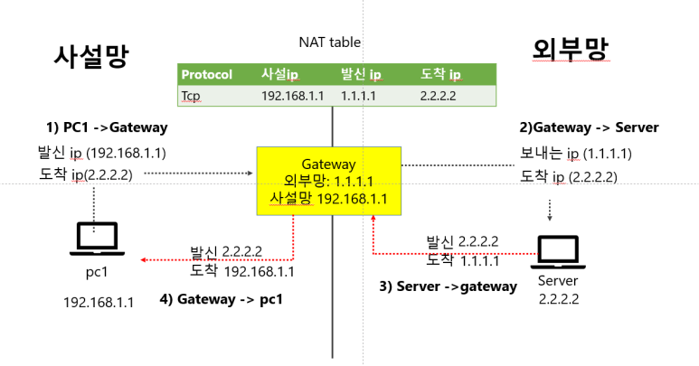
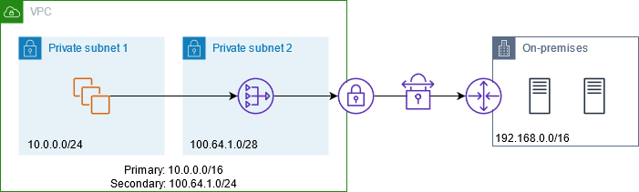

> ### 📄 NAT & DHCP

*NAT은 도데체 뭐길래 계속 3계층에서 언급되는것이냐.*

##### OSI : L3 네트워크 계층
##### 장비 : 가정용 라우터, 공유기가 수행한다.
##### 역할 

1. "공인 IP" 와 "사설 IP"간 상호 변환  (이로서 공유기가 여러 디바이스에게 인터넷을 사용할 수 있게 돕는다.)
2. 포트 매핑을 유지
3. IP 주소 고갈 해결

---

#### 1). DHCP 혹은 (NAT이 이 역할을 수행한다.)

##### 하나의 공인 IP(ISP가 제공하는)를 여러 사설 IP 바꿔주는 역할

(내부망) 호스트에게 사설 IP, 서브넷 마스크, 게이트웨이, DNS 등을 "할당"하는 자동화 프로토콜. 
       (ISP 측 DHCP가 라우터 WAN 인터페이스에 공인 IP 1개를 줄 수도 있음)

---

#### 2). NAT

##### 사설 IP를 공인 IP(ISP가 제공하는)로 바꿔주는 역할

내부 다수 (사설IP:포트) <-> 하나/여러 개 (공인IP:포트) 사이를 세션·포트 기반으로 "번역". 
1:1 고정 고유 매핑이 아니라 동적 임시(translation table) 매핑. 

---

#### 3). L3 와 L4 상호 작용

* NAT으로 사설 IP를 공인 IP로 변환하면서 포드 유지가 될 것이고,
* 이를 게이트웨이로 보내게 될 터이다.

---

#### 4). NAT Gateway 라우트

<div align=center>
    
    <h5></h5>
</div>

##### ① Private Subnet In VPC (Virtual Private Cloud)

<div align=center>
    
    <h5>게이트웨이 생성, 삭제, 연결해제, IPc4 주소 할당과 해제</h5>
</div>

1. **public NAT Gateway 라우트** 
   * 프라이빗 서브넷에서 인터넷을 아웃바운드로 액세스 :
     프라이빗 서브넷은 Internet Gateway 라우트 (IGW)로 향하는 경로가 없어 인터넷과 직접 통신 불능
     Public Nat Gateway 라우트를 사용한다면 파리이빗 서브넷 인스턴스가 
     밖으로 나가는, **아웃 바운드 트래픽**을 인터넷으로 전송할 수 있도록 함
2. **private NAT Gateway 라우트** : 
   * 온프레미스 네트워크와 연계

##### ② 흐름
```
Pc1의 사설IP는 192.168.1.1이다. 
외부망에 있는 서버의 사설 IP 2.2.2.2이고.
그리고 둘다 발신을 하든, 수신을 할때 공통되게 사용되는 공인 IP가 있다. 그게 바로 1.1.1.1 인것이다.

여기서 Gateway 라우트는 바로 공유기, 혹은 라우터가 된다.

공유기는 NAT 테이블을 활용하여 
Pc1.사설ip : 192.168.1.1을 발신 
-> Gateway 라우트.공인ip : 1.1.1.1로 바꾼다.
-> Server.사설ip : 2.2.2.2 도착
```

---

#### 5). NAT Port Forwarding

NAT의 동작을 살펴보면 기기의 요청과, 요청의 응답을 받을때, 포트번호를 유지해 준다라는 말을 기억하는가?

NAT Translation table이 그 "유지(기억)"의 역할을 해 준다.
그리고그 유지(매핑 정보 기록)이 바로 NAT Port Forwarding table이 해준다는것이다.