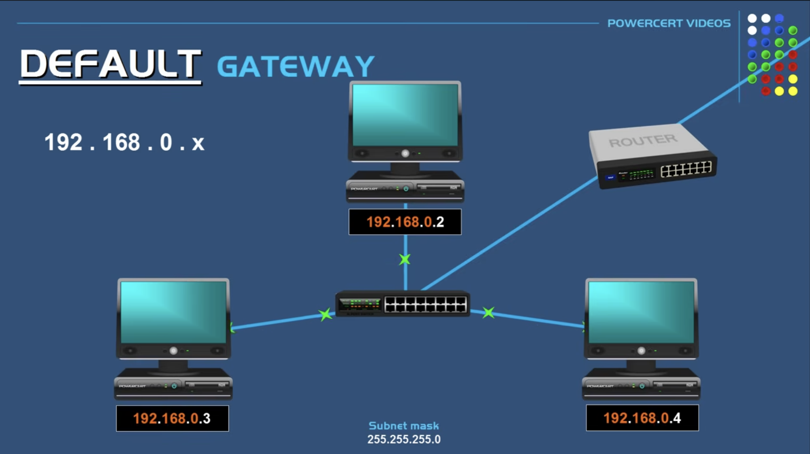
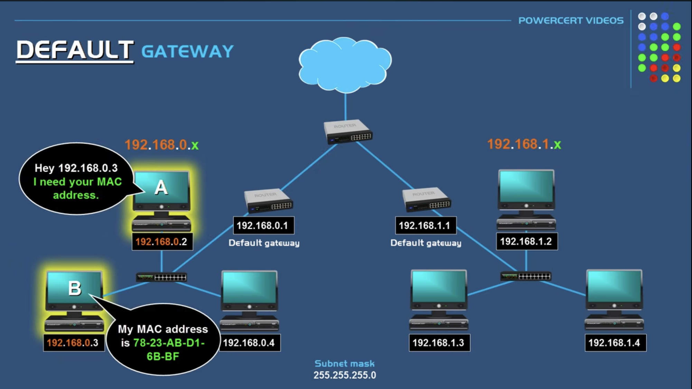
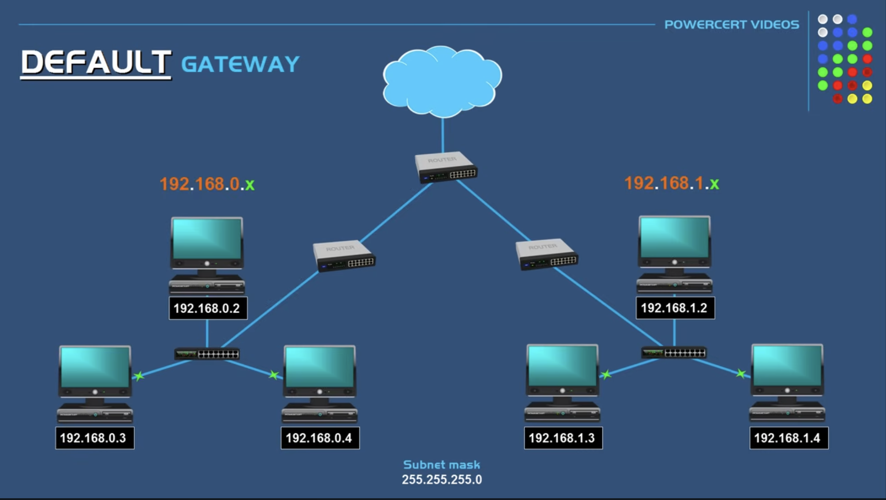
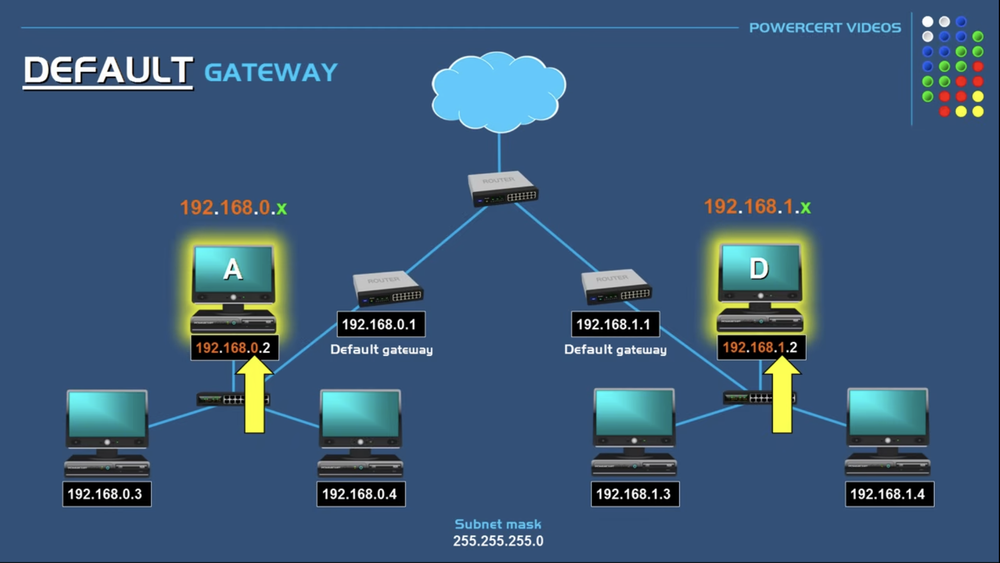
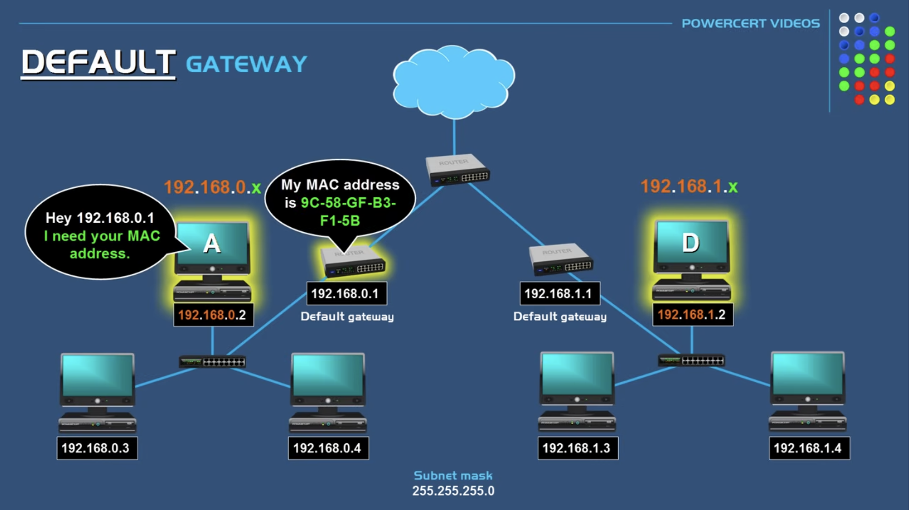
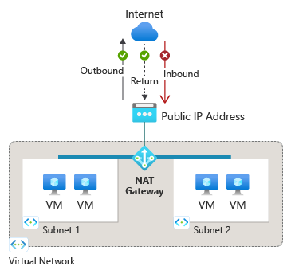

> ### 📄 게이트 웨이

#### 한 네트워크에서 다른 네트워크로 라우팅될 때 관문
##### 자 그럼 게이트 웨이를 좀더 자세히 보자면 네트워크 기기이다.

* L3 까지만 해도. 라우터를 거쳤다 하더라도
    1. 루프 백 (로컬 이였을 수 있고)
    2. 혹은 다른 네트워크 였을 수 있다.

* 여기서 다른 네트워크를 가기 위해서
  내가 속한 라우터를 뚫고 나와야 하는데 
  그 출구겸 입구가 바로 게이트 웨이다.

#### 로컬 VS 외부 구분

##### ① 로컬 영역 네트워크 

    
    
    <h5>같은 서브넷에서의 게이트웨이 동작</h5>

* 스위치를 통해 같은 네트워크끼리의 직접 통신할 수 있다.
* **따라서 게이트 웨이를 쓸 필요는 없다.**
* A와 B통신에 있어서는 A는 B의 MAC을 알필요가 있다.

##### ② 다른 영역 네트워크

    
    
    
    <h5></h5>

* 다른 네트워크에 액세스 하고 접근하며, 통신하도록 한다.
* A와 D통신에 있어서는 A는 컴퓨터가 아닌의 게이트웨이의 MAC을 알필요가 있다.

---

#### 게이트 웨이는 인바운드 아웃바운드 사이에 있다.

    
    <h5></h5>

#### AWS Gateway Services

##### ① Amazon API Gateway

* Edge 최적화로 Regional API 구성 
* Rest/HTTP API 요청을 게시하고, 유지하고 엔드포인트나 로드밸런서로 연결

##### ② Internet Gateway

* VPC와 인터넷 경로 필터링 없음

##### ③ NAT Gateway

* 접근 지점에 따라 Private/Public으로 나뉘기도 한다.
  1. Private Nat Gateway
     인터넷이 아닌 사설 대상 TGW, 온프레미스, VPC 피어링
  2. Public Nat Gateway
     아웃바운드만 인터넷 허용

---

> ### 📄 로드 밸런싱

`ALB` `NLB`

#### 수많은 동적 요청을 클러스터로 존재하는 백엔드 서버가 요청을 처리하게 할때, 요청을 분산 라우팅 하는 녀석

##### 백엔드 : HTTP/Restful API 동적 요청을 받아 처리하는 엔드포인트 호스트
* 백엔드라 할 수 있는것들은 `CloudFront`, `EC2`, `API Server(like AWS lambda)` 
  * EC2 구성요소 : Application Server, EBS ,RDBMS DB Server

#### 로드 밸런서

---

> ### 📄 엔드 포인트

#### 엔드 포인트 = URL As a 동적 Resource
* 자료 하나당 하나의 url `www.{domain_name}.com/{endpoint}` 가지기
`CloudFront`, `EC2`, `VPC`

##### ① Gateway Endpoint

* S3/DynamoDB 전용
* 라우트 테이블에 

##### ② Interface Endpoint

* ENI(Private IP) 생성

---