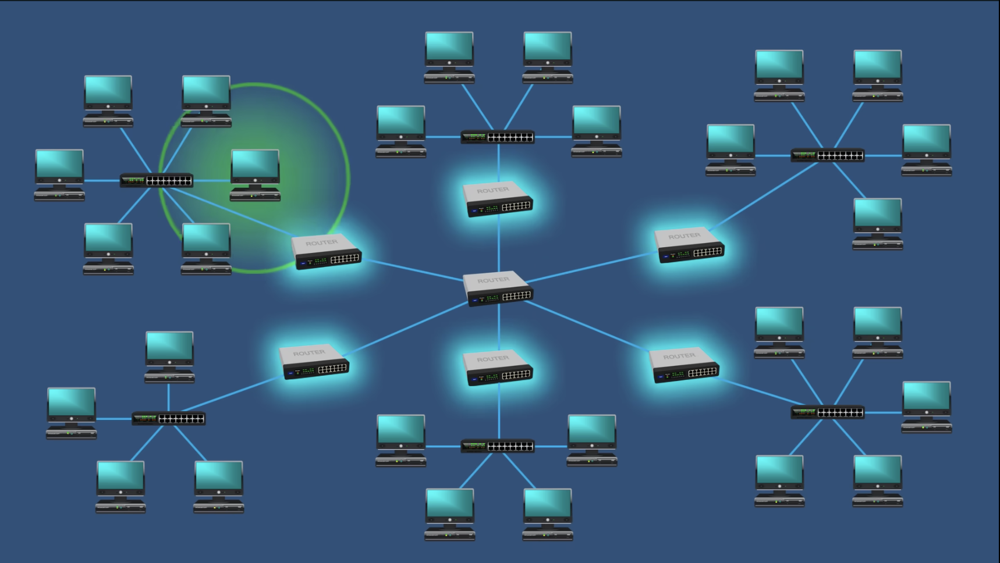
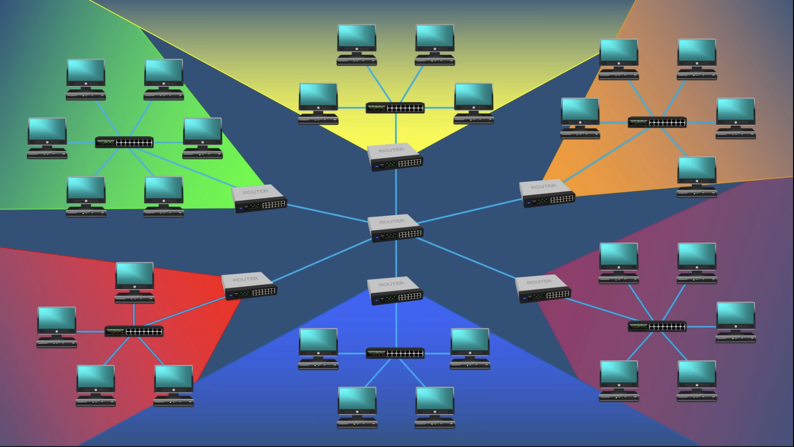
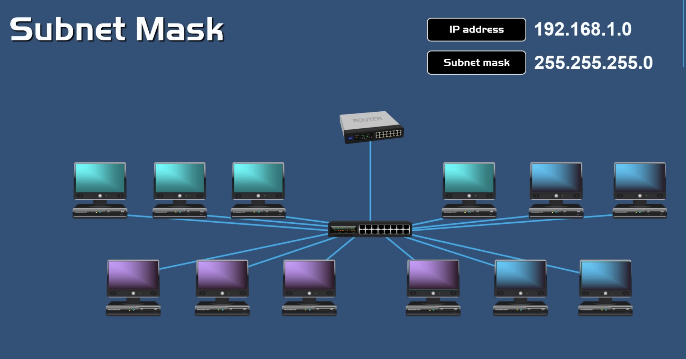
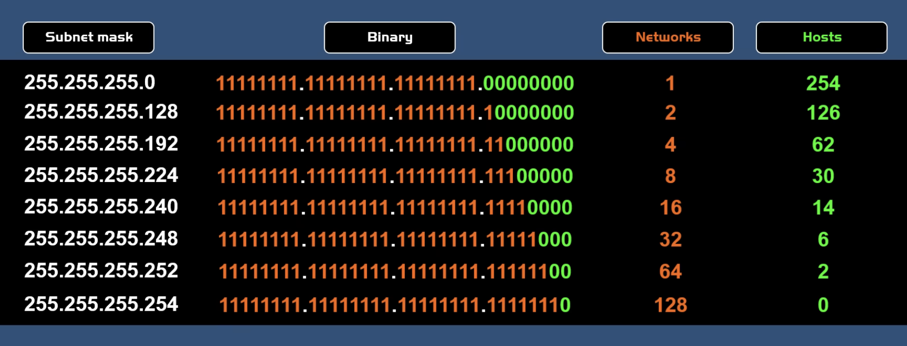
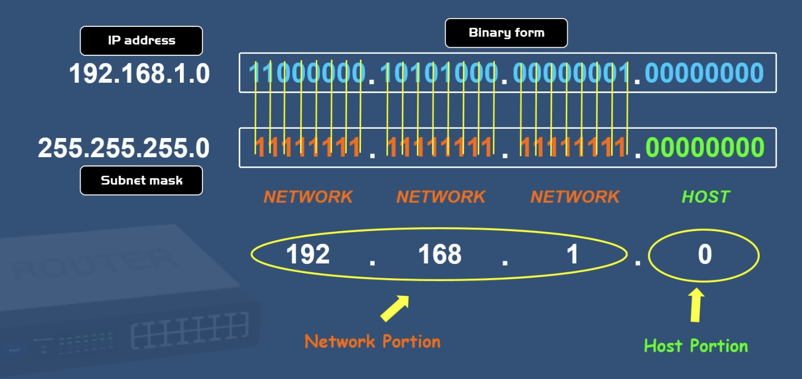
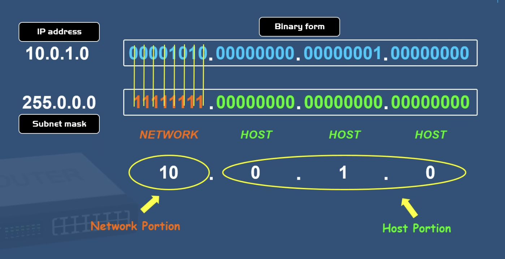
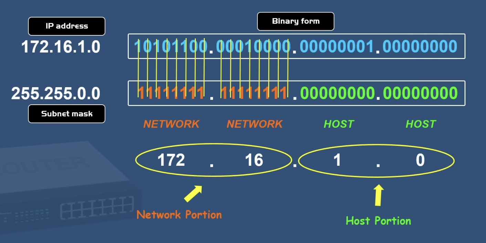
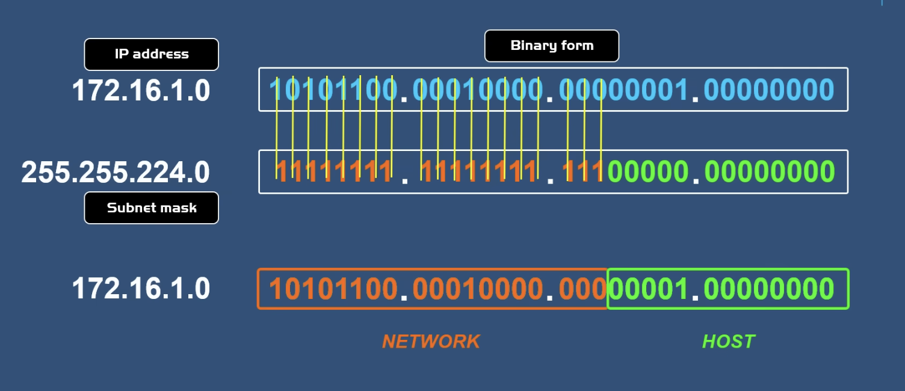

### 서브네팅 

> ### 📄 1. "서브넷 네트워크"가 같냐에 따른 "호스트"간 통신 차이

* 서브넷 마스크는 아파트의 동 건물 한채라 할 수 있다.
* 로컬 네트워크의 범위가 넓어지기도, 좁아질 수도 있다.
  해당 아파트 전체가 같은 네트워크일 수도, 
  좁게는 같은 건물의 5층 라인만이 같은 네트워크일 수도(…)


##### ① 같은 "서브넷 네트워크" 다른 호스트끼리 통신

* 같은 서브넷 네트워크 내의 호스트는 같은 서브넷 호스트 끼리만 통신이 가능
    1. 같은 "서브넷 네트워크" 끼리는 하나의 라우터를 사용한다
        *이 말은 외부의 라우터를 거칠 필요 없다는 것이다.*
    2. 게이트웨이를 탈 필요가 없다는 것 이다.

* 예). 같은 아파트 내 다른 XXX호수 이동
  쓸데 없이 밖으로 나갈 필요 없이 같은 건물에 있는 다른 호를 다니면 된다는 것이다.

##### ② 다른 "서브넷 네트워크" 당연히 다른 호스트 통신

* 다른 서브넷 네트워크간 호스트는 그냥은 통신을 못한다.
    1. 다른 서브넷 네트워크 끼리는 2개이상의 라우터가 있을것이고. 
       여러 라우터를 거치며 대상 호스트가 속한 IP 네트워크를 찾아내는 식으로 통신이 이루어진다.
    2. 라우터 밖으로 나가는 행위는 라우터의 게이트 웨이를 쓴다는것이다.
       *게이트웨이가 없다는 것은 입출구가 없어 건물 밖을 나갈 수 없다는 말과 동일하다.*
       * 출입구를 통해 먼저 밖으로 나가야 한다.

> ### 📄 2. CIDR 표기법

* 192.168.0.1 만 봤을때는 어디까지 네트워크를 사용한 체계고, 어디까지 호스트가 사용할 수 있는 식별 체계인지 모른다
    ```
    여기서 어디가 로컬 네트워크고? 어디가 호스트라는거지?
    (192)   |   1100    0000 
    (168)   |   1010    0000
    (0)     |   0000    0000 
    (1)     |   0000    0000
    ```

* 하지만 24라는것을 알았을 때 부터는 말이 달라진다.

* `192.168.0.1/24` 24가 바로 서브넷 마스크다
    `네트워크 /연속된 1의 개수만 나타낸 마스크` 
    즉 연속된 1의 개수를 제외한다면 이때부터 호스트라는것
    ```
    서브넷 마스크 24를 줬다고 해보자
    1Mask   |   1111   1111
    2Mask   |   1111   1111
    3Mask   |   1111   1111
    noMask  |   0000   0000
    ```

> ### 📄 3. 서브넷

* `192.168.0.1/24`
    * 로컬 네트워크의 개수 : $2^{24}$
    * 호스트 개수 : $(2^{8} - 2) = 254$

<div align=center>
    
    
    
    <h5>우 : 다른 서브넷 네트워크 | 좌 : 같은 서브넷 네트워크 </h5>
</div>

<div align=center>
    
     
     
    <h5></h5>
</div>

> ### 📄 4. 서브넷의 사용 패턴

#### 굳이 다른 네트워크라는 생각에서 벗어나자 

#### 1). Private Subnet과 Public Subnet 이라는 관계로같은 클러스터 내의 통신에서도 응용될 수 있다.

##### ① Public subnet

* **퍼블릭 서브넷** 
  **RT에** `0.0.0.0/0 → IGW` **+ 인스턴스 퍼블릭 IP(EIP/Auto-assign)
  즉 `0.0.0.0/0` 전 세계, 어디에서나 접근할 수 있다는 의미
* 인바운드 아웃바운드 접근이 가능한 IGW를 통해 통신
* 인바운드/아웃바운드 직접 통신 가능(보안그룹/NACL 허용 전제).

##### ② Private Subnet
* 아웃바운드 접근만 가능한 NAT GW를 통한 통신 
* **IGW 경로 없음**. 아웃바운드는 `→ NAT GW(퍼블릭 서브넷 상주)`로 우회.
* VPC 엔드포인트로 외부와 연결, 그렇게 함으로서 다운로드를 받을 수 있다.

#### 2. NAT와 서브넷의 관계

##### NAT
* OSI : L3 네트워크 계층
* 장비 : 가정용 라우터, 공유기가 수행한다.
* 역할 
    1. "공인 IP" 와 "사설 IP"간 상호 변환  
       (이로서 공유기가 여러 디바이스에게 인터넷을 사용할 수 있게 돕는다.)
    2. 포트 매핑을 유지
    3. IP 주소 고갈 해결

##### 하나의 공인 IP를 여러 사설 IP로 바꿔주는 역할
* NAT는 보통 서브넷이 구성된 네트워크의 게이트웨이(공유기, 라우터 등)에 구현되어 있습니다.
* 서브넷으로 분할된 내부 네트워크의 장치들은 각각 사설 IP 주소를 가지며, 
외부와 통신할 때는 게이트웨이의 NAT 기능을 통해 공인 IP 주소로 변환됩니다.
* 서브넷은 내부 네트워크를 구성하고 관리하는 구조이며,
* NAT는 이 내부 네트워크를 외부와 연결하기 위한 통신 방식

---

## AWS 서브넷

### 서브넷과 AZ & Region

* 서브넷은 반드시 한 AZ에만 속한다. 
즉 리전 끼리는 게이트웨이 소통이 발생된다

### 라우트 테이블과 서브넷
* **라우트 테이블(RT)**
  * 서브넷에 1:1 연결. "어디로 보낼지"만 결정
  * 라우트 테이블 ACL은 서브넷 단위로 적용된다.
  * 항상 `local`(VPC 내부 통신) 경로는 자동 존재.

### 네트워크 ALC과 보안그룹

* **기본 네트워크 액세스 제어 목록은 스테이트리스이며 모든 인바운드 및 아웃바운드 트래픽을 허용합니다.**
    * 범위 : 서브넷 경계에서 동작하는 접근 제어 목록
    * 보안그룹과 달리 비상태적이며 허용/거부 규칙을 통해 광역의 패킷 트래픽을 필터링한다.

### 특수목적 IP

* ⭐️AWS CIDR⭐️에서는 특수목적 IP가 2개가 아닌 5개이다!!